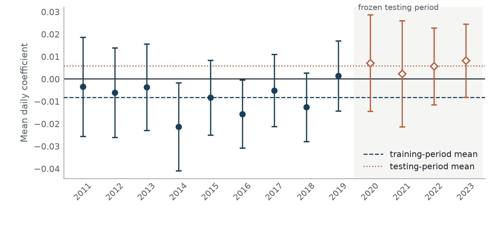

# A Hard Negative-Story Threshold

*Training-Period Association, Temporal Non-Replication and Economic Limits*

Peter Prendergast · MSc Computational Finance · University College London · 2026

Does the share of news stories classified as negative by FinBERT explain stock returns after controlling for average sentiment and news volume?

**The negative association found in 2011–2019 did not replicate in 2020–2023.** Timing diagnostics and trading costs further limit its usefulness as a predictive signal. The study covers 715,546 news-bearing firm-days across 570 priced firms in FNSPID, with separate LSEG/Reuters transfer checks.

[Dissertation PDF](submission/news-sentiment-beyond-mean/Peter-Prendergast-COMP0077-Dissertation.pdf) · [Evidence map](submission/news-sentiment-beyond-mean/docs/evidence_map.md) · [Reproduction guide](docs/reproducing_the_submission.md) · [Documentation](docs/README.md)



*Annual estimates from the dissertation. Horizontal lines show the training- and testing-period means. The figure is reproduced from the committed aggregate evidence.*

## Findings

| Period or contrast | Coefficient | 95% HAC interval |
| --- | ---: | ---: |
| Training, 2011–2019 | −0.00831 | [−0.01410, −0.00252] |
| Frozen testing, 2020–2023 | +0.00583 | [−0.00426, +0.01593] |
| Testing minus training | +0.01414 | [+0.00250, +0.02579] |

These are daily cross-sectional rank-regression coefficients, with five-lag HAC intervals. They are not percentage returns. The predeclared contrast supports a difference across periods, while limited testing-period power leaves uncertainty about small effects.

An association also appears before the assigned trading window. Row-level news availability times are missing, so the data cannot establish that the news could have been traded at the assumed entry time. The best break-even cost among the tested daily rules was approximately **0.625 bps per side**, against **10 bps** charged.

The testing period had informed some earlier design choices, which limits a confirmatory interpretation. The [research design](submission/news-sentiment-beyond-mean/docs/research_design.md) records the chronology, multiplicity corrections and limitations alongside the null and adverse results.

## Reproduce the evidence

From the repository root, with **macOS on Apple silicon, Python 3.12, uv and Make**:

```bash
make setup
make validate
```

This checks the final package's file hashes, manuscript references, prose, analytical tests and lint, then regenerates **30 figure and table artifacts** for byte-for-byte comparison. No model calls or licensed inputs are needed. The frozen testing-period experiment remains sealed.

`make manuscript` builds the PDF if `latexmk` is installed. The committed [portfolio PDF](submission/news-sentiment-beyond-mean/Peter-Prendergast-COMP0077-Dissertation.pdf) has the assessment identifier removed from its cover, with the research content unchanged. See the [reproduction guide](docs/reproducing_the_submission.md) for platform limits, direct commands and the authorised inputs required for a full computational replay.

## Code to read

The final analysis lives in [`submission/news-sentiment-beyond-mean/`](submission/README.md), with 22 selected notebooks, statistical helpers, frozen specifications and aggregate results. Its [evidence map](submission/news-sentiment-beyond-mean/docs/evidence_map.md) traces each claim to the notebook and files that produced it.

The surrounding Python package contains the earlier benchmark and collection tools:

| Area | Source | Tests |
| --- | --- | --- |
| Atomic news-corpus publication | [Artifact writer](src/sentiment_benchmark/news_artifacts.py) | [Tavily](tests/test_news_source.py), [NewsAPI](tests/test_newsapi_source.py) |
| Trading-window alignment and funded portfolios | [Trading pipeline](src/sentiment_benchmark/trading_strategy.py), [portfolio accounting](src/sentiment_benchmark/portfolio.py) | [Pipeline](tests/test_trading_strategy.py), [portfolio](tests/test_portfolio.py) |
| Classification metrics and bootstrap comparisons | [Metrics](src/sentiment_benchmark/metrics.py) | [Statistics](tests/test_statistics.py) |
| Artifact hashes and run provenance | [Artifact I/O](src/sentiment_benchmark/artifact_io.py), [runtime metadata](src/sentiment_benchmark/runtime_metadata.py) | [Metadata](tests/test_runtime_metadata.py), [project checks](tests/test_project_validation.py) |
| Command-line and terminal interfaces | [CLI](src/sentiment_benchmark/cli.py), [TUI](src/sentiment_benchmark/tui.py) | [CLI](tests/test_cli.py), [TUI](tests/test_tui.py) |

These tools have a separate locked environment:

```bash
make benchmark-setup
make benchmark-check
```

The check validates the **5,947-row Financial PhraseBank/FiQA benchmark**, runs the root test suite, and checks Ruff and mypy. To try the application, start with the [benchmark guide](docs/getting_started.md). The [architecture guide](docs/architecture.md) explains the modules and data flow.

## Research history and reuse

[`final_experiments/`](final_experiments/README.md), [`scripts/`](scripts/README.md), [`configs/`](configs/README.md) and [`reports/`](reports/README.md) retain the earlier research. Paths remain stable so old results can still be traced. The [archive map](docs/research_archive.md) explains superseded designs and notebook-number overlaps.

Licensed news text, raw model responses, credentials and intermediate panels stay outside Git. This repository contains material with mixed ownership and no blanket open-source licence. See [data and rights](docs/data_and_rights.md) before reuse and [CITATION.cff](CITATION.cff) for the dissertation citation.

[Contributing](CONTRIBUTING.md) · [Security](SECURITY.md) · [CI](https://github.com/PeterLP123/Sentiment_Dissertation/actions/workflows/ci.yml)
