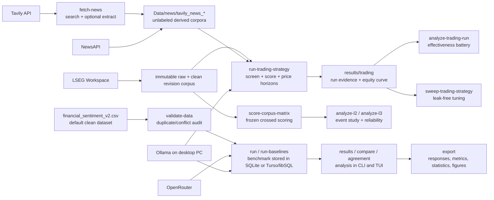

# Sentiment Dissertation Benchmark


A reproducible CLI and terminal UI for dissertation experiments on financial sentiment analysis. The project validates a provenance-clean default dataset, runs OpenRouter or Ollama-hosted models, compares them with non-LLM baselines, exports publication-ready evidence, sources unlabeled news through Tavily and NewsAPI, and runs an exploratory news-to-price trading pilot.

## Project Status

*Active development — MSc dissertation, due 1 September 2026. The CLI/TUI tooling below is stable; current effort is on the dissertation's measurement and trading experiments.*

**Research direction (settled, supervisor-confirmed June 2026): "Beyond the Score."** The central claim is that a single sentiment score `Sₜ` is not a sufficient statistic — the *distribution* of independent model readings carries information the score destroys. The work is layered, and this repository is the measurement engine that feeds it:

- **L1 (baseline):** daily-sentiment threshold trading strategy vs price-only and buy-and-hold.
- **L2:** inter-model consensus → crowding/reversal event study.
- **L3:** measurement-reliability (G-theory) → position sizing.
- **L4 (gated stretch):** writer×scorer robustness.

See [Research protocol](docs/research_protocol.md) and the [Week 4 pre-registration](docs/week4_preregistration.md).

**Where things stand (W4, early July 2026)**

- **Setup (M1) — mostly locked.** Provenance-clean default dataset (`financial_sentiment_v2.csv`), soft-label + calibration (Brier/ECE) metrics, and per-run reproducibility metadata are done. Still open: the final model-roster freeze and the news-API (Tavily) viability decision.
- **Data pipeline (M2) — largely in place.** Timestamped news + price ingestion, trading-decision alignment, and leakage controls are built. The 33-company LSEG collection is running (complete cross-source headlines; story bodies scoped to a source allowlist to stay inside the daily request quota).
- **L1 confirmatory test — collecting now.** The pre-registered, frozen **Week 4+ trading test** is in its rolling collection window: consensus scorer at the D+5 horizon, main dates Jun 25 – Jul 30 plus an untouched August holdout, returns maturing ~late August. The L1 baseline chapter is drafted with results placeholders pending that test.
- **Week 3 pilot — exploratory, no confirmed edge.** The 22-event pilot found no scorer-horizon mean return significant after Benjamini–Hochberg correction, with a suggestive but non-significant positive pattern for the consensus scorer at D+3..D+6. Retained as hypothesis-generating context only.
- **Backtesting infrastructure — merged.** The trading pipeline now has a pure backtest core, a price-provider cache, contamination controls (knowledge-cutoff stratification, entity masking), an effectiveness battery, a leak-free parameter sweep, and a pluggable strategy registry. See [Trading pipeline](docs/trading_pipeline.md).
- **Novel layers (L2 / L3) — next**, once the crossed-design extraction runs land (target late July). The `analyze-l2` / `analyze-l3` commands and the frozen workflow are already in place.

> Trading results to date are screening diagnostics that assume event independence — not confirmed findings.

## What This Project Does

| Capability | Use it for | Main entry point |
| --- | --- | --- |
| Dataset validation | Confirm the default clean benchmark has the expected columns, labels, provenance, and conflict metadata. | `sentiment-bench validate-data` |
| LLM benchmarking | Run model sentiment classifications through OpenRouter or a remote/local Ollama server. | `sentiment-bench run` |
| Shared run storage | Store results locally in SQLite or sync runs across machines with Turso/libSQL. | `.env`, `sentiment-bench runs` |
| Baselines | Add majority, TF-IDF logistic regression, VADER, or FinBERT comparisons. | `sentiment-bench run-baselines` |
| Results analysis | Inspect stored metrics, paired tests, agreement, and prompt sensitivity. | `sentiment-bench results`, `compare`, `agreement` |
| Self-consistency | Sample one model repeatedly to estimate sentiment ambiguity. | `sentiment-bench run-self-consistency` |
| Tavily news sourcing | Search and extract current articles into reproducible derived corpora. | `sentiment-bench fetch-news` |
| Tavily dataset packaging | Batch-fetch query families and package shareable source datasets. | `sentiment-bench fetch-news-batch`, `package-news` |
| NewsAPI sourcing | Page through dated article titles and descriptions with source manifests. | `sentiment-bench newsapi-check`, `fetch-newsapi` |
| LSEG Workspace research corpus | Create preset collection configs, collect entitled stories immutably, clean them offline, catalog corpora, and create seeded local validation sheets. | `lseg-init-config`, `fetch-lseg-news`, `build-lseg-corpus`, `lseg-catalog` |
| Trading pilot | Merge and screen news, score three LLMs plus VADER, optionally run an entity-masked arm and knowledge-cutoff stratification, and calculate next-session event returns. | `sentiment-bench run-trading-strategy` |
| Trading robustness report | Bootstrap event means, run the effectiveness battery (significance, benchmark, economics; BH-corrected), test company sensitivity, and render meeting-ready plots. | `sentiment-bench analyze-trading-run` |
| Parameter sweep | Tune any registered strategy's parameters and horizon on a completed run, selecting on a training split only. | `sentiment-bench sweep-trading-strategy` |
| Pluggable strategies | Register trading ideas across four pipeline seams; equal-weight threshold and conviction-weighted sizing built in. | `sentiment-bench list-strategies` |
| Headline value screen | Assess LSEG headline-only coverage, taxonomy, and lexicon-scored trading value without story bodies. | `sentiment-bench analyze-headline-value` |
| L2 / L3 analyses | Consensus event study with clustered inference, and G-theory reliability with holdout trading rules. | `sentiment-bench analyze-l2`, `analyze-l3` |
| Terminal UI | Run the same workflows interactively with tabs for models, prompts, runs, results, and news. | `sentiment-bench tui` |

## Quick Start

Use Python 3.12, then install the package in editable mode with development tools:

```powershell
py -3.12 -m venv .venv
.\.venv\Scripts\Activate.ps1
python -m pip install --upgrade pip
python -m pip install -e ".[dev]"
```

On Windows, you can run the setup helper instead:

```powershell
.\scripts\setup_windows_py312.ps1
```

The `.venv/` folder is machine-local and ignored by git. Recreate it on each machine with the setup helper; do not copy a virtual environment between machines.

If PowerShell does not recognize `sentiment-bench`, activate the virtual environment first or run the executable directly:

```powershell
.\.venv\Scripts\Activate.ps1
sentiment-bench tui

# Or without activation:
.\.venv\Scripts\sentiment-bench.exe tui
```

Create a local `.env` file. Use placeholder values until you add your real keys:

```bash
OPENROUTER_API_KEY=your-openrouter-key
OPENROUTER_BASE_URL=https://openrouter.ai/api/v1

TAVILY_API_KEY=your-tavily-key
TAVILY_PROJECT=sentiment-dissertation

NEWSAPI_API_KEY=your-newsapi-key

# Optional: route model calls to Ollama instead of OpenRouter.
SENTIMENT_BENCH_PROVIDER=ollama
OLLAMA_HOST=http://desktop-pc:11434

# Optional: friendly label stored with each run when using multiple machines.
SENTIMENT_BENCH_MACHINE_LABEL=desktop-3070

# Optional: shared Turso/libSQL run history.
SENTIMENT_BENCH_DB_BACKEND=libsql
TURSO_DATABASE_URL=libsql://your-database-your-org.turso.io
TURSO_AUTH_TOKEN=your-database-token
TURSO_REPLICA_PATH=results/turso_replica.db
# libSQL uses the local replica by default and syncs to hosted Turso after runs.
# Optional direct hosted mode for small admin tasks: TURSO_CONNECTION_MODE=hosted
# Optional tuning: TURSO_TIMEOUT_SECONDS=5, TURSO_SYNC_INTERVAL_SECONDS=60
```

Validate the dataset:

```bash
sentiment-bench validate-data
```

Run a small OpenRouter pilot:

```bash
sentiment-bench run --models openai/gpt-4o-mini --mode pilot
```

Run a local Gemma model hosted by Ollama on another machine:

```bash
sentiment-bench run --provider ollama --ollama-host http://desktop-pc:11434 \
  --models gemma4:12b --mode pilot --prompt-id finance_calibrated_label_only
```

Source unlabeled news articles through Tavily:

```bash
sentiment-bench news-check --query "financial markets" --max-results 1

sentiment-bench fetch-news --query "bank earnings sentiment" \
  --max-results 10 --time-range week --output-dir Data/news
```

Check NewsAPI and preview or run the fixed Week 3 strategy:

```bash
sentiment-bench newsapi-check --query "Apple AAPL stock"
sentiment-bench run-trading-strategy --dry-run
sentiment-bench run-trading-strategy --config configs/week3_trading_pilot.toml
sentiment-bench analyze-trading-run \
  --run-dir results/trading/<run-id> \
  --output-dir results/trading/<analysis-id>
sentiment-bench sweep-trading-strategy \
  --run-dir results/trading/<run-id> --scorer consensus/majority
```

Collect an entitled LSEG corpus and run the local-model policy:

```bash
python -m pip install -e ".[dev,lseg,baselines,finbert]"
sentiment-bench lseg-news-check --config configs/lseg_us_mega_cap_1y.toml
sentiment-bench fetch-lseg-news --config configs/lseg_us_mega_cap_1y.toml
sentiment-bench build-lseg-corpus --source Data/news/lseg_lseg_us_mega_cap_1y
sentiment-bench lseg-catalog
sentiment-bench run-trading-strategy --config configs/lseg_ollama_trading_example.toml
```

Launch the TUI:

```bash
sentiment-bench tui
```

## Documentation

Start here if you are setting up the project or writing the dissertation methods section:

| Document | Type | Best for |
| --- | --- | --- |
| [Docs home](docs/README.md) | Map | Choosing the right guide. |
| [Getting started](docs/getting_started.md) | Tutorial | First install, validation, pilot run, export, and news fetch. |
| [CLI reference](docs/cli_reference.md) | Reference | Commands, options, defaults, and examples. |
| [TUI guide](docs/tui_guide.md) | How-to | Interactive model, prompt, run, results, and news workflows. |
| [Model providers](docs/model_providers.md) | How-to | OpenRouter setup and local/remote Ollama setup for Gemma models. |
| [News sourcing](docs/news_sourcing.md) | How-to | Search, extract, save, review, and troubleshoot Tavily and NewsAPI corpora. |
| [LSEG to Ollama pipeline](docs/lseg_ollama_pipeline.md) | How-to | Collect, clean, score, validate, and evaluate local-only Workspace news. |
| [Frozen LSEG analysis workflow](docs/lseg_analysis_workflow.md) | How-to | The gated corpus → cohort → validation → crossed scoring → L2/L3 sequence. |
| [Trading pipeline](docs/trading_pipeline.md) | How-to | Run, analyze, tune, and extend the news-to-price trading strategy. |
| [Results and exports](docs/results_and_exports.md) | Reference | SQLite or Turso/libSQL storage, export files, metrics, figures, and reproducibility metadata. |
| [Architecture](docs/architecture.md) | Explanation | Why the project separates source data, runs, providers, news corpora, and exports. |
| [Dataset card](docs/dataset_card.md) | Reference | Dataset identity, shape, label policy, limitations, and ethics. |
| [Research protocol](docs/research_protocol.md) | Explanation | Dissertation research questions, hypotheses, metrics, and experiment rules. |
| [Week 4 pre-registration](docs/week4_preregistration.md) | Explanation | The frozen confirmatory trading test: hypothesis, design, and decision rule. |

## System Map



## Data And Output Policy

`Data/derived/labeled/financial_sentiment_v2.csv` is the default benchmark dataset. It is rebuilt from the original sources by `scripts/build_labeled_dataset.py` and should not be manually edited. `Data/data.csv` is retained as immutable legacy Kaggle source material; do not clean, deduplicate, or relabel it in place.

Generated artifacts are intentionally separated:

| Path | Meaning | Git policy |
| --- | --- | --- |
| `Data/derived/labeled/financial_sentiment_v2.csv` | Default provenance-clean benchmark dataset. | Source-controlled derived data. |
| `Data/data.csv` | Legacy Kaggle source dataset with documented merge corruption. | Source-controlled source material. |
| `Data/news/` | Tavily and NewsAPI article corpora for later review or trading inputs. | Ignored except `.gitkeep`. |
| `Data/derived/lseg/` | Clean, manifest-backed LSEG corpora and local annotation sheets. | Ignored. |
| `Data/derived/trading/` | Provider-neutral merged articles and screening decisions. | Ignored. |
| `results/trading/` | Trading scores, signals, prices, returns, sensitivity tables, charts, and run manifests. | Ignored. |
| `results/sentiment_benchmark.sqlite` | Local run database when using SQLite. | Ignored. |
| `results/turso_replica.db` | Local embedded libSQL replica when using Turso. | Ignored. |
| `results/exports/run_<id>/` | Reproducible run exports and optional figures. | Ignored. |
| `experiments/manifest.toml` | Curated registry for formal dissertation runs. | Source-controlled. |

## Common Workflows

Run a pilot with a few-shot prompt:

```bash
sentiment-bench run --models openai/gpt-4o-mini --mode pilot \
  --few-shot-k 4 --few-shot-seed 42
```

Run baselines on the exact same rows as an LLM run:

```bash
sentiment-bench run-baselines --match-run-id 5 \
  --baselines majority --baselines tfidf_logreg
```

Compare two models on paired rows:

```bash
sentiment-bench compare --run-a 1 --model-a openai/gpt-4o-mini \
  --model-b anthropic/claude-3.5-sonnet --metric macro_f1
```

Export a completed run:

```bash
sentiment-bench export --run-id 1
```

Generate prompt sensitivity runs:

```bash
sentiment-bench run-prompt-suite --models openai/gpt-4o-mini \
  --base-prompt-id default_label_only --include label_order --include paraphrase
```

Measure inter-model agreement:

```bash
sentiment-bench agreement --run-id 1 --scope primary
```

## Reproducibility Checklist

For every formal dissertation result, record:

- Dataset path and SHA-256 hash.
- Code commit SHA.
- Run IDs and export paths.
- Provider route, model IDs, prompt ID, and prompt hash.
- Machine label/id, package version, Python version, git commit, and database backend.
- Mode, seed, row-selection logic, temperature, token limits, retries, and concurrency.
- Metrics emphasized in the dissertation.
- Cost, latency, invalid-output count, and API-error count where available.
- Interpretation limits, especially around duplicate-label conflict and financial-domain generalization.
