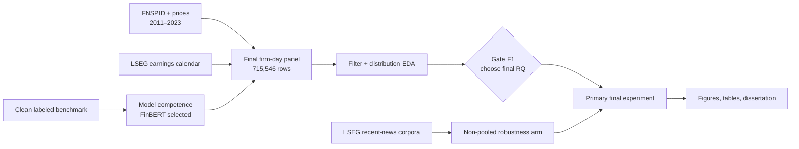

# Sentiment Dissertation Research Workspace


Research workspace for an MSc dissertation on financial-news sentiment. It contains a provenance-clean sentiment benchmark, model and news-ingestion tooling, historical trading and tail-risk studies, and the closing `final_experiments/` programme.

The project is now in its **final experiments phase**. The priority is to improve how multiple news stories become one interpretable firm-day signal, not to add another production pipeline or optimise another backtest.

## Current Status

| Item | Status |
| --- | --- |
| Dissertation deadline | **1 September 2026** |
| Current phase | [Final experiments](final_experiments/README.md), opened 30 July 2026 |
| Final research question | **Not chosen yet.** Five candidates remain open until Gate F1, after the filtering and distribution EDA. |
| Primary data spine | **FNSPID 2011–2023** for breadth and date-cluster support; LSEG is a non-pooled, out-of-regime robustness arm. |
| Current firm-day panel | 715,546 news-bearing firm-days, 570 priced symbols, 3,262 sessions; 2011–2023 |
| Frozen chronological split | Development through 2019-12-31; evaluation from 2020-01-01. Call it a *chronological evaluation block*, not a pristine holdout. |
| Completed closing-stage work | Data inventory, primary-spine decision, LSEG earnings-calendar gather, and FNSPID firm-day panel |
| Next stage | Story filtering, publisher/novelty analysis, and within-company-day score-distribution EDA |
| Deliberately closed | New VaR/ES work, new scorer bake-offs, and multi-scorer signal ensembles |

The standing “Beyond the Mean” cross-model-agreement question is now a **fallback/default, not the chosen final RQ**. The live plan compares it with aggregation, filtering, sentiment-surprise, and learned-threshold questions before Gate F1.

## Research Direction

The closing programme follows one design rule:

> **Fix the measurement, not the trading rule.** FinBERT is the scorer. The open question is how to select, weight, and aggregate the stories it scores.

Six workstreams structure the remaining research:

1. **Consolidated data panel** across a larger universe and longer window.
2. **Story filtering and weighting** by publisher, novelty, repetition, and routine reporting.
3. **Aggregation rules** including the mean, median, trimmed mean, negative share, dispersion, strongest event, attention weighting, and decayed state.
4. **Sentiment surprise** net of the firm baseline, market-wide sentiment level, and market return.
5. **Story-type conditioning** under a declared multiplicity family.
6. **Earnings-date effects** using the locally gathered LSEG results calendar.

A small neural network remains in scope only as a secondary trade/no-trade threshold learner, benchmarked against logistic, gradient-boosted, and fixed-band rules on development data.

### What earlier work has already settled

- **FinBERT is the primary scorer.** It reached 0.811 accuracy and 0.806 macro-F1 on the 5,947-row clean benchmark; hosted LLMs did not beat it.
- **Combining scorers did not help.** The seven-signal portfolio search collapsed to a singleton and the winner was indistinguishable from selection luck.
- **The company-day aggregation is fragile.** Moving from a subset to the full headline population changed daily signals materially even when headline-level distributions barely moved.
- **The first sentiment-surprise pilot was a NO-GO.** Sentiment level beat Kalman surprise out of sample; any retry must use the wider panel and a different demeaning design.
- **Negative share is worth testing.** It is the only text feature in the repository with a strong BH-corrected second-moment result.
- **VaR/ES is finished.** News arrival improved tail-risk forecasts; semantic tone did not add a clear increment. The result is retained, not extended.
- **Trading evidence is exploratory.** The 33-stock robustness run failed after costs and turnover; no result here is deployable alpha or a causal claim.

## Documentation Authority

The repository contains several generations of plans and protocols. Read them in this order:

1. **[Final experiments plan](final_experiments/plan.html)**: live decisions, checklist, and workstream status.
2. **[Research protocol](docs/research_protocol.md)**: current scientific guardrails while the final RQ remains open.
3. **[Dissertation execution plan](docs/dissertation_execution_plan.md)**: current stage sequence, exit conditions, and writing dependencies.
4. **[Final experiments README](final_experiments/README.md)**: operational map for notebooks, local data, and generated outputs.
5. **[Documentation home](docs/README.md)**: technical guides, reference docs, frozen results, and clearly marked historical protocols.

Dated protocols and result reports remain part of the audit trail. They are not silently rewritten into the current design.

## Repository Map

```text
Data/                         tracked benchmark + local/ignored research data
final_experiments/            current notebook-first closing programme
  data/earnings/              licensed local LSEG results calendar
  lib/                        thin reusable analysis helpers
  outputs/                    generated local panels, tables, and figures
src/sentiment_benchmark/      stable benchmark/news/trading library
notebooks/                    earlier FNSPID tail-risk notebooks
configs/                      TOML collection, scoring, and strategy configs
experiments/manifest.toml     curated registry of formal runs
reports/                      compact result narratives and provenance
results/                      generated/local execution evidence
docs/                         guides, references, protocols, and frozen explanations
dissertation/                 LaTeX dissertation source and bibliography
scripts/                      reproducible dataset, collection, and report builders
tests/                        focused tests for the stable library
```



## Setup

Python is pinned to **3.12** (`>=3.12,<3.13`). `uv.lock` is committed, so `uv` is the simplest setup:

```bash
uv sync --extra dev --extra baselines --extra finbert --extra figures --extra tailrisk
uv run sentiment-bench validate-data
```

Equivalent editable install:

```bash
python3.12 -m venv .venv
source .venv/bin/activate                  # Windows: .\.venv\Scripts\Activate.ps1
python -m pip install --upgrade pip
python -m pip install -e ".[dev,baselines,finbert,figures,tailrisk]"
sentiment-bench validate-data
```

Optional provider and news credentials live in an ignored `.env`:

```text
OPENROUTER_API_KEY=...
CEREBRAS_API_KEY=...
TAVILY_API_KEY=...
NEWSAPI_API_KEY=...
SENTIMENT_BENCH_PROVIDER=ollama
OLLAMA_HOST=http://localhost:11434
```

LSEG workflows require an entitled, signed-in Workspace desktop session and the `lseg` extra.

## Working With The Final Experiments

Start with the [phase README](final_experiments/README.md) and [live plan](final_experiments/plan.html). The tracked `.py`/`.ipynb` pairs are the research record; heavy outputs stay local.

```bash
# Inventory both candidate data spines and the earnings calendar.
uv run python final_experiments/00_data_inventory.py

# Rebuild the current FNSPID firm-day panel.
uv run python final_experiments/01_panel.py
```

These commands are **not clone-only demos**. They require the licensed/local archives and generated checkpoints recorded in each notebook. The notebook narrative explains the expected paths and provenance. Never commit raw headline text, the earnings-calendar CSV/JSON files, or `final_experiments/outputs/`.

## Stable Tooling

The older CLI/TUI remains available as a library and reproducibility surface. The final experiments import it rather than extending it.

| Capability | Entry point |
| --- | --- |
| Validate the clean benchmark | `sentiment-bench validate-data` |
| Run/export benchmark models and baselines | `sentiment-bench run`, `run-baselines`, `export` |
| Inspect metrics, comparisons, and agreement | `sentiment-bench results`, `compare`, `agreement` |
| Collect and clean Tavily, NewsAPI, or LSEG news | `fetch-news`, `fetch-newsapi`, `fetch-lseg-news`, `build-lseg-corpus` |
| Replay historical trading/strategy research | `run-trading-strategy`, `sentiment-bench strategy ...` |
| Use the terminal UI | `sentiment-bench tui` |

See the [CLI reference](docs/cli_reference.md), [architecture](docs/architecture.md), and [results/export reference](docs/results_and_exports.md) for the full surface.

## Data And Output Policy

| Path | Role | Git policy |
| --- | --- | --- |
| `Data/derived/labeled/financial_sentiment_v2.csv` | Default provenance-clean labeled benchmark; rebuilt by `scripts/build_labeled_dataset.py` | Tracked; never edit manually |
| `Data/data.csv` | Legacy Kaggle merge with 514 known corrupt neutral duplicates | Legacy only; never use as ambiguity evidence |
| `Data/source/`, `Data/news/`, `Data/collections/*/{raw,derived,reports,packages}/` | Source archives and licensed/generated news corpora | Ignored/local |
| `final_experiments/data/earnings/` | LSEG-derived FNSPID earnings calendar | Documentation tracked; CSV/JSON/checkpoints ignored |
| `final_experiments/outputs/` | Generated panels, tables, figures, and fitted artifacts | Ignored/local |
| `results/` | Databases, exports, backtests, and strategy evidence | Generated/local except deliberately tracked compact evidence |
| `reports/` | Aggregate narratives, manifests, and selected licence-safe tables | Selectively tracked |
| `experiments/manifest.toml` | Formal experiment registry | Tracked |

Every result promoted into the dissertation must record its data identity, split, seed, scorer/model revision, estimand, inference method, multiplicity family, code commit, and limitations. Nulls, invalidated runs, and attrition are results, not cleanup targets.

## Research Limits

- Predictive and associational claims only; no causal market claim.
- Daily/date-only timing leaves residual intraday ambiguity.
- FNSPID and LSEG are different source regimes and must not be pooled.
- The current evaluation period has influenced earlier design work; it is not pristine.
- Prices are split-adjusted but not dividend-adjusted in the core research panels.
- Licensed LSEG/FNSPID text stays local and is not redistributed.
- Portfolio results must report turnover, costs, concentration, and break-even cost; they are secondary to signal measurement.

## Documentation

- [Documentation home](docs/README.md)
- [Final experiments plan](final_experiments/plan.html)
- [Research protocol](docs/research_protocol.md)
- [Dissertation execution plan](docs/dissertation_execution_plan.md)
- [Dataset card](docs/dataset_card.md)
- [Architecture](docs/architecture.md)
- [CLI reference](docs/cli_reference.md)
- [Results and exports](docs/results_and_exports.md)

## Reproducibility Checklist

Before a final result is cited:

- Freeze and report the chronological split before model selection.
- Record source files/manifests and content hashes where available.
- Record the exact FinBERT revision and score definition.
- State the event grain, timing rule, return convention, and initial-reaction treatment.
- State the clustered or block-bootstrap inference unit and random seed.
- Declare the multiple-testing family before opening evaluation results.
- Preserve an attrition table and data-quality caveats.
- Report effect sizes and intervals alongside any p/q-values.
- Register the accepted run and promote only aggregate, licence-safe artifacts.
