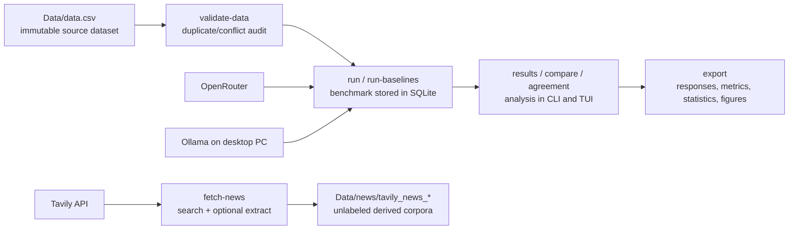

# Sentiment Dissertation Benchmark


A reproducible CLI and terminal UI for dissertation experiments on financial sentiment analysis. The project validates an immutable source dataset, runs OpenRouter or Ollama-hosted models, compares them with non-LLM baselines, exports publication-ready evidence, and sources unlabeled news articles through Tavily for later annotation workflows.

## What This Project Does

| Capability | Use it for | Main entry point |
| --- | --- | --- |
| Dataset validation | Confirm `Data/data.csv` has the expected columns, labels, duplicates, and conflict metadata. | `sentiment-bench validate-data` |
| LLM benchmarking | Run model sentiment classifications through OpenRouter or a remote/local Ollama server. | `sentiment-bench run` |
| Baselines | Add majority, TF-IDF logistic regression, VADER, or FinBERT comparisons. | `sentiment-bench run-baselines` |
| Results analysis | Inspect stored metrics, paired tests, agreement, and prompt sensitivity. | `sentiment-bench results`, `compare`, `agreement` |
| Self-consistency | Sample one model repeatedly to estimate sentiment ambiguity. | `sentiment-bench run-self-consistency` |
| Tavily news sourcing | Search and extract current articles into reproducible derived corpora. | `sentiment-bench fetch-news` |
| Terminal UI | Run the same workflows interactively with tabs for models, prompts, runs, results, and news. | `sentiment-bench tui` |

## Quick Start

Use Python 3.12, then install the package in editable mode with development tools:

```powershell
py -3.12 -m venv .venv
.\.venv\Scripts\Activate.ps1
python -m pip install --upgrade pip
python -m pip install -e ".[dev]"
```

On Windows, you can run the setup helper instead:

```powershell
.\scripts\setup_windows_py312.ps1
```

The `.venv/` folder is machine-local and ignored by git. Recreate it on each machine with the setup helper; do not copy a virtual environment between machines.

Create a local `.env` file. Use placeholder values until you add your real keys:

```bash
OPENROUTER_API_KEY=your-openrouter-key
OPENROUTER_BASE_URL=https://openrouter.ai/api/v1

TAVILY_API_KEY=your-tavily-key
TAVILY_PROJECT=sentiment-dissertation

# Optional: route model calls to Ollama instead of OpenRouter.
SENTIMENT_BENCH_PROVIDER=ollama
OLLAMA_HOST=http://desktop-pc:11434
```

Validate the dataset:

```bash
sentiment-bench validate-data --dataset-path Data/data.csv
```

Run a small OpenRouter pilot:

```bash
sentiment-bench run --models openai/gpt-4o-mini --mode pilot
```

Run a local Gemma model hosted by Ollama on another machine:

```bash
sentiment-bench run --provider ollama --ollama-host http://desktop-pc:11434 \
  --models gemma3 --mode pilot
```

Source unlabeled news articles through Tavily:

```bash
sentiment-bench news-check --query "financial markets" --max-results 1

sentiment-bench fetch-news --query "bank earnings sentiment" \
  --max-results 10 --time-range week --output-dir Data/news
```

Launch the TUI:

```bash
sentiment-bench tui
```

## Documentation

Start here if you are setting up the project or writing the dissertation methods section:

| Document | Type | Best for |
| --- | --- | --- |
| [Docs home](docs/README.md) | Map | Choosing the right guide. |
| [Getting started](docs/getting_started.md) | Tutorial | First install, validation, pilot run, export, and news fetch. |
| [CLI reference](docs/cli_reference.md) | Reference | Commands, options, defaults, and examples. |
| [TUI guide](docs/tui_guide.md) | How-to | Interactive model, prompt, run, results, and news workflows. |
| [Model providers](docs/model_providers.md) | How-to | OpenRouter setup and remote Ollama setup for desktop-hosted Gemma models. |
| [Tavily news sourcing](docs/news_sourcing.md) | How-to | Search, extract, save, review, and troubleshoot article corpora. |
| [Results and exports](docs/results_and_exports.md) | Reference | SQLite storage, export files, metrics, figures, and reproducibility metadata. |
| [Architecture](docs/architecture.md) | Explanation | Why the project separates source data, runs, providers, news corpora, and exports. |
| [Dataset card](docs/dataset_card.md) | Reference | Dataset identity, shape, label policy, limitations, and ethics. |
| [Research protocol](docs/research_protocol.md) | Explanation | Dissertation research questions, hypotheses, metrics, and experiment rules. |

## System Map



## Data And Output Policy

`Data/data.csv` is treated as source material. Do not edit, clean, deduplicate, or relabel it in place. Create derived files and document their provenance instead.

Generated artifacts are intentionally separated:

| Path | Meaning | Git policy |
| --- | --- | --- |
| `Data/data.csv` | Source sentiment benchmark dataset. | Source-controlled. |
| `Data/news/` | Tavily article corpora for later review or labeling. | Ignored except `.gitkeep`. |
| `results/sentiment_benchmark.sqlite` | Local run database. | Ignored. |
| `results/exports/run_<id>/` | Reproducible run exports and optional figures. | Ignored. |
| `experiments/manifest.toml` | Curated registry for formal dissertation runs. | Source-controlled. |

## Common Workflows

Run a pilot with a few-shot prompt:

```bash
sentiment-bench run --models openai/gpt-4o-mini --mode pilot \
  --few-shot-k 4 --few-shot-seed 42
```

Run baselines on the exact same rows as an LLM run:

```bash
sentiment-bench run-baselines --match-run-id 5 \
  --baselines majority --baselines tfidf_logreg
```

Compare two models on paired rows:

```bash
sentiment-bench compare --run-a 1 --model-a openai/gpt-4o-mini \
  --model-b anthropic/claude-3.5-sonnet --metric macro_f1
```

Export a completed run:

```bash
sentiment-bench export --run-id 1
```

Generate prompt sensitivity runs:

```bash
sentiment-bench run-prompt-suite --models openai/gpt-4o-mini \
  --base-prompt-id default_label_only --include label_order --include paraphrase
```

Measure inter-model agreement:

```bash
sentiment-bench agreement --run-id 1 --scope primary
```

## Reproducibility Checklist

For every formal dissertation result, record:

- Dataset path and SHA-256 hash.
- Code commit SHA.
- Run IDs and export paths.
- Provider route, model IDs, prompt ID, and prompt hash.
- Mode, seed, row-selection logic, temperature, token limits, retries, and concurrency.
- Metrics emphasized in the dissertation.
- Cost, latency, invalid-output count, and API-error count where available.
- Interpretation limits, especially around duplicate-label conflict and financial-domain generalization.
