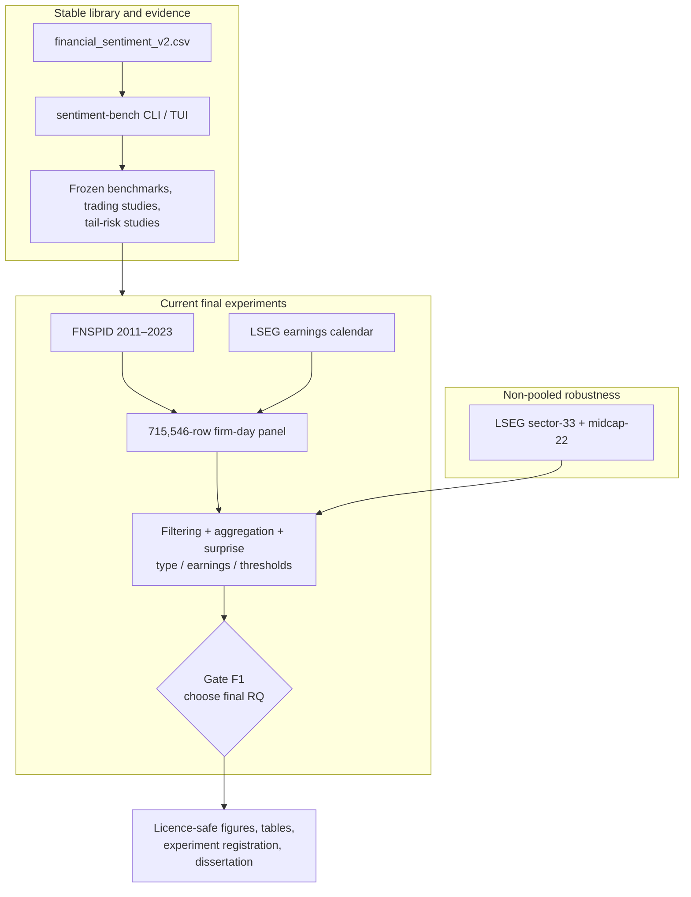

# Documentation Home

The repository has accumulated several generations of protocols, pipelines, and result reports. This page separates the **current closing phase** from reusable tooling and historical evidence so an older plan is not mistaken for the active design.

## Start Here

| Need | Read |
| --- | --- |
| Understand the project in five minutes | [Main README](../README.md) |
| See current decisions and checklist status | [Final experiments plan](../final_experiments/plan.html) |
| Work inside `final_experiments/` | [Final experiments README](../final_experiments/README.md) |
| Understand the current scientific constraints | [Research protocol](research_protocol.md) |
| See stage order and exit conditions | [Dissertation execution plan](dissertation_execution_plan.md) |
| Install the package and run the benchmark | [Getting started](getting_started.md) |
| Find a command or artifact schema | [CLI reference](cli_reference.md) · [Results and exports](results_and_exports.md) |

## Documentation Authority

When two documents conflict, use this order:

1. [`final_experiments/plan.html`](../final_experiments/plan.html): live decisions and checklist.
2. [`research_protocol.md`](research_protocol.md): phase-wide scientific guardrails.
3. [`dissertation_execution_plan.md`](dissertation_execution_plan.md): execution order and promotion gates.
4. [`final_experiments/README.md`](../final_experiments/README.md): operational notebook/data map.
5. Dated protocols and result reports: immutable historical evidence for the design they record.

The final research question is still open. “Beyond the Mean” cross-model agreement is a standing fallback/default, not the chosen final RQ.

## Current Closing Phase

| Document | Type | What it establishes |
| --- | --- | --- |
| [Final experiments plan](../final_experiments/plan.html) | Live HTML plan | Six workstreams, five candidate RQs, completed/open checklist items, primary-spine decision, and frozen split. |
| [Final experiments README](../final_experiments/README.md) | Operational guide | Notebook order, local data prerequisites, generated outputs, and provenance boundary. |
| [Research protocol](research_protocol.md) | Scientific protocol | Open-RQ discipline, FNSPID primary/LSEG robustness roles, inference requirements, and interpretation limits. |
| [Dissertation execution plan](dissertation_execution_plan.md) | Delivery plan | Stages S0–S5, current status, stage exit conditions, and writing dependencies. |

### Current facts

- Primary spine: FNSPID 2011–2023; LSEG is a non-pooled robustness arm.
- Firm-day panel: 715,546 rows, 570 priced symbols, 3,262 sessions.
- Frozen split: development through 2019-12-31; evaluation from 2020-01-01.
- Earnings data: LSEG results calendar gathered locally for the FNSPID cohort; coverage caveats remain.
- Gate F1 is still open: filtering/distribution EDA comes before selecting the final RQ.
- VaR/ES, scorer selection, and multi-scorer ensemble search are closed workstreams.

## Tutorials And How-To Guides

| Document | Status | Best for |
| --- | --- | --- |
| [Getting started](getting_started.md) | Current | Python 3.12 setup, validation, pilot benchmark, result export, and where final experiments fit. |
| [Model providers](model_providers.md) | Current | OpenRouter, Cerebras, and local/remote Ollama setup. |
| [News sourcing](news_sourcing.md) | Current | Tavily and NewsAPI search, extraction, packaging, and troubleshooting. |
| [LSEG to Ollama pipeline](lseg_ollama_pipeline.md) | Current technical guide | Collecting, cleaning, scoring, and validating licensed Workspace news. |
| [TUI guide](tui_guide.md) | Current technical guide | Interactive model, prompt, run, results, and news workflows. |
| [UCL GPU labeling](ucl_gpu_labeling.md) | Operational | Running local-model labeling on the UCL GPU machines. |
| [UCL GPU SSH handoff](ucl_gpu_ssh_handoff.md) | Operational | Gateway, workstation, and handoff conventions for remote GPU jobs. |
| [Mid-cap deadline runbook](midcap_deadline_runbook.md) | Historical runbook | The completed July 2026 one-day Reuters collection/scoring extension. Not the current critical path. |

## Technical Reference And Architecture

| Document | Best for |
| --- | --- |
| [CLI reference](cli_reference.md) | Every `sentiment-bench` command, option, and default. |
| [Results and exports](results_and_exports.md) | Databases, run exports, strategy artifacts, and final-experiment output boundaries. |
| [Dataset card](dataset_card.md) | Clean benchmark identity, provenance, label policy, limitations, and ethics. |
| [Architecture](architecture.md) | Stable library boundaries plus the notebook-first final-experiments layer. |
| [Trading pipeline](trading_pipeline.md) | Historical news-to-price pipeline, funded P&L, sweeps, and pluggable strategies. It is reusable infrastructure, not the current research question. |
| [Historical strategy-research pipeline](strategy_research_pipeline.md) | Separate point-in-time state, portfolio, ledger, tuning, and evaluation path. |
| [LSEG core analysis workflow](lseg_analysis_workflow.md) | Superseded July 12 cross-model-agreement implementation plan, retained for audit. |

## Frozen Protocols And Result Records

These documents record what was planned or observed at the time. Their claims remain bounded to their own samples and dates.

| Document | Evidence status |
| --- | --- |
| [FNSPID tail-risk variant comparison](fnspid_tail_risk_variant_comparison.md) | Verified four-cell factorial; retained result, no new VaR/ES work planned. |
| [Sentiment signal portfolio](sentiment_signal_portfolio.md) | Exploratory seven-signal combination study; singleton winner indistinguishable from selection luck. |
| [Sentiment trading baseline](sentiment_trading_baseline.md) | Literature-grounded Reuters FinBERT/VADER comparator and frozen v1/v2 rules. |
| [Recent-news mid-cap FinBERT protocol](recent_news_midcap_finbert_protocol.md) | Frozen protocol for the 22-stock replay. |
| [Recent-news mid-cap FinBERT result](recent_news_midcap_finbert_strategy.md) | Positive but inconclusive and concentrated chronological result. |
| [Recent-news sector-33 FinBERT protocol](recent_news_sector33_finbert_protocol.md) | Frozen robustness protocol. |
| [Recent-news sector-33 FinBERT result](recent_news_sector33_finbert_result.md) | Failed robustness test; valid null. |
| [Recent-news sentiment persistence protocol/result](recent_news_sentiment_persistence_protocol.md) | Five-session persistence test; failed at 5/10/20 bps. |
| [FinBERT strategy search decision note](finbert_strategy_search_20260722.md) | Development-only search record preserving failed alternatives. |
| [Week 7 receipt-aligned P&L](week7_receipt_aligned_pnl.md) | Supervisor receipt-date accounting view for the accepted mid-cap run. |
| [Trading pre-registration](trading_preregistration.md) | Filed but parked 2026-07-01; binds only if its forward collection is executed. |
| [Local Gemma 4 headline-return report](../reports/local_gemma4_headline_return_study.md) | Frozen 2,282-headline comparison; all clustered intervals include zero. |
| [Full-population FinBERT/VADER report](../reports/week6_finbert_vader_full_population_test.md) | Complete 568,707-headline score comparison and funded evaluation. |
| [Gemma rerun requirement](../reports/week6_model_comparison_rerun_required.md) | Blocking note: Gemma arm has only 15.12% population coverage. |

## Visual Plans, Dashboards, And Explainers

| Document | Purpose |
| --- | --- |
| [Recent-news FinBERT dashboard](recent_news_midcap_finbert_dashboard.html) | Plot-first mid-cap result dashboard. |
| [Sentiment trading baseline explainer](sentiment_trading_baseline_explainer.html) | Interactive explanation of the accepted historical rule and its limitations. |
| [Week 6 trade explorer](week6_trade_explorer.md) | How the local execution-to-headline explorer is assembled and interpreted. |
| [Tavily dataset plan](tavily_dataset_plan.html) | Historical plan for a provenance-first Tavily corpus. |

## Project At A Glance

## Source-Control Boundary

| Source-controlled | Local/generated |
| --- | --- |
| `src/`, `scripts/`, configs, notebooks, thin final-experiment helpers | Databases, model caches, large panels, fitted models |
| Clean labeled benchmark and its dataset card | FNSPID archives and licensed LSEG corpora |
| Protocols, compact manifests, aggregate reports | `final_experiments/outputs/` |
| `final_experiments/data/earnings/{README.md,license_record.md,.gitignore}` | Earnings CSV/JSON/checkpoints from LSEG |
| `experiments/manifest.toml` | Unregistered exploratory output directories |

Do not commit licensed headline/body text or earnings payloads. Promote only aggregate, licence-safe figures and tables after the result is accepted.

## Recommended Reading Order

1. [Main README](../README.md)
2. [Final experiments README](../final_experiments/README.md)
3. [Final experiments plan](../final_experiments/plan.html)
4. [Research protocol](research_protocol.md)
5. [Dissertation execution plan](dissertation_execution_plan.md)
6. [Architecture](architecture.md)
7. [Results and exports](results_and_exports.md)
8. The frozen result record relevant to the chapter being written
