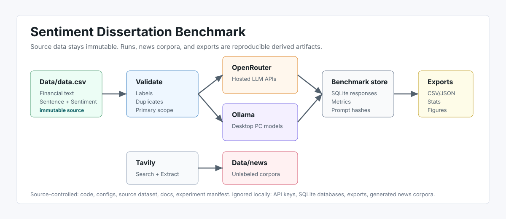
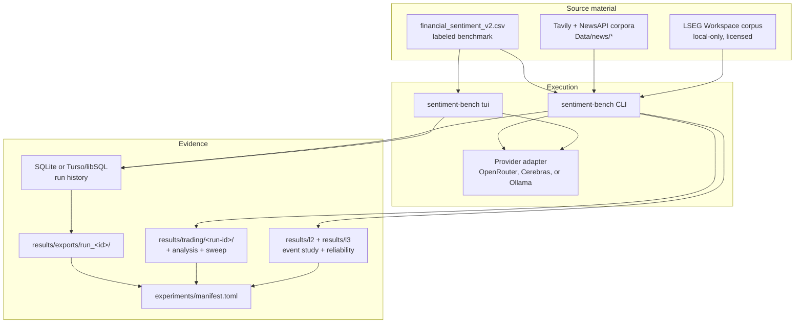

# Documentation Home

This documentation is organized by reader task ([Diátaxis](https://diataxis.fr/)): the tutorial when you are new, how-to guides when you need to complete a job, references for exact options and schemas, and explanations for dissertation-ready rationale.

## The Full Map

| Document | Type | Best for |
| --- | --- | --- |
| [Dissertation execution plan](dissertation_execution_plan.md) | Plan | The refocused critical path: exact code, artifacts, gates, writing dependencies, dates, and nice-to-haves. |
| [Getting started](getting_started.md) | Tutorial | First install, validation, pilot run, export, and news fetch. |
| [Model providers](model_providers.md) | How-to | OpenRouter, Cerebras, and local/remote Ollama setup. |
| [News sourcing](news_sourcing.md) | How-to | Search, extract, package, and troubleshoot Tavily and NewsAPI corpora. |
| [LSEG to Ollama pipeline](lseg_ollama_pipeline.md) | How-to | Collect, clean, score, validate, and evaluate local-only Workspace news. |
| [LSEG analysis workflow](lseg_analysis_workflow.md) | How-to + implementation plan | The gated corpus → price/timing dry run → lean four-scorer panel → held-out event-study sequence. |
| [Mid-cap deadline runbook](midcap_deadline_runbook.md) | Exploratory runbook | One-day Reuters headline collection, bounded local scoring, LSEG prices and funded evaluation for the 22-company extension. |
| [Trading pipeline](trading_pipeline.md) | How-to + explanation | The news-to-price pipeline: runs, effectiveness battery, sweeps, and pluggable strategies. |
| [Historical strategy-research pipeline](strategy_research_pipeline.md) | Technical guide | The separate point-in-time LSEG state, portfolio, ledger, tuning, and paper-order pipeline. |
| [Sentiment trading baseline](sentiment_trading_baseline.md) | Research baseline | The literature-grounded Reuters FinBERT/VADER-share-argmax workflow from frozen collection through point-in-time adjusted-open evaluation. |
| [Recent-news mid-cap FinBERT strategy](recent_news_midcap_finbert_strategy.md) | Strategy explainer | The accepted post-2024 positive-Sharpe rule, exact trading mechanics, metrics, uncertainty, failed alternatives, and reproducibility audit. |
| [Recent-news FinBERT strategy explainer](sentiment_trading_baseline_explainer.html) | Interactive explainer | Visual guide to the accepted rule, data, timing, chronological results, rejected alternatives, uncertainty and reproducibility trail. |
| [TUI guide](tui_guide.md) | How-to | Interactive model, prompt, run, results, and news workflows. |
| [CLI reference](cli_reference.md) | Reference | Every command, option, default, and example. |
| [Results and exports](results_and_exports.md) | Reference | Storage backends, export files, metrics, LaTeX tables, and trading artifacts. |
| [Local Gemma 4 headline-return results](../reports/local_gemma4_headline_return_study.md) | Technical report | Frozen local scoring, benchmark, holdout trading results, uncertainty, and limitations without licensed text. |
| [Dataset card](dataset_card.md) | Reference | Dataset identity, provenance, label policy, limitations, and ethics. |
| [Architecture](architecture.md) | Explanation | Why source data, providers, runs, corpora, and exports are separated. |
| [Research protocol](research_protocol.md) | Explanation | The refocused agreement-validity and incremental held-out market design, inference, artifacts, and interpretation limits. |
| [Trading pre-registration](trading_preregistration.md) | Explanation | A filed confirmatory trading test (collection parked 2026-07-01; binds only if executed). |

## Choose A Starting Point

| I need to... | Read this |
| --- | --- |
| See the dissertation's current critical path and deliverables. | [Dissertation execution plan](dissertation_execution_plan.md) |
| Install the project and run the first benchmark. | [Getting started](getting_started.md) |
| Use Gemma or another local model running on a desktop PC. | [Model providers](model_providers.md) |
| Share run history across machines with Turso/libSQL. | [Results and exports](results_and_exports.md) |
| Fetch articles from Tavily or NewsAPI into `Data/news`. | [News sourcing](news_sourcing.md) |
| Batch-fetch and package a shareable Tavily source dataset. | [News sourcing](news_sourcing.md) |
| Build the licensed Workspace-to-local-model pipeline. | [LSEG to Ollama pipeline](lseg_ollama_pipeline.md) |
| Execute the refocused 33-company LSEG feasibility, scoring, and event-study workflow. | [LSEG analysis workflow](lseg_analysis_workflow.md) |
| Run, analyze, tune, or extend the trading strategy. | [Trading pipeline](trading_pipeline.md) |
| Run the separate historical sentiment-state research portfolio. | [Historical strategy-research pipeline](strategy_research_pipeline.md) |
| Understand the filed (currently parked) confirmatory trading test. | [Trading pre-registration](trading_preregistration.md) |
| Work through the terminal UI. | [TUI guide](tui_guide.md) |
| Look up a command, option, or default. | [CLI reference](cli_reference.md) |
| Understand exported files and metrics. | [Results and exports](results_and_exports.md) |
| Explain the system design in a methods chapter. | [Architecture](architecture.md) and [Research protocol](research_protocol.md) |
| Cite or describe the benchmark dataset. | [Dataset card](dataset_card.md) |

## Project At A Glance

## What Is Source-Controlled

Source-controlled files should explain how an experiment was produced. Local generated files hold the heavy or changing evidence.

| Source-controlled | Local/generated |
| --- | --- |
| Code under `src/` and tests under `tests/`. | SQLite run database and Turso local replica under `results/`. |
| `Data/derived/labeled/financial_sentiment_v2.csv` default benchmark dataset. | Export folders under `results/exports/` and trading evidence under `results/trading/`. |
| `Data/data.csv` legacy Kaggle source dataset. | Tavily corpora and licensed LSEG checkpoints under `Data/news/` or `Data/collections/`. |
| Prompt and run configs under `configs/`. | Local credentials in `.env`. |
| Experiment registry `experiments/manifest.toml`. | Temporary or ad hoc derived datasets outside the tracked labeled default. |

## Recommended Reading Order

1. [Getting started](getting_started.md)
2. [Model providers](model_providers.md)
3. [CLI reference](cli_reference.md)
4. [Results and exports](results_and_exports.md)
5. [Trading pipeline](trading_pipeline.md)
6. [Research protocol](research_protocol.md)
7. [Dissertation execution plan](dissertation_execution_plan.md)
