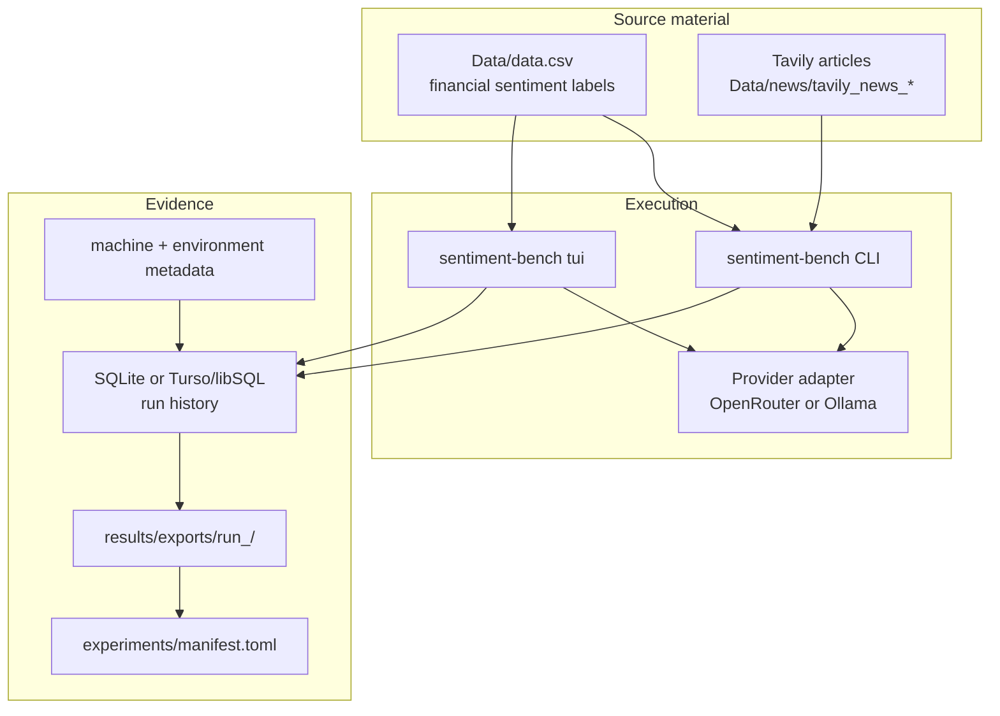

# Documentation Home

This documentation is organized by reader task. Use the tutorial when you are new to the project, the how-to guides when you need to complete a job, the references when you need exact options or output schemas, and the explanations when you need dissertation-ready rationale.

## Choose A Starting Point

| I need to... | Read this |
| --- | --- |
| Install the project and run the first benchmark. | [Getting started](getting_started.md) |
| Use Gemma or another local model running on a desktop PC. | [Model providers](model_providers.md) |
| Share run history across machines with Turso/libSQL. | [Results and exports](results_and_exports.md) |
| Fetch articles from Tavily into `Data/news`. | [Tavily news sourcing](news_sourcing.md) |
| Work through the terminal UI. | [TUI guide](tui_guide.md) |
| Look up a command, option, or default. | [CLI reference](cli_reference.md) |
| Understand exported files and metrics. | [Results and exports](results_and_exports.md) |
| Explain the system design in a methods chapter. | [Architecture](architecture.md) and [Research protocol](research_protocol.md) |
| Cite or describe the benchmark dataset. | [Dataset card](dataset_card.md) |

## Diataxis Coverage

| Quadrant | Documents |
| --- | --- |
| Tutorial | [Getting started](getting_started.md) |
| How-to | [Model providers](model_providers.md), [Tavily news sourcing](news_sourcing.md), [TUI guide](tui_guide.md) |
| Reference | [CLI reference](cli_reference.md), [Results and exports](results_and_exports.md), [Dataset card](dataset_card.md) |
| Explanation | [Architecture](architecture.md), [Research protocol](research_protocol.md) |

## Project At A Glance

## What Is Source-Controlled

Source-controlled files should explain how an experiment was produced. Local generated files should hold the heavy or changing evidence.

| Source-controlled | Local/generated |
| --- | --- |
| Code under `src/` and tests under `tests/`. | SQLite run database and Turso local replica under `results/`. |
| `Data/data.csv` source dataset. | Export folders under `results/exports/`. |
| Prompt configs under `configs/`. | Tavily article corpora under `Data/news/`. |
| Experiment registry under `experiments/manifest.toml`. | Local credentials in `.env`. |

## Recommended Reading Order

1. [Getting started](getting_started.md)
2. [Model providers](model_providers.md)
3. [CLI reference](cli_reference.md)
4. [Results and exports](results_and_exports.md)
5. [Research protocol](research_protocol.md)
