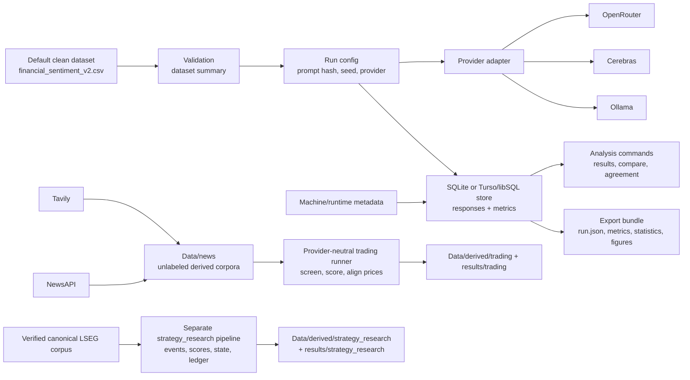
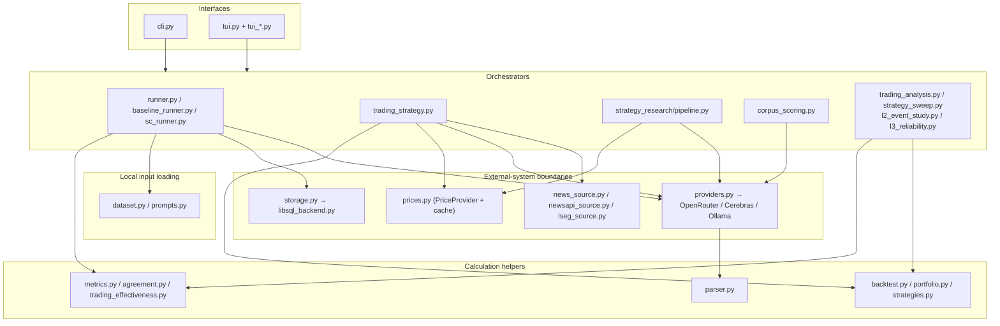
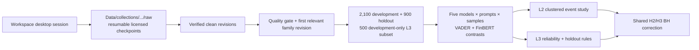
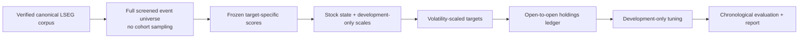

# Architecture

This guide covers `src/sentiment_benchmark`, the earlier benchmark and research
tooling. The final dissertation has its own [code and environment](../submission/README.md).
Benchmark runs record the dataset selection, prompt, provider and runtime alongside
the model responses. News collection writes separate, unlabelled corpora.

## Data flow



## Module Map

The CLI and TUI call orchestration modules, which use provider clients, storage and
calculation helpers. This diagram shows the main responsibilities and call paths.
Dataset and prompt loading also perform local file I/O.



Core boundaries:

| Boundary | Responsibility |
| --- | --- |
| `Data/derived/labeled/financial_sentiment_v2.csv` | Default provenance-clean labeled benchmark dataset. |
| `Data/data.csv` | Immutable legacy Kaggle source with documented merge corruption. |
| `src/sentiment_benchmark/dataset.py` | Dataset loading, validation, duplicate/conflict metadata. |
| `src/sentiment_benchmark/providers.py` | Chooses OpenRouter, Cerebras, or Ollama client from provider settings. |
| `src/sentiment_benchmark/cerebras_client.py` | Cerebras OpenAI-compatible adapter with model-aware request pacing and reset-aware retries. |
| `src/sentiment_benchmark/runner.py` | Executes model runs and stores responses. |
| `src/sentiment_benchmark/metrics.py` | Computes classification metrics and comparison statistics. |
| `src/sentiment_benchmark/storage.py` | Owns database schema and persistence for SQLite or native libSQL/Turso. |
| `src/sentiment_benchmark/libsql_backend.py` | Adapts the native `libsql` client to the SQLite-like store interface. |
| `src/sentiment_benchmark/runtime_metadata.py` | Captures machine id/label, git state, Python version, OS/platform, database backend, and timezone for new runs. |
| `src/sentiment_benchmark/exporter.py` | Writes reproducible run export bundles. |
| `src/sentiment_benchmark/news_source.py` | Sources Tavily article corpora without touching benchmark labels. |
| `src/sentiment_benchmark/newsapi_source.py` | Pages through NewsAPI discovery results and writes provenance-rich snippet corpora. |
| `src/sentiment_benchmark/lseg_cohort.py` | Screens target relevance, collapses story revisions, freezes development/holdout/L3 subsets, and hashes cohort evidence. |
| `src/sentiment_benchmark/corpus_scoring.py` | Plans and resumes the provider-aware crossed LSEG/labeled scoring matrix using exact response identities. |
| `src/sentiment_benchmark/l2_event_study.py` | Builds consensus/ambiguity measures, market-model CARs, clustered inference, and declared H2 tests. |
| `src/sentiment_benchmark/l3_reliability.py` | Fits crossed variance components, derives reliability, compares holdout rules, and combines H2/H3 correction. |
| `src/sentiment_benchmark/trading_strategy.py` | Orchestrates a trading run: merges provider records, screens target relevance, scores sentiment (with optional entity-masking arm and cutoff annotation), aligns sessions, and exports event diagnostics or a funded cross-sectional portfolio plus sensitivity tables. |
| `src/sentiment_benchmark/strategy_research/` | Isolated historical strategy pipeline: builds a full unsampled event universe from the verified canonical LSEG corpus, freezes target-specific scores, constructs decaying stock state, projects risk-limited targets, runs one open-to-open ledger, tunes on development folds, and reports one chronological evaluation. |
| `src/sentiment_benchmark/prices.py` | Price-data seam: `PriceProvider` protocol, LSEG Workspace (preferred, licensed, price-return convention) and yfinance providers, and a per-(symbol,window) cache so backtests are deterministic and offline-replayable. Owns `PriceRow`. |
| `src/sentiment_benchmark/backtest.py` | Pure backtest core (no I/O): default decision policy, per-event return calculation (with signed fractional position sizing), and equity-curve aggregation. Accepts an injected `decision_fn` so alternative strategies plug in. A leaf module that `trading_strategy` re-exports. |
| `src/sentiment_benchmark/portfolio.py` | Pure funded-portfolio evaluator: groups decisions by actual entry session, allocates overlapping horizons through rotating sleeves, marks positions daily, reconciles stock P&L to NAV, and computes annualised risk/return plus sample and shrunk covariance evidence. |
| `src/sentiment_benchmark/strategies.py` | Pluggable strategy layer: `SignalBuilder`/`EventSelector`/`DecisionPolicy`/`Evaluator` seams, event-study and funded cross-sectional evaluators, defaults that reproduce the legacy rule, the conviction-weighted `sentiment_magnitude_v1` idea, and a registry so runs/sweeps name an idea by id. |
| `src/sentiment_benchmark/model_roster.py` | Knowledge-cutoff registry and `is_post_cutoff` logic for contamination stratification. |
| `src/sentiment_benchmark/entity_masking.py` | Replaces company name/ticker/aliases with placeholders for the masked-vs-unmasked ablation. |
| `src/sentiment_benchmark/strategy_sweep.py` | Parameter sweep over any registered strategy's declared parameter space × horizon, selecting on the training split only and reporting held-out test metrics. |
| `src/sentiment_benchmark/trading_plots.py` | Cutoff/masking sensitivity summaries plus event-equity, funded portfolio, stock-contribution, correlation, and parameter-sweep figures (matplotlib optional). |
| `src/sentiment_benchmark/tui.py` + `tui_*.py` | Interactive Textual interface over the same services: an app shell (`tui.py`) that composes per-feature mixins (`tui_run`, `tui_results`, `tui_queue`, `tui_models`, `tui_monitor`, `tui_news`, `tui_baselines`) on a shared `tui_base` foundation, with `tui_format`/`tui_screens` helpers. |

## The LSEG Research Path



Collection, cleaning, cohort freezing, validation, scoring, and analysis are separate commands so downstream evidence can be rebuilt and audited without another licensed API call. Manifests and content/configuration hashes enforce those boundaries. Native story and revision identifiers cross the analysis boundary; URL-based web records retain their existing representation. Sentiment records and trading decisions are separate artifacts so model behavior can be inspected independently from policy thresholds. Python owns the orchestration because network and model inference dominate latency; a C++ component would not improve those boundaries.

## The Separate Historical Strategy Path



This path is exposed only through `sentiment-bench strategy ...` and lives under `strategy_research/`. It may reuse verified corpus loading, relevance rules, provider clients, price conventions, hashing, and runtime metadata, but it does not read or modify event-study, fixed-horizon, rotating-sleeve, Week 6, or benchmark outputs. Text-bearing derived artifacts live under `Data/derived/strategy_research/<logical-id>-<identity-prefix>/`; state, orders, P&L, diagnostics, and reports live under the matching `results/strategy_research/` directory. Both roots are ignored and completed matching stages are validated and reused rather than overwritten.

## Why Two Scoring Scopes Exist

The default v2 dataset has zero conflicting duplicate groups, so `primary` and `all` currently contain the same rows. The two-scope design remains because legacy `Data/data.csv` and future derived datasets can contain conflicting duplicates.

The project therefore stores both:

- `primary`: excludes rows from conflicting duplicate groups and is used for headline comparisons.
- `all`: includes every selected row and is used for audit and ambiguity analysis.

This gives the dissertation a stable comparison scope without mixing legacy merge corruption into headline accuracy.

## Why Prompt Hashes Are Stored

Prompt wording, label order, few-shot demonstrations, and output format all affect model behavior. The benchmark stores prompt content by hash so two runs can be compared only when their prompt context is known.

Few-shot demonstrations are included in the prompt hash. A k-shot run is therefore a distinct reproducible prompt, even if it uses the same model and dataset rows as a zero-shot run.

## Why Providers Are Abstracted

OpenRouter and Ollama expose different Python clients and metadata. The benchmark normalizes them behind a small provider boundary so the runner can ask for the same operation:

```text
classify(model_id, prompt, sentence, request_settings) -> response record
```

The provider boundary keeps the dissertation storage format consistent while still recording provider route, base URL, latency, token usage, cost metadata when available, and raw response fragments.

## Why Runtime Metadata Is Stored

Runs can now be produced on more than one machine and synced through Turso/libSQL. A run therefore records both a queryable `machine_id`/`machine_label` and an `environment_json` snapshot. The machine id is either explicitly configured with `SENTIMENT_BENCH_MACHINE_ID` or derived as a short hash from a stable OS value; raw OS machine identifiers are not stored.

The environment snapshot records package version, git commit/branch/dirty state, Python version, OS/platform, database backend, and local timezone. This makes a shared run history easier to audit when local Gemma behavior differs across machines.

## Why News And Trading Outputs Are Separate

Tavily and NewsAPI supply article source material, not gold benchmark labels. Writing raw provider corpora under `Data/news`, merged screening data under `Data/derived/trading`, and strategy evidence under `results/trading` prevents accidental mutation of the labeled benchmark and keeps external-data provenance explicit. Trading sentiment is stored outside the benchmark database because it has no hidden human label.

The Tavily corpus writer records:

- Query configuration.
- Fetch timestamp.
- Request IDs and usage metadata when returned.
- URL-normalized deduplication.
- Extraction status and errors.
- Raw Tavily payload fragments.
- Schema version.

NewsAPI records the equivalent query, pagination, publication timestamp, publisher, and raw result fragment. The trading runner then canonicalizes URLs, removes exact headline syndications, assigns exchange-local news dates, and records every automatic screening decision. Its run manifest hashes the config and generated evidence, and it refuses to overwrite a completed run created from a different config.

## Why Strategies Are Pluggable

A trading "idea" spans four seams of one pipeline:

```text
raw scores → [SignalBuilder] → daily signals → [EventSelector] → tradeable
           → [DecisionPolicy] → decisions → [Evaluator] ─┬─→ event returns
                                                        └─→ funded daily portfolio
```

`strategies.py` makes each seam a small protocol with a default that reproduces the current behaviour, bundles a choice per seam into a registered `Strategy`, and lets a run or sweep name an idea by id. The decision/sizing seam is the primary extension point: `ThresholdPolicy` is the equal-weight ±1 default and `sentiment_magnitude_v1` (`MagnitudePolicy`) is a conviction-weighted variant whose position size scales with |mean sentiment|. Position sizing is additive — a full ±1 position reproduces the legacy result byte-for-byte, so the filed trading pre-registration is untouched and only opt-in strategies use fractional sizes.

Adding an idea usually means implementing one seam (a `DecisionPolicy`) and calling `register(Strategy(...))`; the sweep, effectiveness battery, and experiment registry then work on it unchanged. A run selects its idea with the config `[strategy]` table (`id`, optional idea params, and `eval_frame`) and records the resolved `strategy_id`/params in `experiments/manifest.toml`; a sweep selects it with `--strategy`. `event_study` preserves the fixed-notional per-event diagnostic, while `cross_sectional` evaluates the same decisions as a funded long/short book configured in `[portfolio]`. Each scorer/horizon owns an independent NAV, and multi-session holdings use rotating sleeves so overlapping cohorts cannot each consume the full capital base. List the registry with `sentiment-bench list-strategies`.

## Final Experiments Layer

The closing `final_experiments/` programme sits **above**, not inside, the stable package:

```text
local FNSPID/LSEG inputs
  -> jupytext notebook pair
  -> thin helper in final_experiments/lib
  -> ignored final_experiments/outputs/<stage>
  -> deliberately promoted aggregate figures/tables
  -> experiments/manifest.toml + dissertation
```

This separation is intentional. `src/sentiment_benchmark` remains the tested source of reusable scoring, calendar, price, and inference utilities. Final-experiment notebooks own exploratory joins, plots, and decision records. A helper moves into the stable package only after an accepted result needs it as a durable interface.

The current primary panel is FNSPID 2011–2023; LSEG is a non-pooled robustness arm. Licensed earnings/news payloads and large generated panels stay local. See the [final experiments README](../final_experiments/README.md), [live plan](../final_experiments/plan.html), and [current research protocol](research_protocol.md).

## Trade-Offs

| Choice | Benefit | Cost |
| --- | --- | --- |
| SQLite local store by default | Simple, inspectable, no service dependency. | Not ideal for sharing one run history across machines. |
| Optional Turso/libSQL backend | Shared run history with per-machine local replicas. | Requires Python 3.12 setup, Turso credentials, and careful secret handling. |
| Ignored generated outputs | Keeps git clean and avoids large artifacts. | Formal outputs must be exported and registered deliberately. |
| Provider abstraction | Same benchmark flow works for OpenRouter, Cerebras, and Ollama. | Lowest common denominator interface hides provider-specific advanced controls. |
| Primary/all scopes | Separates headline comparison from ambiguity audit. | Readers must understand which scope is being discussed. |
| Tavily corpora unlabeled by default | Prevents accidental weak labeling. | A later labeling workflow is required before articles can become benchmark rows. |
| Next-session-open trading entry | Permits all news on day D without look-ahead. | It differs from a literal close-to-close teaching example. |
| Funded rotating-sleeve portfolio | Converts overlapping events into capital-conserving daily P&L and risk metrics. | Capacity can remain unused when a cohort is one-sided or concentration caps bind. |

## Alternatives Considered

The current code favors conservative research traceability over automation. It does not automatically transform Tavily articles into a `Sentence,Sentiment` dataset because there is no labeling protocol yet. It does not edit the source CSV because derived data should carry provenance. It does not hard-code a single provider because the dissertation may compare API-hosted models with local Gemma-family models. It does not copy old local SQLite runs into Turso automatically because a shared dissertation history should include only deliberate, reviewable runs.
