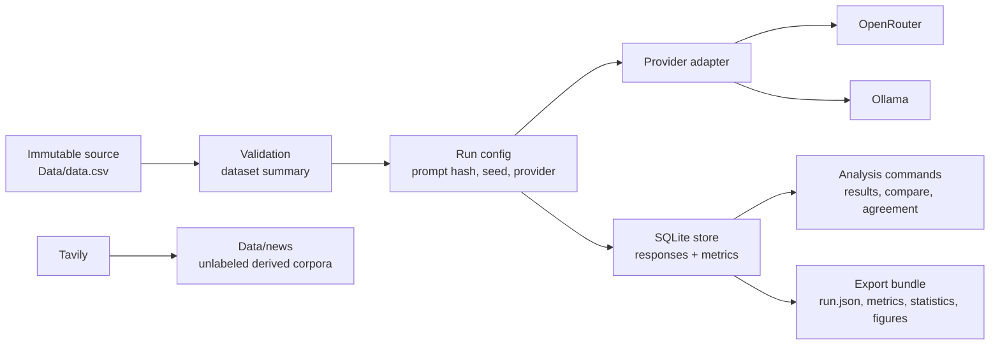

# Architecture

This project keeps source data, external article sourcing, model execution, scoring, and export evidence separated so dissertation results can be reproduced and audited.

## The Problem

Sentiment benchmark projects can become difficult to defend when they mix raw data, cleaned data, live API behavior, run results, and analysis exports in one place. The main failure modes are:

- The source dataset gets silently edited.
- API behavior drifts without recorded run context.
- Prompt changes are compared as if they were the same experiment.
- Generated article corpora are mistaken for labeled benchmark data.
- Results are reported without enough metadata to reproduce the row selection, model route, or prompt.

## The Approach



Core boundaries:

| Boundary | Responsibility |
| --- | --- |
| `Data/data.csv` | Immutable labeled benchmark source. |
| `src/sentiment_benchmark/dataset.py` | Dataset loading, validation, duplicate/conflict metadata. |
| `src/sentiment_benchmark/providers.py` | Chooses OpenRouter or Ollama client from provider settings. |
| `src/sentiment_benchmark/runner.py` | Executes model runs and stores responses. |
| `src/sentiment_benchmark/metrics.py` | Computes classification metrics and comparison statistics. |
| `src/sentiment_benchmark/storage.py` | Owns SQLite schema and persistence. |
| `src/sentiment_benchmark/exporter.py` | Writes reproducible run export bundles. |
| `src/sentiment_benchmark/news_source.py` | Sources Tavily article corpora without touching benchmark labels. |
| `src/sentiment_benchmark/tui.py` | Interactive Textual interface over the same services. |

## Why Two Scoring Scopes Exist

The dataset contains duplicate sentence groups with conflicting labels. Removing them entirely would hide a useful ambiguity signal, while including them in headline accuracy would make model comparison sensitive to known annotation conflicts.

The project therefore stores both:

- `primary`: excludes rows from conflicting duplicate groups and is used for headline comparisons.
- `all`: includes every selected row and is used for audit and ambiguity analysis.

This gives the dissertation a stable comparison scope without discarding the conflict evidence.

## Why Prompt Hashes Are Stored

Prompt wording, label order, few-shot demonstrations, and output format all affect model behavior. The benchmark stores prompt content by hash so two runs can be compared only when their prompt context is known.

Few-shot demonstrations are included in the prompt hash. A k-shot run is therefore a distinct reproducible prompt, even if it uses the same model and dataset rows as a zero-shot run.

## Why Providers Are Abstracted

OpenRouter and Ollama expose different Python clients and metadata. The benchmark normalizes them behind a small provider boundary so the runner can ask for the same operation:

```text
classify(model_id, prompt, sentence, request_settings) -> response record
```

The provider boundary keeps the dissertation storage format consistent while still recording provider route, base URL, latency, token usage, cost metadata when available, and raw response fragments.

## Why Tavily Outputs Are Separate

Tavily searches and extracts article text from the internet. Those articles are useful source material, but they are not labeled sentiment examples yet. Writing them under `Data/news` prevents accidental mutation of `Data/data.csv` and makes later labeling work explicit.

The Tavily corpus writer records:

- Query configuration.
- Fetch timestamp.
- Request IDs and usage metadata when returned.
- URL-normalized deduplication.
- Extraction status and errors.
- Raw Tavily payload fragments.
- Schema version.

## Trade-Offs

| Choice | Benefit | Cost |
| --- | --- | --- |
| SQLite local store | Simple, inspectable, no service dependency. | Not intended for multi-user concurrent experiment orchestration. |
| Ignored generated outputs | Keeps git clean and avoids large artifacts. | Formal outputs must be exported and registered deliberately. |
| Provider abstraction | Same benchmark flow works for OpenRouter and Ollama. | Lowest common denominator interface hides provider-specific advanced controls. |
| Primary/all scopes | Separates headline comparison from ambiguity audit. | Readers must understand which scope is being discussed. |
| Tavily corpora unlabeled by default | Prevents accidental weak labeling. | A later labeling workflow is required before articles can become benchmark rows. |

## Alternatives Considered

The current code favors conservative research traceability over automation. It does not automatically transform Tavily articles into a `Sentence,Sentiment` dataset because there is no labeling protocol yet. It does not edit the source CSV because derived data should carry provenance. It does not hard-code a single provider because the dissertation may compare API-hosted models with local Gemma-family models.
