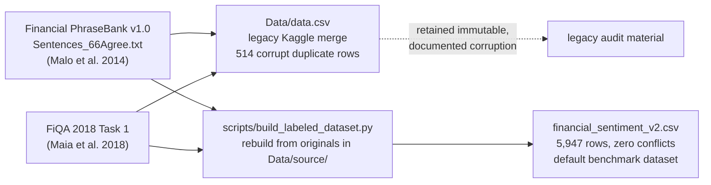

# Dataset Card

Last updated: 2026-06-12

Related documentation:

- [Getting started](getting_started.md)
- [Results and exports](results_and_exports.md)
- [Research protocol](research_protocol.md)
- [Tavily news sourcing](news_sourcing.md)

## Dataset Identity

- Default repository path: `Data/derived/labeled/financial_sentiment_v2.csv`
- SHA-256: `514dfc90316ec43617b7d59ac89a29d1063549ed91b08ef21cd11f5a8ac9ea9e`
- Build script: `scripts/build_labeled_dataset.py`
- Source citations: Financial PhraseBank v1.0 (Malo et al. 2014) and FiQA 2018 Task 1 (Maia et al. 2018)
- Current repository role: default dataset for dissertation sentiment benchmark experiments
- Legacy source path: `Data/data.csv`
- Legacy SHA-256: `3d86ea04e694471479b7473a84c005a5456491ddfdc43ce5340cb2ae1b6c6b05`
- Legacy public source citation: Kaggle Financial Sentiment Analysis, `sbhatti/financial-sentiment-analysis`
- Legacy source URL: <https://www.kaggle.com/datasets/sbhatti/financial-sentiment-analysis>

## Provenance (verified 2026-06-12, M1-5)

Every row of `Data/data.csv` was matched against the original sources. The file is:

- **Financial PhraseBank v1.0, `Sentences_66Agree.txt`** (Malo et al. 2014): 4,217 rows,
  matched exactly after encoding normalization. License CC BY-NC-SA 3.0.
- **FiQA 2018 Task 1** (Maia et al. 2018): 1,111 unique sentences with continuous
  target-level scores discretized to labels (18 rows carry mojibake from a UTF-8/Latin-1
  double-encoding error).
- **514 corrupt rows:** `Sentences_66Agree.txt` contains exactly 514 negative sentences,
  and every one of them appears in `data.csv` a second time relabeled `neutral`. These
  duplicated wrong-label copies are the entirety of the 514 "conflicting duplicate groups."

Consequences:

1. The conflicting duplicates are **merge corruption, not annotation disagreement**.
   They do not trace to PhraseBank's annotator-agreement tiers: 59% of the affected
   sentences have 100% human agreement, and the conflict rate is flat across tiers.
2. The `primary` scope (which excludes conflicting groups) therefore excludes **all**
   PhraseBank negatives; its 346 negatives come solely from FiQA, which is a different
   register (microblogs/headlines vs. news sentences). Per-class negative results on the
   primary scope of `data.csv` measure FiQA only.
3. The merge drops PhraseBank's 50-65% agreement tier (627 sentences) — the most
   human-contested items, which are the most valuable for ambiguity analysis.

**Default provenance-clean rebuild:** `Data/derived/labeled/financial_sentiment_v2.csv`, built by
`scripts/build_labeled_dataset.py` directly from the original sources (downloaded into
`Data/source/`). It has 5,947 unique sentences, zero duplicates/conflicts, 981 genuine
negatives, a `pb_agreement_tier` column (100/75/66/50 — graded human agreement from 16
annotators, 5-8 annotations per sentence), and FiQA's continuous scores preserved. See the
README written next to the file. Formal runs use this rebuild unless an experiment
explicitly records a different dataset path.

## Dataset Shape

The default file has:

- Rows: 5,947
- Columns: `Sentence`, `Sentiment`, `source`, `pb_agreement_tier`, `fiqa_score`,
  `fiqa_n_annotations`, `fiqa_sign_conflict`, `fiqa_format`
- Labels: `positive`, `negative`, `neutral`

Label counts:

| Label | Rows |
| --- | ---: |
| positive | 2,082 |
| negative | 981 |
| neutral | 2,884 |

Duplicate and conflict summary:

| Measure | Count |
| --- | ---: |
| Duplicate sentence groups | 0 |
| Extra duplicate rows | 0 |
| Conflicting duplicate groups | 0 |
| Rows in conflicting duplicate groups | 0 |
| Primary scoring rows after excluding conflicting duplicates | 5,947 |

Primary-scope label counts:

| Label | Rows |
| --- | ---: |
| positive | 2,082 |
| negative | 981 |
| neutral | 2,884 |

## Column Definitions

`Sentence` contains one financial-domain text item. Items may include company names, market commentary, financial results, headlines, stock symbols, or short social-media-style statements.

`Sentiment` is the assigned sentiment label:

- `positive`: text indicates favorable financial performance, outlook, market movement, or sentiment.
- `negative`: text indicates unfavorable financial performance, outlook, market movement, or sentiment.
- `neutral`: text is primarily factual, mixed, procedural, or lacks clear positive or negative sentiment.

## Intended Use

This dataset is used to evaluate and compare sentiment classification systems in a dissertation context. Suitable uses include:

- Benchmarking LLMs and non-LLM sentiment classifiers.
- Comparing prompt variants and model families on shared rows.
- Measuring robustness under prompt perturbation.
- Studying ambiguity through duplicate label conflict, model disagreement, and self-consistency entropy.

The dataset should not be used as evidence for trading decisions, financial advice, or claims about future asset performance.

News article corpora sourced through Tavily are separate derived source material under `Data/news/`. They are not part of this labeled benchmark dataset unless a later labeling workflow creates a documented derived dataset.

## Data Handling Rules

Do not manually edit `Data/derived/labeled/financial_sentiment_v2.csv`; rebuild it from
`scripts/build_labeled_dataset.py` so provenance and metadata stay synchronized. Do not
modify `Data/data.csv` in place. Treat it as legacy source material.

If cleaning, filtering, relabeling, or deduplicating is needed, write a derived file and document:

- Source file and SHA-256 hash
- Cleaning steps
- Label mapping
- Inclusion/exclusion rules
- Train/validation/test split logic
- Random seed
- Date and responsible experiment/run

Benchmark tooling uses two scoring scopes:

- `primary`: excludes rows from duplicate sentence groups with conflicting labels.
- `all`: includes every selected row and is used as an audit or ambiguity-analysis scope.

For the default v2 dataset these scopes currently contain the same rows because the
rebuild has zero conflicting duplicate groups. They remain distinct for legacy runs and
future derived datasets.

## Known Limitations

The dataset is imbalanced, with `neutral` as the majority class. Accuracy alone can therefore be misleading; macro-F1, balanced accuracy, MCC, and per-class metrics should be reported.

The 514 conflicting duplicate groups in legacy `Data/data.csv` are verified merge corruption (see Provenance above): duplicated copies of PhraseBank's negative sentences carrying a wrong `neutral` label. They are not evidence of annotation disagreement and must not be used as an ambiguity signal; PhraseBank's agreement tiers in the default v2 rebuild are the genuine human-disagreement ground truth.

The dataset is financial-domain text. Results may not generalize to product reviews, political text, general social media, or other sentiment-analysis domains.

The public source and license should be rechecked before final dissertation submission. Any redistribution limits from Kaggle or the original upstream data source should be respected.

## Ethical and Privacy Considerations

The file appears to contain public financial text, headlines, and market commentary. It may include company names, stock symbols, and short social-media-style statements. Avoid printing large raw samples in logs, exported reports, or final dissertation appendices unless the citation, licensing, and privacy implications are clear.

Models evaluated on this dataset may reproduce biases from training data or provider-specific moderation/parsing behavior. Report observed results without overstating model understanding or treating benchmark performance as financial expertise.

## Reproducibility Notes

Formal experiments should record:

- Dataset path and SHA-256 hash
- Code commit SHA
- Run IDs and export paths
- Prompt ID and prompt hash
- Model IDs and provider route
- Mode, seed, sample logic, temperature, token limits, retries, and concurrency
- Metrics, statistical tests, and interpretation notes

The experiment registry at `experiments/manifest.toml` is the source-controlled index for formal dissertation runs.
