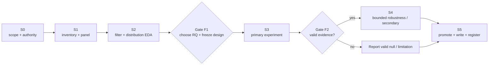

# Dissertation Execution Plan

Last updated: 2026-08-06

This is the delivery plan for the closing phase. The dissertation deadline is **1 September 2026**. Calendar promises from the superseded July 12 plan are retired; progress is controlled by evidence gates and stage exit conditions.

- Live checklist and decisions: [Final experiments plan](../final_experiments/plan.html)
- Scientific constraints: [Research protocol](research_protocol.md)
- Operational notebook/data map: [Final experiments README](../final_experiments/README.md)

## Outcome Contract

Deliver one defensible primary empirical result about firm-day news-sentiment measurement, plus at most one secondary result, with a complete reproducibility chain into the dissertation.

Completion requires:

1. a documented final RQ chosen at Gate F1;
2. one frozen primary estimand and development/evaluation design;
3. one reproducible analysis notebook/helper chain;
4. date-clustered or block-bootstrap uncertainty and declared multiplicity control;
5. attrition, nulls, invalidated runs, and timing/data limitations reported;
6. aggregate, licence-safe figures and tables promoted into the dissertation;
7. the accepted run registered with data/code identities;
8. no core evidence placeholders in the submitted chapter.

Profitability, a significant p-value, a neural network, and a wider news collection are **not** completion criteria.

## Current State

| Item | Status | Evidence |
| --- | --- | --- |
| Closing phase opened | Complete | `final_experiments/plan.html` |
| Primary data spine | Frozen: FNSPID 2011–2023 | `00_data_inventory` decision checklist |
| Robustness spine | Frozen: non-pooled LSEG sector-33 + midcap-22 | Plan and protocol |
| Earnings calendar | Gathered locally; caveats recorded | `final_experiments/data/earnings/` |
| Firm-day panel | Built: 715,546 rows, 570 priced symbols, 3,262 sessions | `01_panel` outputs/manifest |
| Chronological split | Frozen: development through 2019, evaluation from 2020 | `lib/panel.py`, plan, protocol |
| Final RQ | Open | Gate F1 after Stage S2 |
| Current active work | Decide the Gate-F1 dissertation framing from the completed evidence. Notebook 68 has frozen the return-blind 2,000-event Reuters parent sample, 1,445-event body-available population and 1,445/1,445 valid DeepInfra/Gemma annotations; the blinded 200/60 human audit remains open. Under the explicit model-only waiver, Notebook 69 completes a 1,200-event pre-2026 development analysis with zero confirmation returns opened. Its eight-test directional and three-test reaction-magnitude families are null after BH. A fixed h5 novelty-weighted materiality translation is descriptively cost-positive but does not beat cash; its favourable FinBERT comparison is outcome-selected post-primary. Notebook 70 adds the clean temporal falsification: the unchanged continuous rule is net-negative in both same-source LSEG blocks and every half. The viable writing contribution is the separation of measurement quality, semantic richness, implementation economics and predictive alpha—not a validated strategy. Historical strategy expansion remains closed and 2026 confirmation remains sealed. | Stage S2 exit / Gate F1; Notebooks 40–70 |
| Backward external-time arm | Post-stop sensitivities complete; hybrid and continuous-rule robustness rejected, original drift failure binding | Same 33 companies, 2024-01-01 to 2025-10-26; 21,912/21,912 terminal company-days and 1,219,608 unique scored hashes. Notebook 67's unchanged hybrid records backward net Sharpe −0.354 and −3.43% net return. Notebook 70's unchanged continuous rule records backward/opened net Sharpes −1.159/−2.391, every half negative, and an opened cash interval that is significantly negative after BH. The continuous joined path loses 30.00% net. The predeclared drift census still fails endpoint retention at 0.7881 versus 0.80, so neither sensitivity is the original replication or prospective evidence; `final_experiments/67_lseg_gemma_finbert_joined_long_window.ipynb`, `final_experiments/70_lseg_gemma_continuous_joined_long_window.ipynb` |
| Exploratory W3/W4 chain | Repaired and rerun; not promoted because it ran before Gate F1 | `03`–`07`, `INVALIDATED_RUNS.md` |
| Scorer selection | Closed: FinBERT primary | Benchmark and prior reports |
| VaR/ES | Closed | FNSPID factorial report |
| Ensemble search | Closed | Signal-portfolio report |

## Critical Path



Stages are sequential where later work depends on a frozen earlier decision. Notebook work within a stage may run in parallel when it does not open evaluation outcomes early.

## Stage Plan

### S0 — Scope, authority, and environment

**Status:** complete.

Outputs:

- `final_experiments/` phase and live HTML plan;
- agent instructions for notebook-first research mode;
- documentation authority hierarchy;
- explicit open-RQ status;
- output/data ignore boundaries.

Exit condition: current and historical plans are visibly separated; the research question is not hard-coded prematurely.

### S1 — Data inventory and firm-day panel

**Status:** complete for the current checkpoint chain.

Outputs:

- `00_data_inventory.ipynb`;
- FNSPID-versus-LSEG coverage/quality comparison;
- primary-spine decision checklist;
- LSEG FNSPID earnings calendar and licence record;
- `01_panel.ipynb` and `lib/panel.py`;
- firm-day panel, manifest, schema, attrition, and coverage plots under ignored outputs;
- development/evaluation split recorded before downstream scoring/model selection.

Exit condition: one auditable `(symbol, session_date)` panel with news, stock/market returns, earnings flags, split labels, and explicit unavailable fields.

Open integrity actions before final promotion:

- re-verify the large FNSPID archive checksums;
- decide or implement explicit sector mapping if RQ-E or sector demeaning survives Gate F1;
- preserve the current earnings-calendar coverage/title-filter caveat.

### S2 — Story filtering and within-day distribution EDA

**Status:** executable EDA complete. Expanded-LSEG publisher conditioning is a
clean null, the fixed sector-neutral/hysteresis translation improves turnover
but remains non-viable at 10 bps/side, and its paired-scorer robustness check
finds no statistically robust Gemma advantage. The apparent activity benefit
is partly a score-resolution-induced abstention policy: Gemma produces opposing
maximum-absolute ties on 47.73% of firm-opens under `strongest_event`. A
separate 200-event full-text cash-flow-distance audit pack and fail-closed
reliability notebook are prepared. Immutable ID/headline/body hashes bind the
worksheets to the frozen sample; current progress is A 0/200 and B 0/60. LSEG
story-family lineage is also now used directly: first-release filtering removes
8,314 later-revision-only hashes but leaves the frozen continuous strategy
decisively negative, so revision collapse is not a missing alpha mechanism.
Exit remains blocked by unlabelled human audits and unavailable publisher
fields on the primary FNSPID grain.

Goal: establish what the news panel contains before testing return outcomes.

Build:

- `02_filters_and_distribution.ipynb`;
- `lib/novelty.py` and `lib/distribution.py` for reusable, silently dangerous logic;
- source/publisher tables where available;
- novelty, repetition, recap/routine, and direct-target features;
- firm-day distribution summaries by story-count band;
- seeded human-audit template and adjudicated labels;
- `outputs/02_filters_and_distribution/manifest.json` and diagnostic figures.

Required analyses:

- mean, median, dispersion, skew, extrema, and sentiment-class shares;
- distribution by company, date, and story-count band;
- prevalence of duplicates/revisions/recaps/routine reporting;
- filter precision/recall or confusion table from the human audit;
- explicit feasibility assessment for publisher weighting on FNSPID versus LSEG.

Guardrail: do not inspect evaluation returns or rank aggregation rules on outcomes during S2.

Exit condition: the data fields and audit evidence support a documented feasibility judgment for each candidate RQ.

### Gate F1 — Choose the final RQ and freeze the analysis family

Record in `final_experiments/outputs/02_filters_and_distribution/decision.md` and update `plan.html`:

- one primary RQ and at most one secondary;
- visible evidence used for the choice;
- primary signal family and incumbent comparator;
- outcome and horizon set;
- timing/initial-reaction rule;
- development/evaluation boundary;
- model family and inference unit;
- multiplicity family and correction;
- fixed random seed(s);
- dropped candidates and why.

No evaluation-return comparison precedes this gate.

### S3 — Primary experiment

**Status:** blocked on Gate F1.

Use the notebook matching the chosen RQ:

| Chosen question | Primary implementation |
| --- | --- |
| RQ-A aggregation | `03_aggregation.ipynb`, `lib/aggregators.py` |
| RQ-B filtering | Filtering notebook extended into one frozen filtered-versus-unfiltered evaluation; no return-chosen source tiers |
| RQ-C surprise | `04_surprise.ipynb`, `lib/surprise.py` |
| RQ-D agreement | Complete the missing July 12 agreement-validation and LSEG model-panel prerequisites before outcome analysis |
| RQ-E thresholds | Not eligible as sole primary unless Gate F1 documents a validated base signal and sector/firm support |

Common evaluation harness requirements:

- identical row eligibility across compared rules;
- development-only preprocessing/fitting;
- one-shot evaluation opening;
- rank/forecast metrics before portfolio translation;
- daily cross-sectional HAC, date-clustered regression, or date-block inference as the estimand requires;
- full multiplicity family reported;
- effect size, interval, p/q-value, and independent-date count;
- nulls and failures preserved.

### Gate F2 — Evidence validity

Pass if:

- the frozen design ran without leakage or timing violation;
- row eligibility and attrition reconcile;
- uncertainty matches the dependence structure;
- multiplicity correction covers every opened comparison;
- the result is reproducible from recorded inputs and code;
- interpretation stays within the protocol.

Statistical significance is not a pass criterion. A valid null passes. A leaky or post-selected result fails and is reported as invalidated evidence.

### S4 — Bounded robustness and secondary analysis

**Status:** blocked on valid S3 evidence.

Exploratory work nevertheless ran out of order. The latest FNSPID risk-sizing
arms are preserved as such: firm-level brakes on monthly momentum are a clean
cost null, while fixed aggregate negative-pressure hysteresis raises the
descriptive 2020–2023 SPY Sharpe from 0.568 to 0.783 but fails its paired-return,
corrected-downside, and drawdown gates. The sentiment-free HAR volatility
target is the strongest independent base (net Sharpe 0.673; maximum drawdown
−15.73%). A sentiment feature inside its variance forecast fails, a standard
200-session trend layer weakens it, and the development-only surprise strategy
family is erased by costs. Multiplying HAR by the exact unchanged aggregate
hysteresis produces the chain's strongest descriptive gross/net Sharpes
(0.878/0.835) and lowers downside-squared loss (p=0.0148), but its paired return
interval spans zero, drawdown is slightly worse, and the advantage reverses
after 2020. A prior-only 2013–2019 walk-forward audit again lowers
downside-squared loss (p=0.0052), improves net Sharpe from 1.114 to 1.164, and
cuts maximum drawdown from −12.53% to −8.57%, but slightly reduces mean and
total return and misses the Sharpe gate. The combined evidence may motivate one
unchanged-product downside-risk test on genuinely new data; it is not S4
confirmation or a promoted strategy.

The separately maintained
[`sentiment-trading-llm`](https://github.com/PeterLP123/sentiment-trading-llm)
replication was re-audited at main commit
`204f63e5831b2063e378acdc7406ead621945838`. Its validity-corrected public-data
test is corroborating null evidence, not a strategy base to import: chronological
FinBERT return-direction accuracy is 0.512, fixed-effects within R² is 0.0002,
and the fully costed dense-calendar FinBERT long/short portfolio has Sharpe
−4.15 and cumulative return −21.2%. Exact turnover costs total about 24% across
the chronological portfolios. Its useful controls—chronological splitting,
publication buckets, dense calendars, point-in-time eligibility, and exact
weight turnover—are already binding here. Do not repeat its top/bottom-quintile
sentiment strategy or scale the language model on the same outcomes.

The resulting base decision is explicit: retain the sentiment-free HAR
volatility target as the independent price/risk research benchmark, but not as
a time-stable or deployment-qualified strategy. LSEG/Gemma remains essential
measurement and robustness evidence, but
Notebook 43's direct negative LSEG replay means the continuous rule is no longer
a historical strategy base or a reason to design another overlay on opened
returns. At most, its exact frozen specification can receive one prospective
new-date replay. Notebook 42's negative 2010 replay, Notebook 43, and the public
replication jointly argue against another historical sentiment-ranking search.

Notebook 44 makes that base decision auditable without reopening row-level
outcomes. Refreshed through Notebook 70, it assigns an ordinal evidence tier to
26 representative strategy rows, keeps cross-regime Sharpes explicitly
non-comparable, and applies one promotion policy to eighteen paired sentiment or
construction comparisons. One favourable interval excludes zero: Notebook 47's retrospective
revision-delta comparison with a matched latest-score-level construction. It is
not a cash-alpha result and does not pass promotion. Six comparisons report
lower downside loss, and the portable continuous rule is
net-negative at 10 bps/side in every one of seven reported regime/split rows.
HAR is therefore the independent research benchmark, but no strategy is now a
deployment-qualified base. LSEG/Gemma remains central measurement and
non-pooled risk-mechanism evidence, not a selected alpha strategy. This
synthesis informs but does not take Gate F1. Notebooks 53–54 change only the
prospective readiness status. Notebook 55 adds one aggregate historical
strategy row without constructing a new return: the frozen mid-cap FinBERT
event rule has +4.00% evaluation net return, 0.593 net Sharpe, and 16.52
bps/side break-even, but its [−8.86,+19.34] bps/session cash interval crosses
zero, only 37 evaluation sessions are active, and maximum name weight is 50%.
The original local gate passes, so preserve it as a tier-2 historical
LSEG/FinBERT comparator; it is not the current base, a Gemma head-to-head result,
or promoted alpha.

Notebook 56 closes the local LSEG/FinBERT baseline-coverage question without
reopening outcomes. Ten frozen run directories reduce to five exact metrics
payloads and four declared strategy families; repeated payloads are artifacts,
not replications. Only the Notebook 55 mid-cap event family clears the
descriptive floor of positive development/evaluation net return and Sharpe with
at least 20 active sessions in each period. The sole other positive evaluation
arm has net Sharpe 0.545 on five active sessions after development Sharpe
−1.456. No distinct adequately covered positive base is omitted, no new return
is constructed, and no strategy is promoted.

Notebook 57 makes the base stack explicit without adding a return or reselecting
from outcomes. Notebook 21 HAR remains the research benchmark; Notebook 36's
equal-weight Gemma-timing/FinBERT-ranking hybrid is the sole prospective strategy
candidate; Notebook 50 inverse-volatility remains a non-promoting risk
diagnostic; and Notebook 55 remains historical context. The primary candidate's
opened-window gross/net Sharpe is 3.700/2.271 at 10 bps/side, its 5-bps scenario
net Sharpe is 2.995, break-even is 25.24 bps/side, both halves are positive, and
the cash interval is [+0.41,+13.37] bps/session. This is economically decent
retrospective evidence, not validated alpha: its sector-factor interval
[−0.44,+10.08] crosses zero and the candidate was selected iteratively. Under
Y=1 impact, net Sharpe is 1.679 at $1m, 0.413 at $10m, and −0.632 at $25m, where
ten orders exceed 5% ADV. Carry the exact strategy forward once; do not use this
frontier to reopen historical tuning.

Notebook 58 preserves that candidate, cost model, impact coefficient, and full
AUM grid, then adds one pre-outcome-frozen sampling-uncertainty gate. Identical
9,999 five-session circular-block resamples are used at every grid point; a
point must have a strictly positive 95% mean-net interval, at least 95% positive
terminal paths, positive observed net Sharpe in both halves, and no order above
5% lagged ADV. No AUM passes. At $1m, the point Sharpe remains 1.679, but the
mean-net interval is [−1.29,+11.64] bps/session, only 93.48% of terminal paths
are positive, and second-half Sharpe is 0.016. At $10m, the interval is
[−5.20,+8.02], the probability is 62.53%, and second-half Sharpe is −2.011.
Therefore Notebook 51's $10m result is an optimistic point-estimate scenario
bound, not uncertainty-qualified capacity. The frozen prospective candidate is
unchanged and no alpha or deployment claim is promoted.

Notebook 59 adds an exact, pre-outcome-frozen accounting decomposition without
changing the candidate or exit. Intraday supplies +6.465 bps/session
[+1.420,+11.555] with BH q=0.0242 and 57.38% of gross contribution; overnight
supplies +4.802 [+0.113,+10.141] with q=0.0611. More importantly, the unchanged
long leg supplies 97.43% of total arithmetic gross contribution and has gross
Sharpe 4.344 with positive first/second-half Sharpes 4.254/4.856, versus 0.163
for the short leg. This narrows the historical strategy story to a long-side,
partly intraday mechanism; it does not license a long-only or intraday strategy.

Notebook 60 freezes one gross-only exposure control around that finding. The
selected long weights beat same-date equal-weight market exposure by +8.362
bps/session [+3.407,+13.780] (BH q=0.0038) and same-sector equal weight by
+3.662 [+0.952,+6.623] (q=0.0121), with both differences positive in both
halves. This is useful evidence that the opened-window long result is not only
broad-market or between-sector exposure and contains within-sector name-selection
value. But the diagnostic creates no control strategy, cost, turnover, or net
return and cannot repair the Notebook 36 factor-alpha interval or serve as
independent confirmation. Preserve the original long/short prospective rule.

Notebook 61 closes the session-component branch. It exactly decomposes the
Notebook 60 selected-long minus same-sector difference into intraday +1.454
bps/session [−0.324,+3.399] and overnight +2.208 [−0.006,+4.845]. Neither
passes the frozen two-test correction (both BH q=0.1264), and overnight changes
from +4.747 bps/session in the first half to −0.362 in the second. The total
sector-matched result remains useful gross name-selection evidence, but there is
no stable or statistically isolated intraday/overnight mechanism. Do not create
a component exit or continue historical session, direction, threshold, or
allocation decomposition.

Notebook 63 makes one final joint characteristic attribution without changing
the selected-long path. Strictly lagged 1/5-session returns, 20-session
volatility, and log ADV explain −0.073 bps/session of Notebook 60's +3.662-bps
same-sector difference. The coefficient-refitting block-bootstrap residual is
+3.735 bps/session [+0.867,+6.746], p=0.0086, with positive halves
(+5.335/+2.116) and gross diagnostic Sharpe 3.144. This is useful retrospective
evidence that the name-selection result is not a simple proxy for those four
characteristics. It is not a residual strategy, independent confirmation, or
alpha promotion. Do not add controls or alter the frozen prospective hybrid.

Notebook 64 is the one user-authorized costed translation of Notebook 60's
controls. It preserves every selected-long date, name, and weight, then nets
either the equal-weight market or same-sector control by name before charging
drift-aware 10-bps costs and final liquidation. The market residual has net
Sharpe 2.332, +8.70% return, −1.85% drawdown, 55.20 turnover, and 25.30-bps/side
break-even, versus 2.271, +11.82%, −2.90%, 74.56, and 25.24 for the unchanged
incumbent. Its +5.06-bps/session cash comparison [+0.29,+10.40] has BH q=0.0966,
its sector-factor alpha has q=0.0970, and its mean return is −1.75 bps/session
below the incumbent [−5.65,+1.99]. The sector residual has net Sharpe 0.818 and
a negative second-half mean. Both frozen classes are `nonviable`. Preserve the
market hedge only as descriptive risk-efficiency evidence and reject the sector
hedge; neither replaces the prospective candidate or licenses further hedge or
scaling search.

Notebook 65 tests one return-blind Reuters-metadata specificity filter on the
Gemma timing/count leg while retaining Notebook 36's unfiltered FinBERT ranks.
The first contract stopped before returns when filtered FinBERT left one missing
firm-open rank; the replacement was frozen before outcomes and changes only the
Gemma leg. Defined Gemma strongest-event firm-opens rise from 3,841 to 4,826,
but active both-sign sessions collapse from 70 to 22. Gross/net Sharpe falls to
1.508/0.881 and net return to +3.09%. Cash [+1.88 bps/session; −2.64,+7.01],
incumbent improvement [−4.93; −10.82,+0.59], and sector-spanning alpha [+1.00;
−2.46,+4.46] all fail. Preserve this `nonviable` specificity-versus-breadth
mechanism result; do not test another historical metadata filter or alter the
prospective candidate.

Notebook 62 is the executable human cash-flow-distance reliability gate, not a
strategy experiment. It verifies Notebook 16's frozen worksheet identities,
reports aggregate coding progress, and remains stopped at A 0/200 and B 0/60.
After both sheets are complete it will compute the predeclared weighted kappa,
9,999-resample event-bootstrap interval, exact/adjacent agreement, and 5×5
confusion matrix. `NA` pairs are excluded from ordinal kappa and at least 48/60
pairs must be jointly numeric. No sentiment score, machine-proxy validation, or
return is opened by this notebook.

Notebook 45 separates unusually informative timing from the mechanical effect
of reducing exposure. Every circular placement of the exact state is evaluated
in 2013–2019, 2020–2023, and the non-pooled LSEG/Gemma window. The observed
2020–2023 HAR overlay ranks at the 99.1st percentile for downside reduction and
passes the three-test family (p=0.0100, BH q=0.0301). The earlier FNSPID schedule
is suggestive but misses BH (p=0.0455, q=0.0682); the Gemma firm brake is not
unusually timed (p=q=0.3653). No return-timing test passes, so both cross-regime
gates fail. This narrows the useful claim to one-period aggregate market-risk
timing and rejects a general Gemma/downside mechanism. A prospective replay still
does not run: the first local news batch after 2026-06-26 now exists, but
Notebooks 53–54 show that its interval has only a 27-session XNYS upper bound versus
the frozen 120-session minimum.

Notebook 46 transfers Notebook 21's unchanged 2011–2019 HAR coefficients and
QLIKE scale to the 167-session 2025–2026 LSEG S&P 500 window, then applies a
parameter-free market aggregate of Notebook 26's Gemma firm brakes. HAR lowers
annualised volatility to 9.74% and drawdown to −7.77%, but its net Sharpe is
0.240 versus 0.940 for constant matched exposure and its paired timing effect is
−2.731 bps/session [−4.394,−1.360]. Both external-time base gates fail. The
Gemma breadth modifier adds +0.013 bps/session and +0.007 Sharpe. Its downside
reduction passes the two-test family (BH q=0.0244), but drawdown improves only
1.4% and the downside advantage is absent versus a constant multiplier
(p=0.8218). This is mechanical exposure reduction, not semantic timing or
alpha, and leaves no deployment-qualified base.

Notebook 47 uses the expanded LSEG/Gemma data to isolate first-to-current
sentiment changes within Reuters story families. Its hash-only ledger yields
8,654 eligible transitions, 1,606 nonzero original-33 firm-open updates, and
165 both-sign sessions. The frozen one-session revision-delta spread has
gross/net Sharpe 1.523/−1.866 and 4.49-bps/side break-even. It is not better
than cash with uncertainty accounted for, but it beats a matched
latest-score-level construction by +15.620 bps/session
[+2.683,+28.725] (BH q=0.0368). This is useful evidence that revision direction
contains incremental gross information; costs, factor controls, and dependence
checks prevent an alpha claim.

Notebook 48 carries each firm's last nonzero revision sign until replaced, the
only parameter-free implementation repair permitted after Notebook 47. It cuts
turnover by 72.3%, raises break-even to 8.15 bps/side, and produces gross/net
Sharpe 1.459/−0.331 with −1.39% net return at the binding 10-bps cost. The
persistent-minus-event interval narrowly includes zero after BH, second-half
net Sharpe is −1.074, and factor/dependence checks fail. Preserve the cost
frontier—positive at 1–5 bps/side—as an implementation result, but do not tune
expiry, decay, thresholds, lookbacks, or holding periods on this opened window.

Notebook 49 closes the only predeclared semantic restriction left by the gross
revision result: require the first and current Gemma scores to cross zero.
Return-free feasibility is adequate—467 original-33 transition associations,
390 firm-opens across 32 companies, and 74 both-sign sessions—but the strategy
has gross/net Sharpe 0.256/−1.646, −7.17% net return, and only 1.34-bps/side
break-even. It does not differ reliably from cash or the broad revision arm,
the conditional random-name p-value is 0.4227, second-half gross Sharpe is
−0.008, and the sector-factor intercept is significantly negative. Preserve
this as evidence that dramatic tone reversals are not the source of Notebook
47's gross effect and stop further revision filters on the opened window.

Notebook 50 asks whether a conventional risk base can improve the strongest
same-window LSEG/Gemma construction without altering its information set.
Gemma exact events still set all 70 dates and long/short counts; FinBERT ranks
still select the names. The existing portfolio projector replaces equal leg
weights with inverse weights from strictly lagged 20-session open-return
volatility (five-observation minimum, 50-bps floor), retains the 25% cap and
dollar neutrality, never adds leverage, and leaves unused capacity in cash.
The rule passes its return-blind feasibility gate and cuts target turnover
11.7%. At 10 bps/side, annualised net volatility falls from 7.55% to 6.47% and
total turnover from 74.56 to 65.86; gross/net Sharpe remains 3.691/2.207 with
+9.77% net return. The equal-weight hybrid is still slightly better at
3.700/2.271 and +11.82%, and the paired difference is −1.136 bps/session
[−2.679,+0.216] (BH q=0.123). Cash BH q=0.111 and sector-factor alpha
p=0.0919 fail, so this is a useful risk/cost trade-off null rather than a base
replacement or alpha promotion. Freeze the equal-weight hybrid for any future
new-date replay and stop allocation tuning on this opened window. The versioned
forward contract is
`final_experiments/frozen_specs/lseg_gemma_finbert_hybrid_prospective_v1.json`:
it excludes the opened window and stops before inference until at least 120
complete sessions, 60 active sessions, and 20 active sessions per half exist.

Notebook 51 estimates implementation capacity without changing that frozen
hybrid. Its assumptions are source-controlled before calculation: lagged
20-session close-times-volume ADV and open-return volatility, 10 bps/side fixed
cost, a primary square-root impact coefficient Y=1 (Y=0.5 sensitivity), a
predeclared $1m–$1bn AUM grid, and a hard 5%-of-full-day-ADV ceiling. Zero impact
reproduces the core drift ledger and Notebook 36 to numerical precision, and
all 419 nonzero orders have valid point-in-time liquidity. Under Y=1, $1m
retains net Sharpe 1.679 and +8.53% return; $10m retains 0.413 and +1.89%, with
maximum participation 2.30%. At $25m, net Sharpe is −0.632, return is −3.29%,
and ten orders breach the ceiling (eight DUK, two PLD). The optimistic grid
capacity bound is therefore $10m. Because full-day ADV overstates liquidity
available specifically at the open and the impact coefficient is a scenario,
this is an upper-bound implementation result, not deployment validation or new
alpha evidence.

Notebook 52 tests the single analytical implementation implication without
opening a new return search. Within each unchanged leg it allocates in
proportion to lagged `ADV / max(sigma, 0.005)^2`, with deterministic water
filling at the 25% cap. The frozen input gate requires the same 70 event dates,
names, signs, leg budgets, neutrality and cap, complete lagged inputs, a lower
from-flat impact proxy, and target-path L1 turnover no greater than equal
weighting. All information-preservation conditions pass and the proxy falls
6.08%, but target turnover rises 0.54% from 74.458 to 74.858. The rule therefore
stops with `returns_constructed = false`; no modified next-open return is
inspected. This closes liquidity-weight smoothing or shrinkage on the opened
window and leaves the equal-weight hybrid as the prospective candidate.

Notebook 53 starts the prospective evidence stream without opening outcomes.
Its source-controlled acquisition contract freezes the exact original 33,
2026-06-26 inclusive to 2026-08-06 exclusive, all entitled English-language
headlines, no story bodies, no pooling, and an explicit paid-scoring boundary
before retrieval. The completed local collection has 162,123 source story/headline rows,
162,049 strictly post-cutoff, 74 exactly at the shared boundary, zero before it,
all 33 symbols, zero failed stories, and zero pagination anomalies. The
metadata-only gate loads no price or return and launches neither FinBERT nor
paid Gemma. Because the closed interval can contain only 27 eligible XNYS
sessions, it stops before the 120-session minimum; 2026-12-16 is the earliest
possible 120th session. Continue immutable accumulation, then apply the 60
active-session and 20-per-half gates before the one-shot replay.

Notebook 54 adds the cumulative batch ledger required to repeat that process
without mutating an earlier population. The append-only registry contains the
parent and acquisition-spec hashes; `lib/prospective.py` verifies all spec,
config, manifest and headline-file hashes, contiguous intervals, the frozen 33,
headline-only retrieval, timestamps, pagination status, and cross-batch
deduplication. For batch one it resolves 130,742 source-file unique normalized
headlines and 130,692 strictly post-cutoff eligible hashes from 162,049 eligible
story rows, excluding 11 empty-normalized rows. That is 19.35% fewer possible
scoring requests, or about $4.95 at the previous realised Gemma average. The
amount is a planning estimate only; paid Gemma is not authorised. The ledger
loads no price or return, adds no strategy row, and leaves the 27/120 stop
unchanged.

The expanded LSEG/Gemma panel now contributes a separate mechanism check rather
than only scorer and cross-sectional nulls. Notebook 26's semantic sparse brake
cuts a fixed-share company holding only on a maximally negative Gemma event. At
10 bps/side it raises basket net Sharpe from 1.472 to 1.526 and produces a
BH-significant downside-squared reduction (p=0.0088), but its +0.148 bps/day
paired return gain is uncertain and both promotion gates fail. The exact
aggregate hysteresis is not evaluable on this window after its unchanged causal
warm-up (41 finite-z sessions; one trigger). This is non-pooled, retrospective
support for the risk-control mechanism, not S4 confirmation.

Notebook 27 closes the remaining obvious exposure-composition ambiguity without
a parameter sweep. Treating the unchanged 25% sentiment state as an absolute
HAR cap gives net Sharpe 1.176 before 2020 and 0.769 in 2020–2023, compared with
1.164 and 0.835 for the existing product. It reduces downside-squared loss
versus HAR in both eras and has higher Sharpe than HAR in every reported
subperiod, but it does not dominate the product, and its operator, alpha, and
useful-risk gates all fail. Retain the product as the incumbent new-data
candidate and stop tuning exposure composition on the opened samples.

Notebook 28 provides the strongest descriptive LSEG/Gemma portfolio translation
without rescuing the alpha claim. A sparse exact −1-to-+1 rotation reaches
gross/net Sharpe 1.692/1.560 and +10.76% net return at 10 bps/side, versus
1.500/1.472 and +10.01% for the fixed-share basket. Its incremental gross
break-even over the negative cash brake is 23.46 bps/side, but paired return
intervals span zero, downside is not improved, and temporal-half differences
reverse. Keep it as a licence-safe descriptive strategy result; do not promote
it or search additional score thresholds on this opened eight-month window.

Notebook 29 isolates the Gemma signal from the long-market basket with a frozen
gross-1 dollar-neutral exact +1/−1 spread. It is active on 80/167 sessions and,
at 10 bps/side, reaches gross/net Sharpe 2.558/1.185, +10.74% net return, and
18.52-bps gross break-even. A count-matched conditional random-label test gives
one-sided p=0.0094, so the mechanism gate passes. The alpha and strategy-quality
gates fail: net mean +6.49 bps/session has interval [−4.52, +16.95] (p=0.238),
first-half net Sharpe is −0.378 versus 2.912 in the second, and 66/80 active
sessions have a one-name leg. Goldman Sachs supplies 51.5% of gross profit, but
all 44 leave-one-company-out replays remain profitable; a two-name-per-side
diagnostic has net Sharpe 2.088 on only 14 active sessions. Preserve this as the
strongest cost-surviving LSEG/Gemma mechanism and freeze the rule for an
independent longer-period test. It is not a promoted or deployable strategy.

Notebook 30 applies the 25% maximum single-name condition that Notebook 29 had
already declared as its strategy-quality requirement. It preserves the exact
Gemma signs and 80 active sessions, scales both legs to the sparse side's name
capacity, and leaves unused notional in cash. At 10 bps/side, capped versus
uncapped net Sharpe is 1.697 versus 1.185, net return +10.20% versus +10.74%,
maximum drawdown −4.97% versus −7.85%, turnover 40.7% lower, and break-even
23.24 versus 18.52 bps/side. The standalone quality gate passes, paired
downside improves after BH (p=0.012), both temporal-half Sharpes are
non-negative, and all 44 leave-one-company-out replays remain positive. But
capped-minus-uncapped mean return is −0.514 bps/session [−5.483, +4.291]
(p=0.832), and capped-versus-cash is +5.974 bps/session
[−0.973, +13.217] (p=0.100). Treat it as the first decent risk-controlled
candidate in this chain, not validated alpha or a statistically superior cap.
Its next defensible use is an independent longer-period replay with the exact
rule frozen.

Notebook 31 applies exact within-sector demeaning to the capped targets. The
local earnings calendar has zero date overlap with the LSEG panel and an exact
same-sector +1/−1 design has only 9 sessions, so sector demeaning is the only
feasible return-blind factor-control arm. It removes sector-dollar exposure and
reduces equal-weight-market beta, but net Sharpe/return collapse to
−1.857/−6.78%; the paired loss is −10.118 bps/session
[−15.491, −4.902] (BH p=0.0004). A labelled post-result decomposition attributes
87.3% of the loss to removed gross return rather than added trading cost. The
useful boundary is that the positive Gemma result is between-sector, not
within-sector stock selection.

Notebook 32 tests that complementary between-sector projection once: replace
each capped stock weight by its frozen sector mean and spread sector notional
equally across four names. At 10 bps/side it achieves gross/net Sharpe
3.805/1.868, +6.42% net return, −3.80% drawdown, 19.36-bps break-even, and a
12.5% maximum name weight. The sector-placement randomisation passes
(one-sided p=0.001), downside improves after BH (p=0.0094), and all 44 company
and 11 sector exclusions remain profitable. It is still retrospective:
projected-minus-capped return is −2.198 bps/session [−7.604, +3.127] (p=0.418),
the cash interval crosses zero (p=0.113), and first-half net Sharpe is −0.119.
This is the chain's cleanest strategy-shaped mechanism result, but only a frozen
secondary new-date arm; Notebook 30 remains primary because the policy gate did
not pass. It is not alpha or permission to tune a component blend.

Notebook 33 applies a separate immutable-universe robustness test: remove the
fourth, later-added company from every sector and replay both frozen rules on
the original 33 companies. The capped rule reaches gross/net Sharpe
3.344/2.046, +10.42% net return, −3.42% drawdown and 25.37-bps break-even; the
three-name sector projection reaches 4.183/2.421, +8.07%, −2.66% and 23.25 bps.
Both universe-quality gates pass and both halves are positive. Sector placement
again beats the matched random-assignment null (p=0.001), while every company
and sector exclusion remains profitable. The projected cash interval is
nominally positive (p=0.0346) but fails BH across the two frozen rules; neither
alpha gate passes. The 11 additions alone have only three eligible sessions and
cannot form multi-name sector baskets. This strengthens same-window universe
robustness, not time validation; keep the exact rules frozen.

Notebook 34 performs one matched-count scorer substitution rather than a broad
bake-off. Gemma keeps control of the original-33 activity dates and daily
long/short counts; FinBERT only ranks which names receive those fixed slots.
FinBERT cannot generate the exact-event trigger because it has zero exact +1/−1
strongest-event values. Its capped rank substitute is nevertheless
descriptively stronger than Gemma (net Sharpe 2.271 versus 2.046; +11.82%
versus +10.42%), whereas Gemma remains stronger after the sector projection
(2.421 versus 1.630; +8.07% versus +5.43%). Paired intervals span zero and the
ordering reverses across halves, so both scorer-selection gates fail. The
useful hypothesis is a Gemma event-timing gate with potentially competitive
FinBERT name ranking; it is not an authorised hybrid switch on this window.

Notebook 35 tests that timing component against every non-zero circular shift
of the complete 167-session Gemma event/count schedule. Event frequency, daily
positive/negative counts, clustering, FinBERT ranking, the 25% cap, one-session
horizon, 10-bps cost and ledger accounting remain fixed. The capped hybrid's
observed net mean is 6.802 bps/session versus a 0.217-bps shift mean; its
6.585-bps advantage ranks above 98.19% of shifts (one-sided p=0.0240). The
projected hybrid is 3.213 versus −1.277 bps, a 4.490-bps advantage above 97.59%
(p=0.0299). Both tests survive BH across the two rules, break-even exceeds cost,
and both observed half Sharpes remain positive, so both timing gates pass. This
is the strongest evidence that Gemma adds **when-to-trade** information to the
hybrid. It remains same-window circular-shift evidence, not validated alpha.

Notebook 36 freezes the single capped Gemma-timing/FinBERT-ranking hybrid and
audits it directly rather than searching another family. At 10 bps/side its
gross/net Sharpe is 3.700/2.271, net return is +11.82%, maximum drawdown is
−2.90%, and break-even is 25.24 bps/side. The five-session block comparison
with cash is +6.802 bps/session [+0.414,+13.371] (p=0.039), both chronological
halves are positive, and all 33 company plus 11 sector exclusions remain
positive. The frozen retrospective cash and dependence gates therefore pass.
The stricter HAC(5) market-plus-sector-spread intercept is +4.823 bps/session
[−0.436,+10.083] (p=0.072), so the factor-alpha gate fails. Treat this as the
leading LSEG/Gemma candidate and useful evidence against a single-name or
single-sector explanation, not validated alpha. Further same-window tuning is
closed; the next test is a genuinely new-date or separately frozen external
replay.

Notebook 37 then tests whether that candidate's exact numeric ±1 event trigger
is portable across Gemma implementations. On the 85,960 hashes shared by the
older partial Cerebras Gemma 31B checkpoint and complete DeepInfra Gemma 26B
checkpoint, 31B emits 10,172 exact endpoints versus 95 for 26B (107.1×).
After identical aggregation, eligible-date Jaccard is 0.059 and the
positive/negative daily-count correlations are 0.035/0.016. Matched-coverage
26B has only six eligible sessions, so it stops before returns. The permitted
31B-trigger/FinBERT-rank stress test has gross/net Sharpe 1.624/−0.543,
−2.73% net return, 7.50-bps break-even, negative Sharpes in both halves, and
one-sided timing p=0.204. Both transfer and timing gates fail. Notebook 36
remains the leading same-window candidate, but the endpoint equality is now a
model/prompt calibration property rather than a portable semantic rule.
Independent validation requires a calibration-aware event definition frozen
without reference to the opened 167-session returns.

Notebook 38 freezes the first public-label-calibrated attempt: the 0.65
directional threshold is selected without LSEG returns and reaches held-out
precision of 82.9% positive/83.0% negative. It fails at the firm-open
construction rather than the public measurement gate. Of 5,511 original-33
firm-opens containing at least one selected direction, 5,472 contain both
positive and negative selected headlines (99.29%); binary collision abstention
therefore leaves only two active sessions. Gross/net Sharpe is
−0.755/−1.013, cash p=0.577, timing p=0.743, and sector-spanning alpha p=0.428.
Every return and dependence gate fails. This closes the independent-binary-
threshold route. A future new-date rule may preserve the same public threshold
but must resolve firm-open direction with continuous confidence or margin
specified without these opened returns.

Notebook 39 completes that return-free base construction. On 85,960 shared
hashes, 31B-versus-26B headline-score Spearman is 0.953; at firm-open grain the
mean signed score reaches Spearman 0.983, 93.9% sign agreement, median daily
rank correlation 0.977, and top-two/bottom-two Jaccard 0.720/0.864. Its
scale-free trailing-dispersion schedule has 22 active dates per model, 17
shared (Jaccard 0.630), with shared-date name Jaccard 0.647/0.922. Mean
continuous passes every frozen portability gate; strongest event fails both.
On the complete 888,155-headline input, the retained rule yields 40 active
sessions among 127 post-warm-up sessions without loading a return. Freeze the
manifest specification: mean continuous firm-open sentiment, q90−q10 spread at
or above the strictly prior trailing-60 75th percentile after 40 observations,
top two/bottom two names, 25% cap, one-session hold, and 10 bps/side. This is a
portable and feasible strategy base, not alpha evidence.

Notebook 40 then translates that construction once into the broad FNSPID panel,
freezing relative breadth before reading its returns because only 9/33 original
LSEG names overlap. On 998 evaluation sessions the translated FinBERT rule has
gross/net Sharpe 1.056/−1.103, gross/net return +27.29%/−23.27%, and 4.904-bps
break-even at 0.507 mean turnover. Its net mean is significantly below cash,
both evaluation-half net Sharpes are negative, development gross Sharpe is only
0.187, and timing, BH-controlled mechanism, factor-alpha, and deployment gates
all fail. The nominal matched-random-name result (p=0.035; q=0.070) and broad
566-symbol attribution justify reporting a diversified gross ranking effect,
not deployment or scorer equivalence. This is post-research cross-regime
evidence because FNSPID evaluation outcomes had already been opened elsewhere.
No strategy parameter may be selected from these realised returns.

Notebook 41 then tests the one obvious lower-turnover shortcut without loading
any return: hold the active episode's opening basket until the dispersion gate
turns off. Target turnover falls 32.35%–43.30%, but the retained names cease to
represent the current signal. Continuation long/short Jaccard is 0.275/0.157 in
LSEG/Gemma and roughly 0.02–0.03 in both FNSPID eras, failing every frozen
persistence gate. Median active-episode length is one session, and target-only
entry/exit cost remains 11.03–12.84 bps per active session. The candidate stops
before returns. This rules out holding stale ranks as the bridge from gross to
net performance.

Notebook 42 then applies the unchanged LSEG/Gemma-derived construction to a
separately extracted pre-2011 FNSPID checkpoint. The 41,019 locally scored
headlines provide 59 fully tradable active 2010 sessions after late-2009
warm-up. Gross/net Sharpe is −1.141/−3.397, gross/net return is
−5.53%/−15.87%, and break-even is −4.802 bps/side. Both halves are negative;
cash, timing, name-selection, and factor-alpha gates all fail. The initial
file-level price-filter execution is invalidated because it admitted later IPOs
and forced 95 sessions to cash; the corrected valid-current-open replay has
zero missing selected returns. Although later-survivor conditioning prevents a
pristine holdout claim, this rejects a stable cross-era alpha interpretation of
Notebook 40. Do not reverse or retune the rule on 2010.

Notebook 43 uses the complete LSEG/Gemma corpus to close the remaining
revision-overweighting explanation. A return-independent first-release screen
removes 8,314 later-revision-only hashes (0.936%), changes 1,938 firm-opens and
eight frozen decision dates, and leaves a 43-active-session strategy. It does
not rescue the exact Notebook 39 construction. All-headline versus
first-release-only gross Sharpe is −1.737/−1.473, net Sharpe is
−2.635/−2.502, and net return is −18.13%/−16.82%. The +0.935-bps/session
paired improvement has interval [−0.652,+2.619] and BH q=0.262; the filtered
strategy is significantly below cash (BH q=0.0366) and both halves are
negative. This is retrospective because the LSEG return window was already
opened, but it directly shows that the portable continuous Gemma measurement
rule is not historical alpha and that revision collapse is not the missing
fix. Do not search another story-family rule on this window.

Priority order:

1. use Notebooks 44–70 to write the cross-regime conclusion: HAR remains the independent price/risk research benchmark but is not time-stable or deployment-qualified; aggregate sentiment shows one-period downside timing; Gemma/LSEG adds mechanical de-risking and gross opened-window mechanisms, but the unchanged hybrid fails its earlier same-33 robustness block. Notebook 70 independently closes the continuous alternative as a historical strategy: backward/opened net Sharpes are −1.159/−2.391, every half is negative, and the opened block is significantly below cash. High duplicate-score rank repeatability therefore does not imply economic portability. The original Gemma drift failure separately prevents a preregistered-replication claim. Preserve implementation and measurement diagnostics as secondary evidence, not as a strategy rescue;
2. treat Notebooks 42–43 as falsifications and Notebooks 47–49 as a bounded mechanism/cost frontier, not permission to reverse sentiment, tune revision persistence, or search another revision filter on opened outcomes;
3. finish or explicitly waive the human novelty audit and take Gate F1; Notebook 52 has used and closed the single permitted liquidity-aware implementation follow-up, so no historical alpha or allocation arm remains open;
4. continue immutable LSEG acquisition through at least the earliest possible 120th session (2026-12-16); only after the 120-session, 60-active-session, and 20-per-half gates pass, score the fixed population and replay the frozen hybrid once as prospective evidence against its now-negative prior;
5. preserve Notebooks 67 and 70 as the two bounded backward same-33 strategy sensitivities: do not revise the failed drift threshold, hide negative blocks inside joined paths, or tune either signal, costs, exclusions, completeness treatment, breadth, dispersion gate, or holding period;
6. earnings-window exclusion or one pooled story-type interaction family only if the corresponding calendar/audit validity gate passes;
7. learned thresholds remain closed unless a separately informative base signal exists.

Limits:

- at most one secondary result enters the main text;
- no further scorer bake-off beyond Notebook 34's single matched-count diagnostic;
- no wider-universe collection unless the primary claim depends on missing metadata;
- no new VaR/ES experiment;
- no broad threshold/model tournament.

### S5 — Promotion, registration, and dissertation integration

**Status:** blocked on S3/S4.

Outputs:

- final aggregate tables: sample/attrition, primary estimate, robustness/nulls, costs where relevant;
- final figures: panel/measurement diagnostic, primary effect, robustness or failure surface;
- experiment entry in `experiments/manifest.toml`;
- run manifest with data hashes/identities, code commit, package versions, seeds, split, and inference;
- dissertation methods/results/limitations text linked to generated artifacts;
- updated README/docs status with the selected RQ and result identity.

Exit condition: a clean checkout plus authorised local inputs can regenerate the cited aggregate artifacts; every dissertation number has a source artifact.

## Candidate-RQ Decision Matrix

Use this at Gate F1; do not score it using evaluation returns.

| Criterion | RQ-A Aggregation | RQ-B Filtering | RQ-C Surprise | RQ-D Agreement | RQ-E Thresholds |
| --- | ---: | ---: | ---: | ---: | ---: |
| Fits available FNSPID checkpoint fields | High | Low–medium | High | Low | Medium after sector map |
| Motivated by prior failure/evidence | High | Medium | High | Medium | Medium |
| Supports long-window clustered inference | High | Medium | High | Low until LSEG prerequisites exist | High |
| Explainability | High | High | Medium | Medium | Low–medium |
| New data/model dependency | Low | Medium–high | Low | High | Medium |
| Risk of post-selection/overfitting | Medium | Medium | Medium | Medium | High |

This is a feasibility frame, not a pre-decided winner.

## Notebook And Artifact Contract

Each stage notebook begins with:

- question and non-goals;
- input paths/identities;
- data licence boundary;
- scorer/model revision;
- split and seed;
- estimand and evaluation unit;
- outputs it will write.

Each completed notebook ends with:

- attrition/sample counts;
- decision or result summary;
- nulls/failures/deviations;
- limitations;
- exact next gate.

Generated output layout:

```text
final_experiments/outputs/
  00_data_inventory/
  01_panel/
  02_filters_and_distribution/
  03_aggregation/
  04_surprise/
  05_interpretation/
  06_strategy/
  07_strategy_analysis/
  superseded/
  final/
```

`03`–`07` are exploratory evidence produced before Gate F1. The 2026-07-31
rigour repair corrected return timing, split leakage, IC definition, portfolio
construction, and event-time inference. The invalid predecessor is preserved in
`final_experiments/INVALIDATED_RUNS.md`; the repaired chain still cannot be
described as a preregistered primary experiment.

The directory is ignored because outputs can be large or licensed. Promote only selected aggregate, licence-safe artifacts deliberately.

## Dissertation Writing Dependencies

Writing runs alongside analysis only where it does not depend on unknown results.

| Chapter content | Can write now | Waits for |
| --- | --- | --- |
| Motivation and literature | Yes | Nothing |
| Data provenance and source-regime comparison | Yes | Final checksum verification |
| Benchmark competence and scorer choice | Yes | Nothing; evidence is settled |
| Firm-day panel construction and timing | Yes | Final panel manifest reconciliation |
| Filtering/aggregation methods | Skeleton only | Gate F1 and frozen rule family |
| Primary results | No | Gate F2 |
| Robustness/heterogeneity | No | S4 |
| Limitations | Start now | Final selected RQ/result |
| Conclusion | No | Final promoted evidence |

Every result paragraph should state sample, split, estimand, effect size/interval, correction, and limitation before interpretation.

## Reproducibility Commands

Current completed stages:

```bash
uv run jupyter nbconvert --to notebook --execute --inplace final_experiments/00_data_inventory.ipynb
```

Repeat in numeric order through `11_lseg_robustness.ipynb`; the numbered
notebooks are the sole stage sources and import reusable helpers from `lib/`.

Stable benchmark integrity:

```bash
uv run sentiment-bench validate-data
uv run pytest tests/test_dataset.py tests/test_build_labeled_dataset.py
```

Do not run the full historical suite after each notebook edit. Focused helper tests and notebook execution are sufficient until accepted code is promoted.

## Risk Register

| Risk | Consequence | Control |
| --- | --- | --- |
| FNSPID archive integrity not rechecked | Weak provenance claim | Verify recorded SHA-256 values before promotion. |
| Date-only publication timing | Look-ahead ambiguity | Revised next-session mapping; state residual limitation. |
| Publisher/story-family unavailable in checkpoint | RQ-B infeasible on primary spine | Raw rescan or confine metadata-rich test to LSEG. |
| Earnings calendar mapping/filter holes | Biased coverage or timing | Validation audit, coverage table, exclusion sensitivity. |
| Evaluation period influenced prior work | Overstated confirmation | Call it chronological evaluation; preserve full design path. |
| Thousands of rows but shared dates | Anti-conservative inference | Daily cross-sectional HAC, date clustering, or date-block bootstrap; report independent dates. |
| Aggregator/model tournament | Selection bias | Freeze family at F1; correct all opened comparisons. |
| COVID regime dominates evaluation | Fragile generalisation | Report time-block/regime stability. |
| Position turnover destroys economics | False alpha claim | Costs, concentration, turnover, and break-even cost. |
| Licensed text leaks into Git | Redistribution breach | Keep raw/local outputs ignored; promote aggregates only. |
| Documentation drifts from plan | Conflicting instructions | Plan → protocol → execution-plan authority order. |

## Deliberately Out Of Scope

- New VaR/ES or ES backtests.
- New hosted-LLM or local-model bake-offs.
- Multi-scorer signal ensembles.
- Full production refactors or broad test expansion.
- Causal language about news sentiment and returns.
- Unbounded country/universe expansion.
- Writer-scorer/persona experiments.
- G-theory reliability sizing or crowding/reversal extensions.

These remain future-work ideas, not closing-stage obligations.
