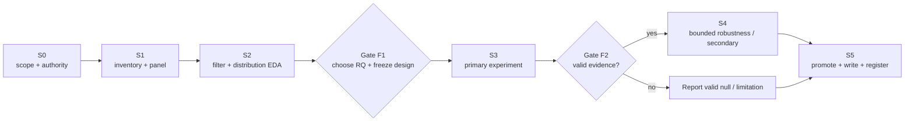

# Dissertation Execution Plan

Last updated: 2026-08-03

This is the delivery plan for the closing phase. The dissertation deadline is **1 September 2026**. Calendar promises from the superseded July 12 plan are retired; progress is controlled by evidence gates and stage exit conditions.

- Live checklist and decisions: [Final experiments plan](../final_experiments/plan.html)
- Scientific constraints: [Research protocol](research_protocol.md)
- Operational notebook/data map: [Final experiments README](../final_experiments/README.md)

## Outcome Contract

Deliver one defensible primary empirical result about firm-day news-sentiment measurement, plus at most one secondary result, with a complete reproducibility chain into the dissertation.

Completion requires:

1. a documented final RQ chosen at Gate F1;
2. one frozen primary estimand and development/evaluation design;
3. one reproducible analysis notebook/helper chain;
4. date-clustered or block-bootstrap uncertainty and declared multiplicity control;
5. attrition, nulls, invalidated runs, and timing/data limitations reported;
6. aggregate, licence-safe figures and tables promoted into the dissertation;
7. the accepted run registered with data/code identities;
8. no core evidence placeholders in the submitted chapter.

Profitability, a significant p-value, a neural network, and a wider news collection are **not** completion criteria.

## Current State

| Item | Status | Evidence |
| --- | --- | --- |
| Closing phase opened | Complete | `final_experiments/plan.html` |
| Primary data spine | Frozen: FNSPID 2011–2023 | `00_data_inventory` decision checklist |
| Robustness spine | Frozen: non-pooled LSEG sector-33 + midcap-22 | Plan and protocol |
| Earnings calendar | Gathered locally; caveats recorded | `final_experiments/data/earnings/` |
| Firm-day panel | Built: 715,546 rows, 570 priced symbols, 3,262 sessions | `01_panel` outputs/manifest |
| Chronological split | Frozen: development through 2019, evaluation from 2020 | `lib/panel.py`, plan, protocol |
| Final RQ | Open | Gate F1 after Stage S2 |
| Current active work | Finish/waive the unlabelled novelty audit, then take Gate F1 | Stage S2 exit / Gate F1 |
| Exploratory W3/W4 chain | Repaired and rerun; not promoted because it ran before Gate F1 | `03`–`07`, `INVALIDATED_RUNS.md` |
| Scorer selection | Closed: FinBERT primary | Benchmark and prior reports |
| VaR/ES | Closed | FNSPID factorial report |
| Ensemble search | Closed | Signal-portfolio report |

## Critical Path



Stages are sequential where later work depends on a frozen earlier decision. Notebook work within a stage may run in parallel when it does not open evaluation outcomes early.

## Stage Plan

### S0 — Scope, authority, and environment

**Status:** complete.

Outputs:

- `final_experiments/` phase and live HTML plan;
- agent instructions for notebook-first research mode;
- documentation authority hierarchy;
- explicit open-RQ status;
- output/data ignore boundaries.

Exit condition: current and historical plans are visibly separated; the research question is not hard-coded prematurely.

### S1 — Data inventory and firm-day panel

**Status:** complete for the current checkpoint chain.

Outputs:

- `00_data_inventory.ipynb`;
- FNSPID-versus-LSEG coverage/quality comparison;
- primary-spine decision checklist;
- LSEG FNSPID earnings calendar and licence record;
- `01_panel.ipynb` and `lib/panel.py`;
- firm-day panel, manifest, schema, attrition, and coverage plots under ignored outputs;
- development/evaluation split recorded before downstream scoring/model selection.

Exit condition: one auditable `(symbol, session_date)` panel with news, stock/market returns, earnings flags, split labels, and explicit unavailable fields.

Open integrity actions before final promotion:

- re-verify the large FNSPID archive checksums;
- decide or implement explicit sector mapping if RQ-E or sector demeaning survives Gate F1;
- preserve the current earnings-calendar coverage/title-filter caveat.

### S2 — Story filtering and within-day distribution EDA

**Status:** executable EDA complete; exit blocked by the unlabelled human audit and unavailable publisher fields.

Goal: establish what the news panel contains before testing return outcomes.

Build:

- `02_filters_and_distribution.ipynb`;
- `lib/novelty.py` and `lib/distribution.py` for reusable, silently dangerous logic;
- source/publisher tables where available;
- novelty, repetition, recap/routine, and direct-target features;
- firm-day distribution summaries by story-count band;
- seeded human-audit template and adjudicated labels;
- `outputs/02_filters_and_distribution/manifest.json` and diagnostic figures.

Required analyses:

- mean, median, dispersion, skew, extrema, and sentiment-class shares;
- distribution by company, date, and story-count band;
- prevalence of duplicates/revisions/recaps/routine reporting;
- filter precision/recall or confusion table from the human audit;
- explicit feasibility assessment for publisher weighting on FNSPID versus LSEG.

Guardrail: do not inspect evaluation returns or rank aggregation rules on outcomes during S2.

Exit condition: the data fields and audit evidence support a documented feasibility judgment for each candidate RQ.

### Gate F1 — Choose the final RQ and freeze the analysis family

Record in `final_experiments/outputs/02_filters_and_distribution/decision.md` and update `plan.html`:

- one primary RQ and at most one secondary;
- visible evidence used for the choice;
- primary signal family and incumbent comparator;
- outcome and horizon set;
- timing/initial-reaction rule;
- development/evaluation boundary;
- model family and inference unit;
- multiplicity family and correction;
- fixed random seed(s);
- dropped candidates and why.

No evaluation-return comparison precedes this gate.

### S3 — Primary experiment

**Status:** blocked on Gate F1.

Use the notebook matching the chosen RQ:

| Chosen question | Primary implementation |
| --- | --- |
| RQ-A aggregation | `03_aggregation.ipynb`, `lib/aggregators.py` |
| RQ-B filtering | Filtering notebook extended into one frozen filtered-versus-unfiltered evaluation; no return-chosen source tiers |
| RQ-C surprise | `04_surprise.ipynb`, `lib/surprise.py` |
| RQ-D agreement | Complete the missing July 12 agreement-validation and LSEG model-panel prerequisites before outcome analysis |
| RQ-E thresholds | Not eligible as sole primary unless Gate F1 documents a validated base signal and sector/firm support |

Common evaluation harness requirements:

- identical row eligibility across compared rules;
- development-only preprocessing/fitting;
- one-shot evaluation opening;
- rank/forecast metrics before portfolio translation;
- daily cross-sectional HAC, date-clustered regression, or date-block inference as the estimand requires;
- full multiplicity family reported;
- effect size, interval, p/q-value, and independent-date count;
- nulls and failures preserved.

### Gate F2 — Evidence validity

Pass if:

- the frozen design ran without leakage or timing violation;
- row eligibility and attrition reconcile;
- uncertainty matches the dependence structure;
- multiplicity correction covers every opened comparison;
- the result is reproducible from recorded inputs and code;
- interpretation stays within the protocol.

Statistical significance is not a pass criterion. A valid null passes. A leaky or post-selected result fails and is reported as invalidated evidence.

### S4 — Bounded robustness and secondary analysis

**Status:** blocked on valid S3 evidence.

Priority order:

1. non-pooled LSEG out-of-regime replication of the primary measurement rule;
2. earnings-window exclusion or interaction if calendar validation passes;
3. one pooled story-type interaction family if audit validity passes;
4. sentiment-surprise extension if RQ-C was not primary and it directly clarifies the primary result;
5. learned threshold only after an informative base signal exists.

Limits:

- at most one secondary result enters the main text;
- no new scorer bake-off;
- no wider-universe collection unless the primary claim depends on missing metadata;
- no new VaR/ES experiment;
- no broad threshold/model tournament.

### S5 — Promotion, registration, and dissertation integration

**Status:** blocked on S3/S4.

Outputs:

- final aggregate tables: sample/attrition, primary estimate, robustness/nulls, costs where relevant;
- final figures: panel/measurement diagnostic, primary effect, robustness or failure surface;
- experiment entry in `experiments/manifest.toml`;
- run manifest with data hashes/identities, code commit, package versions, seeds, split, and inference;
- dissertation methods/results/limitations text linked to generated artifacts;
- updated README/docs status with the selected RQ and result identity.

Exit condition: a clean checkout plus authorised local inputs can regenerate the cited aggregate artifacts; every dissertation number has a source artifact.

## Candidate-RQ Decision Matrix

Use this at Gate F1; do not score it using evaluation returns.

| Criterion | RQ-A Aggregation | RQ-B Filtering | RQ-C Surprise | RQ-D Agreement | RQ-E Thresholds |
| --- | ---: | ---: | ---: | ---: | ---: |
| Fits available FNSPID checkpoint fields | High | Low–medium | High | Low | Medium after sector map |
| Motivated by prior failure/evidence | High | Medium | High | Medium | Medium |
| Supports long-window clustered inference | High | Medium | High | Low until LSEG prerequisites exist | High |
| Explainability | High | High | Medium | Medium | Low–medium |
| New data/model dependency | Low | Medium–high | Low | High | Medium |
| Risk of post-selection/overfitting | Medium | Medium | Medium | Medium | High |

This is a feasibility frame, not a pre-decided winner.

## Notebook And Artifact Contract

Each stage notebook begins with:

- question and non-goals;
- input paths/identities;
- data licence boundary;
- scorer/model revision;
- split and seed;
- estimand and evaluation unit;
- outputs it will write.

Each completed notebook ends with:

- attrition/sample counts;
- decision or result summary;
- nulls/failures/deviations;
- limitations;
- exact next gate.

Generated output layout:

```text
final_experiments/outputs/
  00_data_inventory/
  01_panel/
  02_filters_and_distribution/
  03_aggregation/
  04_surprise/
  05_interpretation/
  06_strategy/
  07_strategy_analysis/
  superseded/
  final/
```

`03`–`07` are exploratory evidence produced before Gate F1. The 2026-07-31
rigour repair corrected return timing, split leakage, IC definition, portfolio
construction, and event-time inference. The invalid predecessor is preserved in
`final_experiments/INVALIDATED_RUNS.md`; the repaired chain still cannot be
described as a preregistered primary experiment.

The directory is ignored because outputs can be large or licensed. Promote only selected aggregate, licence-safe artifacts deliberately.

## Dissertation Writing Dependencies

Writing runs alongside analysis only where it does not depend on unknown results.

| Chapter content | Can write now | Waits for |
| --- | --- | --- |
| Motivation and literature | Yes | Nothing |
| Data provenance and source-regime comparison | Yes | Final checksum verification |
| Benchmark competence and scorer choice | Yes | Nothing; evidence is settled |
| Firm-day panel construction and timing | Yes | Final panel manifest reconciliation |
| Filtering/aggregation methods | Skeleton only | Gate F1 and frozen rule family |
| Primary results | No | Gate F2 |
| Robustness/heterogeneity | No | S4 |
| Limitations | Start now | Final selected RQ/result |
| Conclusion | No | Final promoted evidence |

Every result paragraph should state sample, split, estimand, effect size/interval, correction, and limitation before interpretation.

## Reproducibility Commands

Current completed stages:

```bash
uv run jupyter nbconvert --to notebook --execute --inplace final_experiments/00_data_inventory.ipynb
```

Repeat in numeric order through `11_lseg_robustness.ipynb`; the numbered
notebooks are the sole stage sources and import reusable helpers from `lib/`.

Stable benchmark integrity:

```bash
uv run sentiment-bench validate-data
uv run pytest tests/test_dataset.py tests/test_build_labeled_dataset.py
```

Do not run the full historical suite after each notebook edit. Focused helper tests and notebook execution are sufficient until accepted code is promoted.

## Risk Register

| Risk | Consequence | Control |
| --- | --- | --- |
| FNSPID archive integrity not rechecked | Weak provenance claim | Verify recorded SHA-256 values before promotion. |
| Date-only publication timing | Look-ahead ambiguity | Revised next-session mapping; state residual limitation. |
| Publisher/story-family unavailable in checkpoint | RQ-B infeasible on primary spine | Raw rescan or confine metadata-rich test to LSEG. |
| Earnings calendar mapping/filter holes | Biased coverage or timing | Validation audit, coverage table, exclusion sensitivity. |
| Evaluation period influenced prior work | Overstated confirmation | Call it chronological evaluation; preserve full design path. |
| Thousands of rows but shared dates | Anti-conservative inference | Daily cross-sectional HAC, date clustering, or date-block bootstrap; report independent dates. |
| Aggregator/model tournament | Selection bias | Freeze family at F1; correct all opened comparisons. |
| COVID regime dominates evaluation | Fragile generalisation | Report time-block/regime stability. |
| Position turnover destroys economics | False alpha claim | Costs, concentration, turnover, and break-even cost. |
| Licensed text leaks into Git | Redistribution breach | Keep raw/local outputs ignored; promote aggregates only. |
| Documentation drifts from plan | Conflicting instructions | Plan → protocol → execution-plan authority order. |

## Deliberately Out Of Scope

- New VaR/ES or ES backtests.
- New hosted-LLM or local-model bake-offs.
- Multi-scorer signal ensembles.
- Full production refactors or broad test expansion.
- Causal language about news sentiment and returns.
- Unbounded country/universe expansion.
- Writer-scorer/persona experiments.
- G-theory reliability sizing or crowding/reversal extensions.

These remain future-work ideas, not closing-stage obligations.
