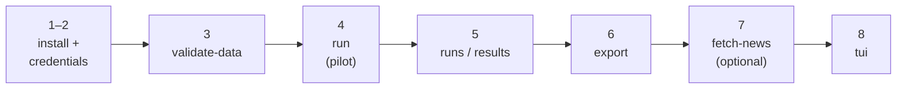

# Getting Started With The Benchmark

This guide installs the broader benchmark application retained in the research workspace. It lets you validate the public benchmark dataset, run a small model comparison, inspect stored metrics, and export results.

For the completed dissertation study, use the separate [`submission/news-sentiment-beyond-mean/`](../submission/news-sentiment-beyond-mean/README.md) package and its [reproducibility guide](../submission/news-sentiment-beyond-mean/docs/reproducibility.md). The archived [`final_experiments/`](../final_experiments/README.md) notebooks additionally require local FNSPID and licensed LSEG artifacts that are intentionally absent from a clean clone.





## What You'll Need

- Python 3.12.
- The repository checked out locally.
- `Data/derived/labeled/financial_sentiment_v2.csv` present in the repository. If it is missing, run `python scripts/build_labeled_dataset.py`.
- An OpenRouter API key for OpenRouter model runs, or an Ollama server reachable from this machine.
- A Tavily API key if you want to source news articles.

## Step 1: Install The Package

From the repository root:

```bash
uv sync --extra dev
uv run sentiment-bench --help
```

This is the shortest cross-platform setup. It uses the Python version declared by the project and creates a local `.venv`. If `uv` is unavailable, create and activate a Python 3.12 virtual environment, then install the editable package:

```bash
python3.12 -m venv .venv
source .venv/bin/activate
python -m pip install --upgrade pip
python -m pip install -e ".[dev]"
```

On Windows PowerShell, the equivalent commands are:

```powershell
py -3.12 -m venv .venv
.\.venv\Scripts\Activate.ps1
python -m pip install --upgrade pip
python -m pip install -e ".[dev]"
```

On Windows, you can run the setup helper instead:

```powershell
.\scripts\setup_windows_py312.ps1
```

This installs the `sentiment-bench` command, runtime dependencies, and development tools used by the test suite.

The `.venv/` folder is local to each machine and is intentionally ignored by git. Do not copy it between machines; recreate it on each machine with the setup command above. The repository carries the reproducible setup instructions through `.python-version`, `pyproject.toml`, and `scripts/setup_windows_py312.ps1`.

If PowerShell says `sentiment-bench` is not recognized, the virtual environment is not active. Use:

```powershell
.\.venv\Scripts\Activate.ps1
sentiment-bench --help
```

or call the script directly:

```powershell
.\.venv\Scripts\sentiment-bench.exe --help
```

## Step 2: Add Local Credentials

Create `.env` in the repository root:

```bash
OPENROUTER_API_KEY=your-openrouter-key
OPENROUTER_BASE_URL=https://openrouter.ai/api/v1

TAVILY_API_KEY=your-tavily-key
TAVILY_PROJECT=sentiment-dissertation

SENTIMENT_BENCH_MACHINE_LABEL=desktop-3070
```

Do not commit `.env`. It is ignored by git.

For Ollama instead of OpenRouter, add:

```bash
SENTIMENT_BENCH_PROVIDER=ollama
OLLAMA_HOST=http://localhost:11434
```

See [Model providers](model_providers.md) for the desktop PC setup.

To share one run history across machines with Turso/libSQL, also add:

```bash
SENTIMENT_BENCH_DB_BACKEND=libsql
TURSO_DATABASE_URL=libsql://your-database-your-org.turso.io
TURSO_AUTH_TOKEN=your-database-token
TURSO_REPLICA_PATH=results/turso_replica.db
```

Each machine should keep its own `.env`, local `.venv/`, and local replica path. New runs store a machine label/id and an environment snapshot so shared results can be traced later.

## Step 3: Validate The Dataset

Run:

```bash
sentiment-bench validate-data
```

You should see a Rich table summarizing row counts, label counts, duplicates, conflicting duplicate groups, and the primary scoring scope. This step is the fastest proof that the environment and dataset path are correct.

## Step 4: Run A Pilot Benchmark

Run one small OpenRouter pilot:

```bash
sentiment-bench run --models openai/gpt-4o-mini --mode pilot
```

Pilot mode samples 30 primary rows per class with seed `42` by default. Results are stored in `results/sentiment_benchmark.sqlite` unless `SENTIMENT_BENCH_DB_BACKEND=libsql`, in which case they sync through the Turso/libSQL replica configured in `.env`.

To use a local Gemma model through Ollama:

```bash
sentiment-bench run --provider ollama --ollama-host http://localhost:11434 \
  --models gemma4:12b --mode pilot --prompt-id finance_calibrated_label_only
```

The `finance_calibrated_label_only` prompt is tuned for short financial-sentiment headlines and trading language. For Gemma 4 in the TUI, keep the `Disable Ollama thinking` checkbox enabled so reasoning tokens do not consume the short label-only completion budget.

## Step 5: Inspect Results

List recent runs:

```bash
sentiment-bench runs
```

Show metrics for one run:

```bash
sentiment-bench results --run-id 1 --confusion
```

The metrics include accuracy, macro-F1, weighted-F1, balanced accuracy, MCC, invalid-output counts, API-error counts, and confusion matrices when requested.

## Step 6: Export A Run

Export the run evidence:

```bash
sentiment-bench export --run-id 1
```

The default export path is `results/exports/run_1/`. It contains response tables, metrics, prompt/run metadata, statistical summaries, and optional figures if the plotting extra is installed.

## Step 7: Fetch A Small News Corpus

Check Tavily connectivity:

```bash
sentiment-bench news-check --query "financial markets" --max-results 1
```

Fetch articles into a timestamped derived corpus:

```bash
sentiment-bench fetch-news --query "bank earnings sentiment" \
  --max-results 10 --time-range week --output-dir Data/news
```

Each fetch writes:

- `articles.jsonl` for provenance-rich records.
- `articles.csv` for spreadsheet review.
- `manifest.json` for reproducibility metadata.

These articles are unlabeled source material. The command does not modify benchmark datasets and does not create benchmark rows automatically.

## Step 8: Open The TUI

Run:

```bash
sentiment-bench tui
```

Use tabs `1` through `6` for Dashboard, Models, Prompt, Run, Results, and News. The TUI persists its local session state in `results/tui_session.json`.

When the provider is local Ollama, the TUI can automatically fetch installed model IDs from `http://localhost:11434`. The Dashboard and Run tabs also show a local resource monitor with selected/fetched model counts, TUI concurrency, max tokens, Ollama thinking state, `OLLAMA_NUM_PARALLEL`, and NVIDIA GPU stats when `nvidia-smi` is available.

## What You Built

You now have a working dissertation benchmark environment with:

- A validated provenance-clean default dataset.
- At least one stored benchmark run.
- Inspectable metrics and exports.
- Per-run machine and environment metadata for shared histories.
- Optional Tavily article sourcing.
- Optional local/remote Ollama routing for Gemma-family models.
- Optional Turso/libSQL shared result storage with a local replica.

For exact command options, use [CLI reference](cli_reference.md). For output interpretation, use [Results and exports](results_and_exports.md).
