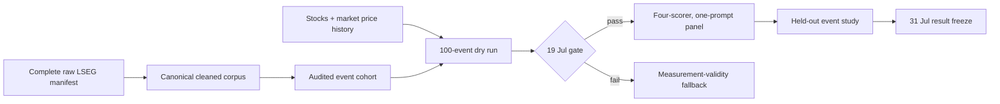

# LSEG Core Analysis Workflow

Last updated: 2026-07-12

> **Historical status (30 July 2026).** This July 12 cross-model-agreement workflow is retained as an implementation record, not the current critical path. Its planned commands were not completed as core evidence. Cross-model agreement remains candidate RQ-D/fallback in the [current protocol](research_protocol.md); live work uses the FNSPID-first [final experiments plan](../final_experiments/plan.html).

## Objective

Build one auditable point-in-time LSEG event panel and test whether continuous cross-model agreement adds held-out information beyond mean sentiment and the initial price reaction.

Core flow:



## Known blockers on 12 July

- The documented price file has only the 33 stocks, no `^GSPC`, and roughly 127–128 sessions; it cannot support the declared market model.
- `l2_event_study.py` currently aligns using `news_date` rather than the precise `version_created` timing rule.
- Existing CAR windows include the initial reaction, while the refocused outcome must exclude it.
- The old analysis uses categorical agreement/H2 crowding hypotheses instead of the continuous nested held-out comparison.
- Formal core score and L2 artifact directories do not yet exist.

Do not launch full scoring until these blockers and the 100-event dry run are resolved.

## 0. Protect the worktree

The repository contains unrelated dirty funded-portfolio work. Commit/park it deliberately or use a separate `codex/dissertation-core` worktree. Do not mix those changes with the core analysis.

## 1. Complete and rebuild the canonical corpus

Existing commands:

```bash
sentiment-bench fetch-lseg-news --config configs/lseg_us_sector_33_6m.toml

sentiment-bench build-lseg-corpus \
  --source Data/collections/lseg_us_sector_33_6m/raw/lseg_us_sector_33_6m
```

Implementation task: allow the verified auxiliary `csv/` export directory to coexist with canonical outputs while preserving the refusal to overwrite any unrecognised non-empty derived content.

Required outputs:

- `articles.jsonl`;
- `screening_index.csv`;
- complete corpus `manifest.json` with source, cleaner and file hashes;
- corpus counts and exclusion reasons.

## 2. Build and audit the event cohort

Existing command:

```bash
sentiment-bench build-lseg-analysis-cohort \
  --corpus-manifest Data/collections/lseg_us_sector_33_6m/derived/us_sector_33_6m/manifest.json \
  --config configs/lseg_us_sector_33_analysis.toml
```

Core event identity is the earliest eligible revision for each `story_family × symbol`. Keep `include`, `review`, and `exclude` decisions auditable. The eventual analysis aggregates to one `symbol × event_session` observation.

The old fixed 2,100-development/900-holdout target is a capacity target, not proof of statistical adequacy. Before freeze, report:

- included/review/excluded counts and reasons;
- distinct firms and calendar dates;
- development/evaluation date boundary and non-overlap;
- company-day concentration;
- minimum detectable effect or equivalent support analysis.

Use the existing validation sampler for a 150-event relevance/sentiment audit, with at least the registered double-coded subset and adjudication. Market feasibility requires relevance precision of at least 0.85.

## 3. Build a valid event-study price panel

Planned code/config:

- `src/sentiment_benchmark/price_panel.py`;
- `tests/test_price_panel.py`;
- `configs/lseg_us_sector_33_prices.toml`;
- CLI `build-price-panel`.

Planned command:

```bash
sentiment-bench build-price-panel \
  --config configs/lseg_us_sector_33_prices.toml \
  --output Data/derived/prices/lseg_us_sector_33_event_study.csv
```

The output manifest must contain every retained stock plus the verified broad-market series (`^GSPC`, mapped to the confirmed LSEG instrument) and enough history for 120 estimation sessions, a 21-session gap, the initial session, and ten subsequent sessions.

## 4. Run the 100-event timing/CAR gate

Before scoring the full cohort, select 100 representative events across firms, dates and publication-time categories. Verify:

1. `version_created` UTC → `America/New_York` conversion;
2. same-session versus next-session assignment under the declared close rule;
3. 120-session market-model estimation and 21-session gap;
4. event-session `initial_reaction`;
5. post-event `CAR(+1,+1)`, `CAR(+1,+5)`, and `CAR(+1,+10)` excluding the initial session;
6. deterministic attrition reasons.

The 19 July market gate passes only when at least 80% of evaluation events align, at least 25 symbols survive, relevance precision is at least 0.85, and date support is adequate for the declared inference. Otherwise activate the measurement-validity fallback; do not redesign the market study on the fly.

## 5. Freeze and score the core roster

Core scorers:

- ProsusAI/FinBERT;
- VADER;
- Cerebras `gemma-4-31b`;
- Cerebras `gpt-oss-120b`.

Core LLM config target: `configs/dissertation_core_scoring.toml`, one target-company label prompt, temperature 0, one sample.

Planned execution shape:

```bash
sentiment-bench score-corpus-matrix \
  --config configs/dissertation_core_scoring.toml \
  --prompts-path configs/default_prompts.toml \
  --input Data/collections/lseg_us_sector_33_6m/derived/us_sector_33_6m_analysis/cohort.jsonl \
  --kind lseg \
  --output-dir results/scoring/lseg_us_sector_33_core_v1 \
  --dry-run
```

The implementation must also score FinBERT/VADER on the identical item identities and assemble all four scorers under one validated schema. Freeze the dry-run identity list before calls.

Acceptance:

- model/version/prompt/content/config hashes recorded;
- at least 98% success per scorer;
- at least 95% complete four-scorer item coverage;
- duplicate identities, content mismatch and model drift rejected;
- no evaluation-driven roster/prompt changes.

The expected hosted workload is approximately 6,000 calls rather than 147,500; the actual dry-run count is the binding value.

## 6. Run the refocused event study

Planned/refactored command:

```bash
sentiment-bench analyze-l2 \
  --scores results/scoring/lseg_us_sector_33_core_v1/scores.jsonl \
  --prices Data/derived/prices/lseg_us_sector_33_event_study.csv \
  --output-dir results/l2/lseg_us_sector_33_core_v1
```

Required comparisons on identical symbol-session rows:

1. strongest individual scorer + initial reaction;
2. ensemble mean + initial reaction;
3. ensemble mean + agreement + mean×agreement + initial reaction.

Primary held-out evidence is `MSE(model 3) - MSE(model 2)`; a negative value favours the agreement-augmented model. Also report MAE, out-of-sample R-squared and a date-block bootstrap interval. Development data alone determine standardisation and model fit. A company/date-aware coefficient table is secondary explanatory evidence.

Required output bundle:

- `item_metrics.csv`;
- `event_panel.csv`;
- `development_coefficients.csv`;
- `holdout_predictions.csv`;
- `model_comparison.csv`;
- `bootstrap.csv`;
- `robustness.csv`;
- `figures/`;
- `summary.md`;
- `manifest.json`.

Every summary includes attrition and null results. Agreement interaction signs may describe strengthening, attenuation, continuation, or reversal; they do not identify crowding.

## 7. Register, export, reproduce, freeze

Register:

- `phrasebank-agreement-core-v1`;
- `lseg-core-scoring-v1`;
- `lseg-agreement-event-study-v1`.

Store commit, command, split, input/config/model/prompt/output hashes and deviations in `experiments/manifest.toml`. Export main-text assets to `dissertation/generated/`. Reproduce into a fresh output directory before the 31 July freeze.

Verification:

```bash
pytest -q <focused core tests>
pytest -q
ruff check .
mypy src/sentiment_benchmark
sentiment-bench validate-data
cd dissertation
make assets
make count
make pdf
```

After 31 July, permit only bug fixes, declared robustness, exact reproduction and asset regeneration.

## Optional extended workflow

The following are preserved but not on the critical path:

- old `configs/crossed_scoring.toml` three-prompt/five-sample matrix;
- TF–IDF fifth scorer after a documented full-data fit;
- prompt sensitivity and within-model entropy;
- L3 G-theory/reliability analysis and sizing;
- one after-cost agreement-conditioned portfolio rule;
- futures overlay, training-cutoff, heterogeneity and Echo experiments.

An extension can start only after core reproduction on 31 July, at least 7,500 substantive dissertation words, and no risk to the 9–10 August supervisor draft. At most one enters the main text.

## Evidence and change control

- Never overwrite raw LSEG text, completed run artifacts, score files or manifests.
- A changed cohort, roster, model digest, prompt, split, timing rule, outcome or analysis parameter creates a new run ID/output directory.
- Keep licensed raw/derived text and heavy generated results out of Git; source-controlled manifests/docs/code explain how to reproduce them.
- Report nulls, failures, attrition and limitations. This workflow does not establish causal market effects or deployable alpha.
