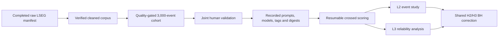

# LSEG Analysis Workflow

Last updated: 2026-07-02

> **Design status (2026-07-02): working design, not a pre-registration.** Everything below — roster, prompts, sample counts, call budgets — is the current default, and we stay flexible to switch models, providers (e.g. Cerebras Inference), prompts, or analysis parameters as tooling and evidence evolve. What *is* fixed is provenance: every executed run records exactly what it used (hashes, digests, config, commit) and a revised design becomes a new dated run rather than an overwrite. Freezing happens per run at execution time, not project-wide in advance. The only binding commitments are ones explicitly filed and dated before their data are collected or inspected.

This is the working plan from the completed LSEG collection to the L2/L3 analyses. The primary design is the 33-company US single-stock panel over `2025-12-26T00:00:00Z` to `2026-06-26T00:00:00Z`. Index futures are a secondary overlay. The design does not make a pre/post-2023 comparison.

The raw collection is resumable and may continue independently. Formal scoring waits until the raw manifest, cleaned corpus, quality validation, and cohort build are complete. Raw checkpoints and licensed story text are never source-controlled.

## Gate Sequence



Each command refuses incompatible or incomplete inputs instead of silently replacing artifacts. Use a new output directory for a revised design.

## 1. Complete And Clean The Corpus

```bash
sentiment-bench fetch-lseg-news --config configs/lseg_us_sector_33_6m.toml

sentiment-bench build-lseg-corpus \
  --source Data/collections/lseg_us_sector_33_6m/raw/lseg_us_sector_33_6m
```

The fetcher resumes exact raw checkpoints. The corpus builder verifies the completed raw manifest and creates a derived corpus without changing the raw files.

## 2. Build The Analysis Cohort

```bash
sentiment-bench build-lseg-analysis-cohort \
  --corpus-manifest Data/collections/lseg_us_sector_33_6m/derived/us_sector_33_6m/manifest.json \
  --config configs/lseg_us_sector_33_analysis.toml
```

For each `(story_family, symbol)`, the builder keeps the earliest eligible revision that passes target relevance. Relevance requires either a curated company alias in the headline, or an alias in the lead plus at least two mentions in the body. TOML overrides are the auditable exception mechanism. Decisions are `include`, `review`, or `exclude`; only `include` enters the primary analysis.

Timestamps are converted to New York time. Seed 42 freezes 2,100 development events and a 900-event chronological holdout. The 500-item L3 prompt-facet subset is selected from development only. The manifest hashes the cohort, split, screening index, symbol/date coverage, configuration, and source corpus. Incomplete corpora, fewer than 3,000 included events, fewer than 500 development items, overwrites, and configuration drift are hard failures.

## 3. Validate Relevance And Sentiment Jointly

```bash
sentiment-bench sample-lseg-validation \
  --cohort-manifest Data/collections/lseg_us_sector_33_6m/derived/us_sector_33_6m_analysis/manifest.json \
  --output-dir Data/collections/lseg_us_sector_33_6m/derived/us_sector_33_6m_validation
```

The sample contains 150 included events; 30 are double-coded with seed 43. Both annotators record relevance and sentiment. Every disagreement is adjudicated separately, and relevance and sentiment percent agreement/Cohen's kappa are reported independently. Only adjudicated-relevant records are exported. The downstream development/holdout boundary remains chronological 70/30.

## 4. Score The Crossed Matrix

The current default LLM roster is GPT-4o mini, Gemini 2.5 Flash Lite, Llama 3.3 70B Instruct, `gemma3:12b`, and `qwen3:8b`. The roster is a choice, not a commitment — swap models or providers (e.g. Cerebras-hosted `gemma-4-31b` / `gpt-oss-120b` for throughput) by editing `configs/crossed_scoring.toml`; the run manifest records whatever roster actually executed. FinBERT and VADER are deterministic contrasts. The soft-label prompt families cross target-company/general-financial wording with base, label-order, and semantic-paraphrase variants.

```bash
sentiment-bench score-corpus-matrix \
  --config configs/crossed_scoring.toml \
  --prompts-path configs/default_prompts.toml \
  --input Data/collections/lseg_us_sector_33_6m/derived/us_sector_33_6m_analysis/cohort.jsonl \
  --subset Data/collections/lseg_us_sector_33_6m/derived/us_sector_33_6m_analysis/l3_subset.jsonl \
  --kind lseg \
  --output-dir results/scoring/lseg_us_sector_33_formal \
  --dry-run
```

With the default configuration the dry-run totals 147,500 calls: 100,000 LSEG calls and 47,500 labeled-benchmark calls, split into 88,500 hosted and 59,000 local calls. A different roster or sample count changes these totals; `--dry-run` reprints them without contacting a provider. The full cohort/benchmark tier receives the base prompt; the 500-item facet subsets receive the two additional variants. Five stochastic samples are stored per crossed cell.

Every response identity includes item ID and content hash, model ID and digest, prompt ID and hash, and sample index. Probabilities, label, token usage, latency, cost, parse status, and errors are recorded. Resume skips exact matches only. Formal execution fails if local Ollama tags/digests cannot be verified or if a recorded identity drifts mid-run.

## 5. Run L2 And L3

```bash
sentiment-bench analyze-l2 \
  --scores results/scoring/lseg_us_sector_33_formal/scores.jsonl \
  --prices Data/derived/prices/lseg_us_sector_33.csv \
  --output-dir results/l2/lseg_us_sector_33

sentiment-bench analyze-l3 \
  --scores results/scoring/lseg_us_sector_33_formal/scores.jsonl \
  --benchmark-scores results/scoring/financial_sentiment_formal/scores.jsonl \
  --event-returns results/l2/lseg_us_sector_33/event_returns.csv \
  --l2-hypotheses results/l2/lseg_us_sector_33/hypotheses.csv \
  --output-dir results/l3/lseg_us_sector_33
```

L2 takes the five-sample majority reading per model, labels pairwise agreement as unanimous/high, 4–1/medium, or at most 0.4/low, and uses mean normalized self-consistency entropy as H2c ambiguity. Company-day event weights sum to one. Primary abnormal returns use a 120-session market model against `^GSPC`, ending 21 sessions before the event, at CAR horizons 1, 5, and 10; market-adjusted returns are sensitivity evidence. Inference includes company/date effects and two-way clustered uncertainty.

L3 fits crossed item, model, prompt, and interaction variance components with sample residual, then reports variance shares, G/dependability coefficients, item measurement-error variance, bounded reliability, and equal-weight daily reliability. Fixed-threshold, shrunk-signal, and signal-to-noise rules are tuned on development only and compared on the identical holdout with 10 bps per side and date-block bootstrap inference. PhraseBank agreement tiers provide the independent ambiguity/reliability validation. H2 and H3 declared p-values share one Benjamini-Hochberg adjustment.

## Evidence And Change Control

- Register formal run families in `experiments/manifest.toml` with source/config hashes and the exact Git commit.
- Keep raw LSEG text, generated corpora, scores, databases, exports, model caches, and price caches out of Git.
- A changed cohort rule, prompt, roster, model digest, split, or analysis parameter creates a new run; it does not overwrite the recorded one. Switching designs is allowed and expected — the record of what ran is what must not change.
- Report null results and limitations. The event study and backtest are observational and do not establish causal market effects or deployable alpha.
