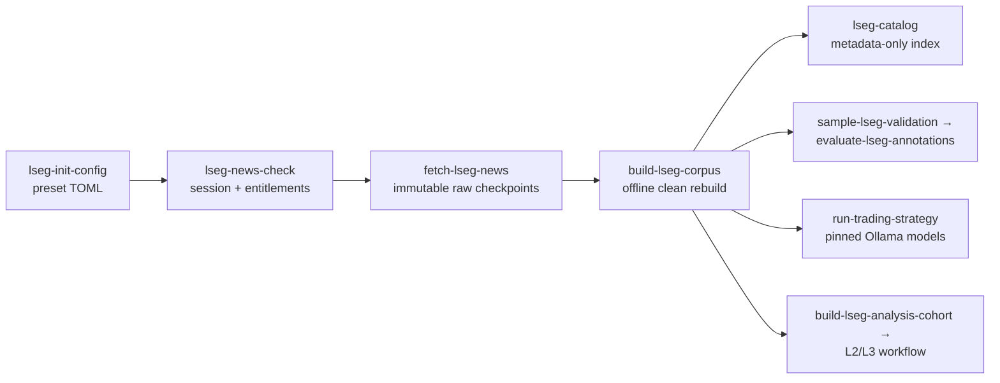

# LSEG Workspace To Ollama Trading Research Pipeline

This workflow collects entitled Workspace news into a local immutable corpus, rebuilds deterministic clean text without another LSEG call, scores it with pinned local Ollama models and baselines, then applies an inspectable trading policy. It is research infrastructure, not a live-order system or investment advice.



## Install And Prerequisites

The normal installation does not include the Workspace SDK. Install the optional collector and cleaner dependencies only on the collection machine:

```bash
python -m pip install -e ".[dev,lseg,baselines,finbert]"
```

Workspace Desktop must be running and the signed-in user must have headline and full-story entitlements. For the first comprehensive corpus, use the checked-in `configs/lseg_us_mega_cap_1y.toml`. To create a copy with a different collection ID, run:

```bash
sentiment-bench lseg-init-config --collection-id my_lseg_collection --output configs/my_lseg_collection.toml
```

The default preset covers `AAPL`, `AMZN`, `GOOGL`, `JPM`, `META`, `MSFT`, `NVDA`, and `TSLA` from `2025-06-26T00:00:00Z` to `2026-06-26T00:00:00Z` with `window_days = 1`. For other work, copy a config, choose a new stable collection ID, freeze the UTC interval and explicit per-company queries, and do not reuse an ID for different settings.

For a larger cross-sector corpus, `configs/lseg_us_sector_33_6m.toml` defines three US-listed companies in each of 11 sectors over the fixed interval `2025-12-26T00:00:00Z` to `2026-06-26T00:00:00Z`. Its per-company queries use `R:<RIC> and Language:LEN` without a Reuters-only source filter, so the collection retains all English-language sources available under the active Workspace entitlements. Raw, derived, and reporting artifacts are grouped under `Data/collections/lseg_us_sector_33_6m/`; see its README for the exact layout and commands. Validate the configured RICs and headline/story entitlements with `lseg-news-check` before starting the full collection. After collection, follow the [LSEG analysis workflow](lseg_analysis_workflow.md) for the quality gate, validation, crossed scoring, and L2/L3 analyses.

## Collect And Clean

```bash
# Read-only entitlement/session check; writes no corpus.
sentiment-bench lseg-news-check --config configs/my_lseg_collection.toml

# Immutable, atomic, resumable raw collection.
sentiment-bench fetch-lseg-news --config configs/my_lseg_collection.toml

# Offline deterministic rebuild from the raw manifest.
sentiment-bench build-lseg-corpus \
  --source Data/news/lseg_<collection-id>

# Metadata-only local catalog for completed clean corpora.
sentiment-bench lseg-catalog
```

The collector requests at most 100 headlines per page and follows `meta.next` through the content-layer cursor interface documented in [LSEG's news pagination guide](https://developers.lseg.com/en/article-catalog/article/lseg-data-library-for-python--news-pagination). If `collection.window_days` is set, each company query is split into fixed UTC windows and each page checkpoint includes the window identity; if omitted, the collector keeps the original whole-interval behavior. It deduplicates story IDs across queries and windows, retains all ticker/query associations, and checkpoints every page and story with atomic replacement. Four story requests may be in flight; transient failures use exponential retry. A completed matching configuration returns unchanged. A changed configuration cannot overwrite the collection, except that an unfinished run may safely increase `max_pages` without invalidating compatible page checkpoints. Setting `collection.prune_story_shards_on_completion` deletes the per-story checkpoint files under `stories/` — byte-for-byte duplicates of the consolidated `stories.jsonl` — once a run completes, roughly halving the raw footprint; deletion is gated on `stories.jsonl` hash-matching the manifest, the shards are retained while a run is unfinished so resume is unaffected, and a completed collection is reproduced from `stories.jsonl` rather than the shards. The flag is operational-only and excluded from the configuration identity hash, so it can be enabled on an in-flight collection without forcing a new collection ID. Setting `collection.story_source_allowlist` (e.g. `["NS:RTRS"]`) keeps collecting every headline but fetches full story bodies only for headlines whose source is on the list — a way to retain complete cross-source headline coverage while keeping the expensive story phase inside a request quota. The allowlist is a safe in-progress change (it only narrows the not-yet-run story phase), and the manifest records it alongside the count of headlines left without a story fetch.

For a deliberately headline-only experiment, set `collection.fetch_story_bodies = false`; the collector writes an empty authoritative `stories.jsonl`, records the choice in the manifest, and makes no story requests. `collection.max_requests_per_run` adds a hard safety ceiling before another API request starts. Hitting the ceiling leaves page checkpoints intact for an explicit later resume.

The CLI fetch command shows a live resume-aware dashboard with separate headline-window and full-story phases, saved-checkpoint counts, progress bars, and ETA estimates. The headline ETA covers the current collection phase; once headline pagination completes, the story ETA is the estimate to final completion.

Raw data is written to `Data/news/lseg_<collection-id>/`; clean data is written to `Data/derived/lseg/<collection-id>/`. Both roots are ignored by Git. Manifests hash all aggregate files and record configuration, SDK/runtime versions, per-query page and row counts, deduplication, failures, and cleaning quality counts.

The clean corpus uses `versionCreated` as its availability timestamp. Missing or unparseable timestamps are ineligible. External-URL-only items become `story_unavailable`; the pipeline never scrapes them. The `lxml` cleaner removes markup, executable/non-content elements, comments, and only recognized trailing provider notices. It preserves datelines, substantive text, paragraph/bullet boundaries, and Unicode. Full clean text stays in the local corpus; scoring later uses only the headline plus the first 8,000 body characters and records truncation.

## Score And Make Decisions

Copy `configs/lseg_ollama_trading_example.toml`, replace dates/companies, set the verified corpus manifest, and pin two exact tags shown by `ollama list`:

```bash
sentiment-bench run-trading-strategy \
  --config configs/my_lseg_ollama_trading.toml
```

An LSEG/Ollama run enforces temperature 0, concurrency 1, thinking disabled, and enum-constrained label-only output. The prompt treats `<news_document>` as untrusted data and ignores instructions inside it. The run records model tags and available Ollama digests, prompt/content/request hashes, keep-alive and generation settings. A resumed score is reused only when all of those identity fields match.

Configure one primary and one secondary Ollama model. VADER and FinBERT are independent baselines; model consensus is disabled in the example and is not the primary signal. Pure-LSEG runs do not create Tavily or NewsAPI clients and need no Workspace session after corpus creation.

### Windows headline soft-label study

For the licensed headline-only mid-cap study, keep the collection in its ignored local directory and start Ollama from the same PowerShell process that sets its environment:

```powershell
$env:OLLAMA_NUM_PARALLEL = "2"  # select only after the frozen 1/2/4 benchmark
$env:OLLAMA_CONTEXT_LENGTH = "1024"
$env:OLLAMA_KEEP_ALIVE = "-1"
ollama serve
```

In a second PowerShell window, score into a new immutable file:

```powershell
sentiment-bench score-headlines `
  --model gemma4:e4b-it-qat --provider ollama `
  --collection-root <local-collection-root> `
  --prompt-id financial_soft_label_base --output <new-local-scores.csv> `
  --temperature 0 --max-completion-tokens 32 --concurrency 2 `
  --source-code NS:RTRS --direct-company-only --max-population 2282 `
  --no-ollama-think --ollama-keep-alive -1 --structured-output
```

Pin the complete digest returned by Ollama and verify `ollama ps` reports `100% GPU`. The effective context shown by Ollama may exceed the requested 1,024-token value; record the observed value and verify the largest prompt token count remains below it. Benchmark client and server concurrency together on the same hash-ordered 100 headlines, preserving separate outputs. Do not test a higher setting when the preceding run nearly exhausts VRAM.

`financial_soft_label_base` receives headline text only, so this initial comparison measures general financial headline tone, not company-specific impact. The score file retains company associations and independent explicit-target, contextual, and market-price/technical flags. Explicit identity means a configured company name/alias or exact RIC is present; bare ambiguous ticker words are not treated as identity. A target-company prompt may be used only if the rendered request actually includes that company identity.

After Gemma scoring, `scripts/run_lseg_headline_study.py` can run local VADER/FinBERT baselines, audit the score arithmetic, and produce the frozen next-open to following-open study. The analysis assigns a pre-open headline to that session's open and any later headline to the next observed open, aggregates scores by company-entry date, and reserves the final 30% of dates as untouched holdout. Text-bearing score files remain local and ignored; the study directory contains aggregate-only metrics and a manifest.

The policy maps positive/neutral/negative to `1/0/-1` and equally averages valid story revisions by ticker and exchange-local date. It holds below three valid stories, buys at a mean of at least `0.5`, sells at at most `-0.5`, and holds inside the band. Every action and hold is written to `trading_decisions.csv` with the count, mean, threshold, policy version, and reason. Hold rows remain in coverage/signal outputs but do not appear in traded returns.

For LSEG decisions, availability is the latest `versionCreated` among valid contributing stories. Entry is the first observed 09:30 exchange-local session open strictly after that timestamp. A pre-open story may enter the same session; an intraday, after-hours, weekend, or holiday story waits for the next observed open. Gross returns use the existing 1–7-session price machinery. Net returns subtract the configured entry and exit cost (10 basis points each in the example); short borrow defaults to zero. Index fallback is disabled so each signal trades its own security.

## Local Validation Sample

Create the seeded annotation sheets only under an ignored local directory:

```bash
sentiment-bench sample-lseg-validation \
  --corpus-manifest Data/derived/lseg/<collection-id>/manifest.json \
  --output-dir Data/derived/lseg/<collection-id>/validation_seed42 \
  --sample-size 150 --double-code-size 30 --seed 42 --double-code-seed 43
```

Fill `primary_label` for all 150 items and `secondary_label` for the 30 double-coded items. When coders disagree, fill `adjudicated_label` in the primary sheet. Then run:

```bash
sentiment-bench evaluate-lseg-annotations \
  --primary Data/derived/lseg/<collection-id>/validation_seed42/annotation_primary.csv \
  --secondary Data/derived/lseg/<collection-id>/validation_seed42/annotation_secondary.csv \
  --output-dir Data/derived/lseg/<collection-id>/validation_evaluated
```

The evaluator reports percent agreement and Cohen's kappa, requires adjudication for every disagreement, and writes a local benchmark-compatible CSV. Use the existing benchmark commands for accuracy, macro-F1, MCC, per-class metrics, and confusion matrices.

For predictive evaluation, sort unique exchange-local dates and split them chronologically 70/30. Tune only on the first 70%. Freeze exact model tags/digests, prompt hash, cleaning version, representation, and decision policy before running the final 30% once. Report coverage, traded events, hit rate, gross/net means and confidence intervals, and corrected multiple tests. Do not make causal claims.

## Licensing And Performance

Raw responses, story text, clean text, and annotations are licensed local research material. Do not commit, redistribute, attach to share packages, or print large samples in logs. Metadata-only dissertation reporting must still follow the institution's LSEG agreement and the [LSEG Data Library usage limits](https://developers.lseg.com/en/article-catalog/article/the-data-library-for-python-maximum-usage-reference-guide).

Python remains the only implementation language. Collection and inference are dominated by Workspace/network latency and local model generation; C++ would add a second build/runtime stack without accelerating those boundaries. Profile first, then tune bounded Python concurrency or model/runtime settings if needed.

## Verification

```bash
uv run pytest
uv run ruff check .
uv run mypy

# Opt-in, requires running Workspace and entitlements.
sentiment-bench lseg-news-check --config configs/my_lseg_collection.toml
```
