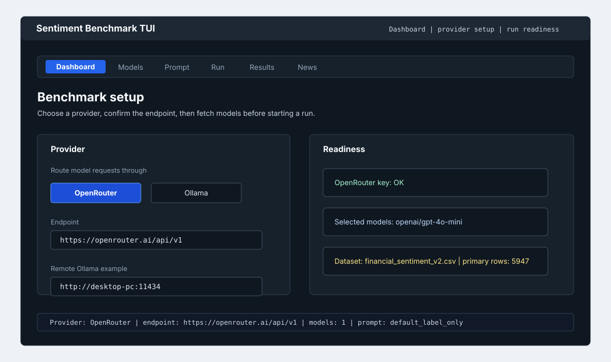

# How To Configure Model Providers

Use this guide to route benchmark calls to OpenRouter or to an Ollama server running local models such as Gemma on a desktop PC.

## Prerequisites

- Project installed with `python -m pip install -e ".[dev]"`.
- `sentiment-bench --help` works from the repository root.
- For OpenRouter: `OPENROUTER_API_KEY`.
- For Ollama: the official `ollama` Python package is installed through project dependencies, and the Ollama server is reachable from this machine.
- For Ollama Cloud models (`-cloud` tags): the Ollama daemon is signed in (`ollama signin`) and has internet access. See [Use Ollama Cloud Models](#use-ollama-cloud-models).

## Provider Defaults

| Setting | Default | Used by |
| --- | --- | --- |
| `SENTIMENT_BENCH_PROVIDER` | `openrouter` | CLI and TUI provider selection. |
| `OPENROUTER_BASE_URL` | `https://openrouter.ai/api/v1` | OpenRouter-compatible chat endpoint. |
| `OLLAMA_HOST` | `http://localhost:11434` | Ollama Python client host. |
| `SENTIMENT_BENCH_AUTO_FETCH_MODELS` | `1` | TUI auto-fetches local Ollama models when provider is Ollama and host starts with `http://localhost`. |
| `OLLAMA_NUM_PARALLEL` | Ollama default | Optional Ollama server setting for parallel request handling; the TUI displays the value it can see. |
| `--provider` | `openrouter` | Overrides the env default for one command. |
| `--ollama-host` | `http://localhost:11434` | Overrides `OLLAMA_HOST` for one command. |

## Configure OpenRouter

Add this to `.env`:

```bash
OPENROUTER_API_KEY=your-openrouter-key
OPENROUTER_BASE_URL=https://openrouter.ai/api/v1
SENTIMENT_BENCH_PROVIDER=openrouter
```

Check available models:

```bash
sentiment-bench list-models --provider openrouter --limit 20
```

Run a pilot:

```bash
sentiment-bench run --provider openrouter \
  --models openai/gpt-4o-mini --mode pilot
```

## Configure Ollama On A Desktop PC

The repository can run on the same machine as Ollama or on another machine while the model runs on a desktop PC. The important requirement is that the Ollama server listens on an address reachable from the benchmark process.

On the machine running Ollama:

```bash
ollama pull gemma4:12b
ollama list
```

Use the exact model tag from `ollama list` in benchmark commands. For example, `gemma4:latest` and `gemma4:12b` are different run contexts and should be recorded separately.

Start Ollama so it listens on the network interface you intend to use. On macOS or Linux, a common local-network setup is:

```bash
OLLAMA_HOST=0.0.0.0:11434 ollama serve
```

On Windows PowerShell:

```powershell
$env:OLLAMA_HOST="0.0.0.0:11434"
ollama serve
```

Restrict this to a trusted private network and configure the desktop firewall deliberately. Do not expose the Ollama port to the public internet.

On the machine running this repository, add:

```bash
SENTIMENT_BENCH_PROVIDER=ollama
OLLAMA_HOST=http://localhost:11434
```

If the model is hosted on another computer, use its hostname or private IP address:

```bash
# Hostname example:
OLLAMA_HOST=http://desktop-pc:11434

# Private IP example:
OLLAMA_HOST=http://192.168.1.25:11434
```

Check the model list from the benchmark machine:

```bash
sentiment-bench list-models --provider ollama \
  --ollama-host http://desktop-pc:11434
```

Run a pilot with the remote Gemma model:

```bash
sentiment-bench run --provider ollama \
  --ollama-host http://desktop-pc:11434 \
  --models gemma4:12b --mode pilot --prompt-id finance_calibrated_label_only
```

For local Ollama on the same Windows machine, use:

```powershell
.\.venv\Scripts\sentiment-bench.exe run --provider ollama `
  --ollama-host http://localhost:11434 `
  --models gemma4:12b --mode pilot --prompt-id finance_calibrated_label_only
```

## Use Ollama Cloud Models

Ollama Cloud runs large hosted models (for example `gpt-oss:120b-cloud`, `deepseek-v3.1:671b-cloud`, and `qwen3-coder:480b-cloud`) on Ollama's infrastructure while you talk to them through a **signed-in local daemon**. No separate provider or API key is configured in this repository — the daemon proxies the request, so cloud models use the existing `ollama` provider and the same chat API as local models.

Sign in once on the machine running the Ollama daemon:

```bash
ollama signin
```

Then reference the model by its `-cloud` tag. The daemon pulls the manifest and routes inference to the cloud:

```bash
sentiment-bench run --provider ollama \
  --ollama-host http://localhost:11434 \
  --models gpt-oss:120b-cloud --mode pilot --prompt-id finance_calibrated_label_only
```

In the TUI:

1. Keep Provider on `Ollama` and the endpoint on your daemon (for example `http://localhost:11434`).
2. On the Models tab, add the cloud model by id (for example `gpt-oss:120b-cloud`) or fetch models and look for the **Cloud** column, which marks `-cloud` tags. Type `cloud` in the search box to filter to them.
3. The Selected models summary shows how many of your chosen models are cloud (for example `3 model(s) selected (1 cloud).`).

Notes specific to cloud models:

- They run remotely, so the **local GPU/VRAM monitor and `Loaded in Ollama` (`/api/ps`) do not reflect them** — those panels describe only models in your local VRAM.
- They require internet access and a signed-in daemon; an unauthenticated daemon returns an error for a `-cloud` tag.
- Record the exact `-cloud` tag (and that the run used cloud routing) for reproducibility, just as you would a local tag.
- Reasoning-capable cloud models such as `gpt-oss` can spend a short completion budget on thinking; keep `Disable Ollama thinking` enabled for short label-only classification, the same as for local thinking models.

## Gemma 4 Notes

Gemma 4 models can spend a short completion budget on internal thinking before emitting a label. In the TUI, keep `Disable Ollama thinking` enabled for `gemma4:*` and other thinking-capable local models. The TUI highlights this recommendation when such a model is selected and stores the setting with the run request metadata.

For CLI runs, use the finance-calibrated label-only prompt and keep `--max-completion-tokens` at the default `64` or higher. If a CLI Gemma 4 pilot produces invalid outputs, retry through the TUI with `Disable Ollama thinking` enabled, then compare the run metadata.

## Use The TUI Provider Controls

Open:

```bash
sentiment-bench tui
```

In the Dashboard tab:

1. Set Provider to `OpenRouter` or `Ollama`.
2. Set the endpoint field. For Ollama, use `http://desktop-pc:11434`.
3. Open the Models tab and fetch models. For local Ollama at `http://localhost:11434`, the TUI also auto-fetches installed models on startup unless `SENTIMENT_BENCH_AUTO_FETCH_MODELS=0`.
4. Select one or more models.
5. For Gemma 4, keep `Disable Ollama thinking` enabled on the Run tab.
6. Continue through Prompt and Run.



## Local Resource Monitoring

The TUI Dashboard and Run tabs include a local resource monitor. It shows:

- Provider and active endpoint.
- Selected model count and fetched provider model count.
- TUI concurrency and max completion tokens.
- `OLLAMA_NUM_PARALLEL` as visible to the TUI process.
- Ollama thinking state.
- NVIDIA GPU utilization, VRAM, power, and temperature when `nvidia-smi` is available.

Low GPU utilization during a run is not always a benchmark bug. Local model throughput can be limited by Ollama scheduling, prompt/token generation speed, CPU work, or a single active request. Increase concurrency cautiously after a successful pilot, and watch invalid-output counts as well as speed.

## Verification

OpenRouter verification:

```bash
sentiment-bench list-models --provider openrouter --limit 5
```

Ollama verification:

```bash
sentiment-bench list-models --provider ollama \
  --ollama-host http://desktop-pc:11434 --limit 5
```

A successful check prints a table of model IDs. A failed check usually means credentials, host reachability, firewall rules, or a missing model on the Ollama host need attention.

## Troubleshooting

| Symptom | Likely cause | Fix |
| --- | --- | --- |
| `OPENROUTER_API_KEY is required` | `.env` missing or key not exported. | Add `OPENROUTER_API_KEY` to `.env` or your shell. |
| Ollama connection refused | Ollama is not running or only bound to localhost on the model host. | Start Ollama on the host and make `OLLAMA_HOST` reachable from the benchmark machine. |
| Model not found | The model was not pulled on the Ollama host or the tag differs. | Run `ollama list`, pull the exact tag such as `ollama pull gemma4:12b`, and use that tag in the benchmark. |
| `-cloud` model fails or asks to sign in | The daemon is not signed in to Ollama Cloud or has no internet access. | Run `ollama signin` on the daemon machine, confirm connectivity, then retry with the exact `-cloud` tag. |
| Gemma 4 pilot has many invalid outputs | The model spent the short answer budget on thinking or ignored the strict label-only format. | In the TUI, keep `Disable Ollama thinking` enabled and use `finance_calibrated_label_only`. |
| Very slow local runs | Desktop model inference is slower than API routing, a single request is active, or Ollama scheduling is limiting throughput. | Use pilot mode first, review the TUI resource monitor, then increase TUI/CLI concurrency and `OLLAMA_NUM_PARALLEL` cautiously. |
| Different results across machines | Local model version, prompt settings, sampling settings, or hardware/runtime environment differ. | Set `SENTIMENT_BENCH_MACHINE_LABEL` per machine and compare model tag, provider route, prompt hash, seed, temperature, git commit, Python version, and export metadata. |
