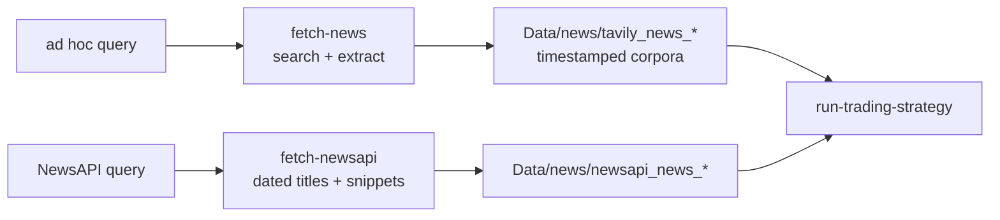

# How To Source News Articles With Tavily And NewsAPI

Use Tavily when you need current article source material from the internet. The feature searches for articles, optionally extracts full text, deduplicates URLs, and writes a timestamped derived corpus under `Data/news`.

Use NewsAPI when you need a simpler dated discovery feed. It supplies titles, descriptions, URLs, publishers, and UTC publication timestamps but not complete article bodies. The trading pilot therefore scores the common `title + snippet/description` representation for both providers and uses Tavily full text only for screening provenance.

Use the separate [LSEG to Ollama pipeline](lseg_ollama_pipeline.md) for entitled Workspace headlines and full stories. LSEG content remains local, uses native story/revision identities instead of synthetic URLs, and is never included in Tavily share packages.


The sourcing pipeline, from query to trading input:



The batch-fetch/quality/packaging campaign tooling was retired after the v4 shared
package was frozen — see [Retired Campaign Tooling](#retired-campaign-tooling).

## Prerequisites

- A Tavily account and API key.
- Project dependencies installed, including `tavily-python>=0.7`.
- `.env` available in the repository root.

Add:

```bash
TAVILY_API_KEY=your-tavily-key
TAVILY_PROJECT=sentiment-dissertation
NEWSAPI_API_KEY=your-newsapi-key
```

`TAVILY_PROJECT` is optional and is passed through for project tracking when configured. The API key is never printed by the CLI or TUI.

## NewsAPI Connectivity And Fetching

Check the key with one result:

```bash
sentiment-bench newsapi-check --query "Apple AAPL stock"
```

Fetch a dated corpus through the Everything endpoint:

```bash
sentiment-bench fetch-newsapi --query "Apple AAPL stock news" \
  --from 2026-06-08T04:00:00Z --to 2026-06-11T04:00:00Z \
  --max-pages 10 --output-dir Data/news
```

Each request uses the `X-Api-Key` header, requests English results ordered by publication time, and pages in batches of 100 until `totalResults` is exhausted or `--max-pages` is reached. Output directories use the `newsapi_news_*` prefix and contain `articles.jsonl`, `articles.csv`, and `manifest.json`. API keys are never placed in URLs, manifests, or logs.

## Trading Pilot Sourcing

Preview the fixed companies, dates, models, and price horizons without external calls:

```bash
sentiment-bench run-trading-strategy --dry-run
```

Run it after configuring Tavily, NewsAPI, and OpenRouter credentials:

```bash
sentiment-bench run-trading-strategy --config configs/trading_pilot_3co.toml
```

The runner reuses `Data/derived/tavily_ticker_panel_v1`, collects one NewsAPI date-range corpus per company, merges by canonical URL and normalized headline, and records title-based screening decisions. A company-day with no accepted merged text triggers one targeted Tavily daily fetch. NewsAPI source pointers and successful LLM results are resumable; a completed run is returned unchanged and cannot be overwritten with a changed config.

Generated merged data lives under `Data/derived/trading/<run-id>/`. Meeting evidence lives under `results/trading/<run-id>/`, including the report, raw scorer outputs, signals, adjusted prices, 1–7-session returns, charts, and hashed run manifest. A successful run also appends one completed exploratory entry to `experiments/manifest.toml`; reruns do not duplicate the entry.

## Check Connectivity

Run a minimal Tavily news search:

```bash
sentiment-bench news-check --query "financial markets" --max-results 1
```

The command prints a compact status table with record count, request ID when returned, response time, and usage metadata when Tavily provides it.

## Fetch Articles

Run:

```bash
sentiment-bench fetch-news --query "bank earnings sentiment" \
  --max-results 10 --time-range week --output-dir Data/news
```

Defaults:

| Option | Default | Notes |
| --- | --- | --- |
| `--topic` | `news` | Allowed: `news`, `finance`, `general`. |
| `--time-range` | `week` | Allowed: `day`, `week`, `month`, `year`. |
| `--search-depth` | `basic` | Allowed: `basic`, `advanced`, `fast`, `ultra-fast`. |
| `--extract` | enabled | Runs Tavily Extract on returned URLs. |
| `--extract-depth` | `basic` | Allowed: `basic`, `advanced`. `advanced` returns cleaner article bodies with less navigation boilerplate. |
| `--min-text-chars` | `500` | Quality-gate floor for extracted text; `0` disables it. |
| `--max-results` | `10` | Valid range: `1` to `20`. |
| `--output-dir` | `Data/news` | Timestamped subdirectory is created per fetch. |

## Extraction Quality Gate

Extraction can technically succeed while returning junk: some sites (notably Yahoo Finance) serve an "Oops, something went
wrong" error page to the extractor, and others return only a cookie wall or a short stub. Every extracted body therefore passes
a quality gate before it counts as usable:

- Text whose opening matches a known error-page signature is classified `error_page`.
- Text shorter than `--min-text-chars` (default 500) is classified `too_short`.
- Anything else is classified `ok`; records without text are `missing`.

Gated records are downgraded to `extraction_status = failed` with the reason in `extract_error`, and `article_text` is cleared
so junk never looks like an article. The raw extractor output stays available in `raw_extract_result` for auditing. The
classification is stored per record in `text_quality`, and the manifest reports `usable_record_count` plus a
`text_quality_counts` breakdown.

When Tavily does not return a publication date, the fetch attempts to recover one from the URL path (for example
`/2026/05/27/story`) or from a date near the start of the extracted text. `published_date_source` records where the date came
from: `search`, `url`, `text`, or empty when unknown. Treat `url` and `text` dates as best-effort.

The default query matrix sets `extract_depth = "advanced"` and excludes `finance.yahoo.com`, because the first collection run
showed basic extraction returning navigation boilerplate and Yahoo serving error pages for more than half of all records.

Use snippet-only mode when you want a quick provenance list without full extraction:

```bash
sentiment-bench fetch-news --query "central bank inflation outlook" \
  --max-results 5 --no-extract
```

Constrain domains:

```bash
sentiment-bench fetch-news --query "bank earnings sentiment" \
  --include-domain reuters.com --include-domain ft.com \
  --exclude-domain example.com
```

Constrain dates:

```bash
sentiment-bench fetch-news --query "market volatility" \
  --start-date 2026-06-01 --end-date 2026-06-07
```

## Retired Campaign Tooling

The batch-fetch (`fetch-news-batch`), offline quality audit (`news-quality`), and
dataset packaging (`package-news`) commands were removed on 2026-07-01 after the
Tavily collection campaign completed. The frozen deliverable is the v4 shared
package (see `experiments/manifest.toml` and the dataset card); the tooling and its
tests are recoverable from git history (pre-`427537d`) if another campaign is run.

## Output Files

Each fetch writes to a directory like:

```text
Data/news/tavily_news_20260607T120000Z_bank-earnings-sentiment/
```

| File | Purpose |
| --- | --- |
| `articles.jsonl` | One provenance-rich JSON record per article. Use this for reproducible processing. |
| `articles.csv` | Compact review table for spreadsheets and manual article screening. |
| `manifest.json` | Query parameters, fetched timestamp, counts, package/schema version, request IDs, usage, and failure counts. |

Both Tavily and NewsAPI stream these files into a temporary directory and publish
the timestamped directory only after every file is complete. Existing destinations
are preserved; repeated or concurrent saves use `_2`, `_3`, and subsequent suffixes.
Handled write failures clean up the temporary directory and leave earlier corpora intact.

## Record Fields

`articles.jsonl` preserves fields only when Tavily returns them.

| Field | Meaning |
| --- | --- |
| `record_id` | `sha256(normalized_url)[:16]`; stable across repeated fetches of the same normalized URL. |
| `url` | Original URL returned by Tavily. |
| `normalized_url` | Lower-cased host, stripped fragment, normalized trailing path. |
| `title` | Article title when available. |
| `snippet` | Search result snippet. |
| `article_text` | Extracted full text when extraction succeeds and passes the quality gate. |
| `published_date` | Tavily-provided publication date, or a best-effort date recovered from the URL or text. |
| `published_date_source` | `search`, `url`, `text`, or empty when no date is known. |
| `score` | Tavily relevance score when available. |
| `favicon` | Tavily-provided favicon URL when available. |
| `extraction_status` | `success`, `failed`, or `skipped`. Quality-gated junk counts as `failed`. |
| `text_quality` | `ok`, `error_page`, `too_short`, or `missing`. |
| `extract_error` | Failure message when extraction fails or is quality-gated. |
| `search_request_id` | Tavily search request ID when returned. |
| `extract_request_id` | Tavily extract request ID when returned. |
| `raw_search_result` | JSON-safe fragment of the original Tavily search result. |
| `raw_extract_result` | JSON-safe fragment of the Tavily extract result. |

## Data Handling Rules

Tavily corpora are unlabeled source material. They are not converted into `Sentence,Sentiment` benchmark rows automatically.

The source benchmark dataset is not modified:

```text
Data/derived/labeled/financial_sentiment_v2.csv   default benchmark dataset, unchanged
Data/data.csv                                     legacy source dataset, unchanged
Data/news/                                        generated article corpora, ignored by git except .gitkeep
```

If you later label article snippets or full text for benchmarking, create a separate derived dataset and document the labeling protocol, inclusion rules, label mapping, and random seed.

## TUI Workflow

Open:

```bash
sentiment-bench tui
```

Go to tab `6` or select News. The News tab has:

- API check button.
- Query input.
- Topic selector.
- Time range selector.
- Max results input.
- Extract toggle.
- Output directory input.
- Status/log output.

The TUI uses the same Tavily client and output writer as the CLI.

## Verification

After a fetch:

```bash
find Data/news -maxdepth 2 -type f | sort
```

You should see `articles.jsonl`, `articles.csv`, and `manifest.json` under one timestamped directory.

Check the manifest without printing article bodies:

```bash
python -m json.tool Data/news/tavily_news_*/manifest.json | head -80
```

## Troubleshooting

| Symptom | Likely cause | Fix |
| --- | --- | --- |
| `TAVILY_API_KEY is required` | `.env` missing or key not exported. | Add `TAVILY_API_KEY` to `.env`. |
| `NEWSAPI_API_KEY is required` | NewsAPI key is missing. | Add the key locally to `.env`; do not paste it into logs or commit it. |
| `max_results must be between 1 and 20` | Out-of-range input. | Choose a value from `1` to `20`. |
| `topic must be one of...` | Unsupported topic. | Use `news`, `finance`, or `general`. |
| Extracted text is empty | Source blocks extraction or Tavily returned no content. | Review `extraction_status`, `extract_error`, and `raw_extract_result`. |
| Many records have `text_quality = error_page` | The source serves an error or bot wall to the extractor (common for Yahoo Finance). | Exclude the domain in the query matrix or rely on the gate; raw output stays in `raw_extract_result`. |
| Real articles gated as `too_short` | Legitimately brief items fall under the 500-character floor. | Lower `--min-text-chars` or pass `0` to disable the floor. |
| Batch reports failed fetches | Tavily timeout or network error persisted through 3 attempts. | Re-run the same command; completed fetches are skipped and only the failures retry. Keep the same `--end-date` (or explicit windows) so the windows match. |
| Too much generated data | Repeated broad fetches. | Use narrower queries, domain filters, date filters, and keep `Data/news` ignored unless a specific corpus is curated. |
