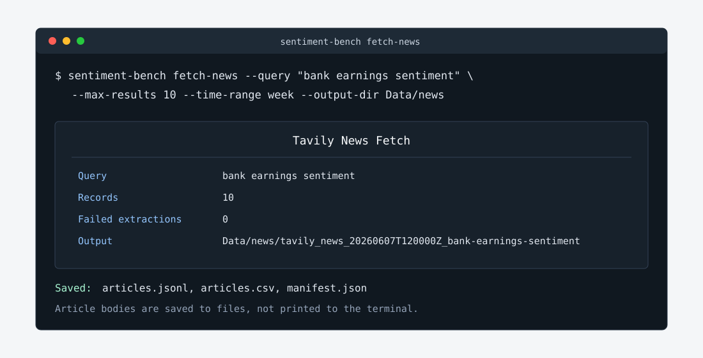

# How To Source News Articles With Tavily

Use Tavily when you need current article source material from the internet. The feature searches for articles, optionally extracts full text, deduplicates URLs, and writes a timestamped derived corpus under `Data/news`.



## Prerequisites

- A Tavily account and API key.
- Project dependencies installed, including `tavily-python>=0.7`.
- `.env` available in the repository root.

Add:

```bash
TAVILY_API_KEY=your-tavily-key
TAVILY_PROJECT=sentiment-dissertation
```

`TAVILY_PROJECT` is optional and is passed through for project tracking when configured. The API key is never printed by the CLI or TUI.

## Check Connectivity

Run a minimal Tavily news search:

```bash
sentiment-bench news-check --query "financial markets" --max-results 1
```

The command prints a compact status table with record count, request ID when returned, response time, and usage metadata when Tavily provides it.

## Fetch Articles

Run:

```bash
sentiment-bench fetch-news --query "bank earnings sentiment" \
  --max-results 10 --time-range week --output-dir Data/news
```

Defaults:

| Option | Default | Notes |
| --- | --- | --- |
| `--topic` | `news` | Allowed: `news`, `finance`, `general`. |
| `--time-range` | `week` | Allowed: `day`, `week`, `month`, `year`. |
| `--search-depth` | `basic` | Allowed: `basic`, `advanced`, `fast`, `ultra-fast`. |
| `--extract` | enabled | Runs Tavily Extract on returned URLs. |
| `--extract-depth` | `basic` | Allowed: `basic`, `advanced`. `advanced` returns cleaner article bodies with less navigation boilerplate. |
| `--min-text-chars` | `500` | Quality-gate floor for extracted text; `0` disables it. |
| `--max-results` | `10` | Valid range: `1` to `20`. |
| `--output-dir` | `Data/news` | Timestamped subdirectory is created per fetch. |

## Extraction Quality Gate

Extraction can technically succeed while returning junk: some sites (notably Yahoo Finance) serve an "Oops, something went
wrong" error page to the extractor, and others return only a cookie wall or a short stub. Every extracted body therefore passes
a quality gate before it counts as usable:

- Text whose opening matches a known error-page signature is classified `error_page`.
- Text shorter than `--min-text-chars` (default 500) is classified `too_short`.
- Anything else is classified `ok`; records without text are `missing`.

Gated records are downgraded to `extraction_status = failed` with the reason in `extract_error`, and `article_text` is cleared
so junk never looks like an article. The raw extractor output stays available in `raw_extract_result` for auditing. The
classification is stored per record in `text_quality`, and the manifest reports `usable_record_count` plus a
`text_quality_counts` breakdown.

When Tavily does not return a publication date, the fetch attempts to recover one from the URL path (for example
`/2026/05/27/story`) or from a date near the start of the extracted text. `published_date_source` records where the date came
from: `search`, `url`, `text`, or empty when unknown. Treat `url` and `text` dates as best-effort.

The default query matrix sets `extract_depth = "advanced"` and excludes `finance.yahoo.com`, because the first collection run
showed basic extraction returning navigation boilerplate and Yahoo serving error pages for more than half of all records.

Use snippet-only mode when you want a quick provenance list without full extraction:

```bash
sentiment-bench fetch-news --query "central bank inflation outlook" \
  --max-results 5 --no-extract
```

Constrain domains:

```bash
sentiment-bench fetch-news --query "bank earnings sentiment" \
  --include-domain reuters.com --include-domain ft.com \
  --exclude-domain example.com
```

Constrain dates:

```bash
sentiment-bench fetch-news --query "market volatility" \
  --start-date 2026-06-01 --end-date 2026-06-07
```

## Fetch A Medium Corpus Smoothly

Use `fetch-news-batch` when you want the reusable query matrix to run across several date windows. The default matrix in `configs/tavily_query_matrix.toml` contains 10 query families. Five date windows therefore plan up to 50 Tavily searches.

The easiest form uses `--weeks`, which generates contiguous 7-day windows ending today. Preview the plan first, then run it:

```bash
sentiment-bench fetch-news-batch --weeks 5 --dry-run
sentiment-bench fetch-news-batch --weeks 5 --package-id tavily_shared_v3
```

Batches are resumable: fetches whose exact parameters already produced a corpus under `Data/news` are skipped by default and the existing corpora still flow into the package, so rerunning after an interruption (or adding more weeks later) never pays Tavily credits twice. Changing any parameter — date window, extract depth, domain filters, quality floor — triggers a real refetch; pass `--refetch` to force one with identical parameters.

Pass `--end-date` to anchor the windows somewhere other than today, or spell out explicit windows with repeated `--date-window` when the weeks are not contiguous:

```bash
sentiment-bench fetch-news-batch --weeks 5 --end-date 2026-06-11 --dry-run
sentiment-bench fetch-news-batch \
  --date-window 2026-05-07:2026-05-14 \
  --date-window 2026-06-05:2026-06-11 \
  --package-id tavily_shared_v3 \
  --text-policy metadata
```

With the default 10 query families and `max_results = 20` in the query matrix, this targets up to 1,000 source records before deduplication and screening:

```text
10 query families x 5 date windows x 20 results = up to 1,000 source records
```

During a real run, the CLI shows a Rich progress bar with the current query family, date window, fetch number, records returned, failed extraction count, and output directory for each fetched corpus. After fetching, it shows a packaging progress step and reports unique source count plus duplicate URLs removed.

Restrict a pilot to one or two query families with repeated `--query-id`:

```bash
sentiment-bench fetch-news-batch \
  --query-id bank_earnings \
  --query-id market_volatility \
  --date-window 2026-06-05:2026-06-11 \
  --dry-run
```

## Check Corpus Quality

After any fetch, summarize what you actually collected without calling Tavily:

```bash
sentiment-bench news-quality
```

By default this scans every corpus under `Data/news` and prints three tables: an overview (records, unique URLs, usable
unique URLs, `text_quality` breakdown, and where publication dates came from), per-query-family counts, and the top source
domains with their usable share. Query families that returned zero records stay visible so coverage gaps are obvious.

Use `--source` to inspect specific corpus directories, `--news-dir` to scan a different root, and `--top-domains` to widen
the domain table. Corpora fetched before the quality gate existed are re-assessed on the fly.

The domain table's `Shared prefix` column reports the longest identical opening shared by two or more distinct usable
articles from a domain. A large value means site boilerplate is leaking into extracted bodies (or the domain publishes
near-duplicate articles) — review those texts before labeling, and prefer `extract_depth = "advanced"` when refetching.

## Output Files

Each fetch writes to a directory like:

```text
Data/news/tavily_news_20260607T120000Z_bank-earnings-sentiment/
```

| File | Purpose |
| --- | --- |
| `articles.jsonl` | One provenance-rich JSON record per article. Use this for reproducible processing. |
| `articles.csv` | Compact review table for spreadsheets and manual article screening. |
| `manifest.json` | Query parameters, fetched timestamp, counts, package/schema version, request IDs, usage, and failure counts. |

## Record Fields

`articles.jsonl` preserves fields only when Tavily returns them.

| Field | Meaning |
| --- | --- |
| `record_id` | `sha256(normalized_url)[:16]`; stable across repeated fetches of the same normalized URL. |
| `url` | Original URL returned by Tavily. |
| `normalized_url` | Lower-cased host, stripped fragment, normalized trailing path. |
| `title` | Article title when available. |
| `snippet` | Search result snippet. |
| `article_text` | Extracted full text when extraction succeeds and passes the quality gate. |
| `published_date` | Tavily-provided publication date, or a best-effort date recovered from the URL or text. |
| `published_date_source` | `search`, `url`, `text`, or empty when no date is known. |
| `score` | Tavily relevance score when available. |
| `favicon` | Tavily-provided favicon URL when available. |
| `extraction_status` | `success`, `failed`, or `skipped`. Quality-gated junk counts as `failed`. |
| `text_quality` | `ok`, `error_page`, `too_short`, or `missing`. |
| `extract_error` | Failure message when extraction fails or is quality-gated. |
| `search_request_id` | Tavily search request ID when returned. |
| `extract_request_id` | Tavily extract request ID when returned. |
| `raw_search_result` | JSON-safe fragment of the original Tavily search result. |
| `raw_extract_result` | JSON-safe fragment of the Tavily extract result. |

## Data Handling Rules

Tavily corpora are unlabeled source material. They are not converted into `Sentence,Sentiment` benchmark rows automatically.

The source benchmark dataset is not modified:

```text
Data/derived/labeled/financial_sentiment_v2.csv   default benchmark dataset, unchanged
Data/data.csv                                     legacy source dataset, unchanged
Data/news/                                        generated article corpora, ignored by git except .gitkeep
```

If you later label article snippets or full text for benchmarking, create a separate derived dataset and document the labeling protocol, inclusion rules, label mapping, and random seed.

## Package For Colleagues

After one or more fetches, create a metadata-first share package from existing corpus directories:

```bash
sentiment-bench package-news \
  --source Data/news/tavily_news_20260607T120000Z_bank-earnings-sentiment \
  --package-id tavily_shared_v1 \
  --output-dir Data/derived \
  --text-policy metadata
```

Repeat `--source` to combine multiple fetched corpora. The command reads `articles.jsonl` and `manifest.json`, deduplicates by normalized URL, and writes the files below. Corpora fetched before the quality gate existed are re-assessed during packaging, so older error pages and stubs are flagged in `text_quality` and excluded from `extract_text_available` and `extracts.jsonl` — re-packaging an old collection is enough to get an honest screening index without refetching.

| File | Purpose |
| --- | --- |
| `sources.csv` | One row per unique source URL with titles, snippets, source domains, query provenance, request IDs, extraction status, `text_quality`, and text hashes. |
| `screening_index.csv` | Editable colleague review sheet with a `text_quality` column, `pending` screening decisions, and blank optional label columns. |
| `package_manifest.json` | Package ID, source corpora, counts, duplicate count, query matrix path, unmatched queries, file hashes, and sharing notes. |
| `README.md` | Short handoff note explaining contents, counts, and text policy. |
| `extracts.jsonl` | Optional full-text file written only with `--text-policy internal-extracts`. |

Default `--text-policy metadata` does not write full article bodies into the share package. Use `--text-policy internal-extracts` only when full-text sharing is appropriate for the audience and source terms.

The optional query matrix at `configs/tavily_query_matrix.toml` records reusable query families for future collection and enriches package metadata when a fetched corpus query matches a matrix entry. It does not trigger any Tavily calls.

## TUI Workflow

Open:

```bash
sentiment-bench tui
```

Go to tab `6` or select News. The News tab has:

- API check button.
- Query input.
- Topic selector.
- Time range selector.
- Max results input.
- Extract toggle.
- Output directory input.
- Status/log output.

The TUI uses the same Tavily client and output writer as the CLI.

## Verification

After a fetch:

```bash
find Data/news -maxdepth 2 -type f | sort
```

You should see `articles.jsonl`, `articles.csv`, and `manifest.json` under one timestamped directory.

Check the manifest without printing article bodies:

```bash
python -m json.tool Data/news/tavily_news_*/manifest.json | head -80
```

## Troubleshooting

| Symptom | Likely cause | Fix |
| --- | --- | --- |
| `TAVILY_API_KEY is required` | `.env` missing or key not exported. | Add `TAVILY_API_KEY` to `.env`. |
| `max_results must be between 1 and 20` | Out-of-range input. | Choose a value from `1` to `20`. |
| `topic must be one of...` | Unsupported topic. | Use `news`, `finance`, or `general`. |
| Extracted text is empty | Source blocks extraction or Tavily returned no content. | Review `extraction_status`, `extract_error`, and `raw_extract_result`. |
| Many records have `text_quality = error_page` | The source serves an error or bot wall to the extractor (common for Yahoo Finance). | Exclude the domain in the query matrix or rely on the gate; raw output stays in `raw_extract_result`. |
| Real articles gated as `too_short` | Legitimately brief items fall under the 500-character floor. | Lower `--min-text-chars` or pass `0` to disable the floor. |
| Batch reports failed fetches | Tavily timeout or network error persisted through 3 attempts. | Re-run the same command; completed fetches are skipped and only the failures retry. Keep the same `--end-date` (or explicit windows) so the windows match. |
| Too much generated data | Repeated broad fetches. | Use narrower queries, domain filters, date filters, and keep `Data/news` ignored unless a specific corpus is curated. |
