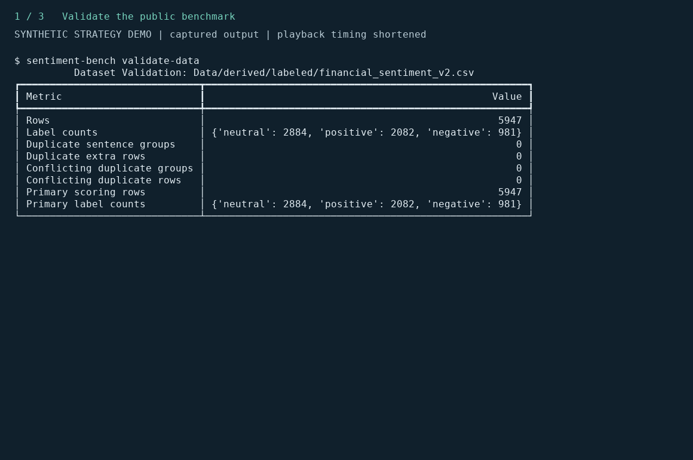
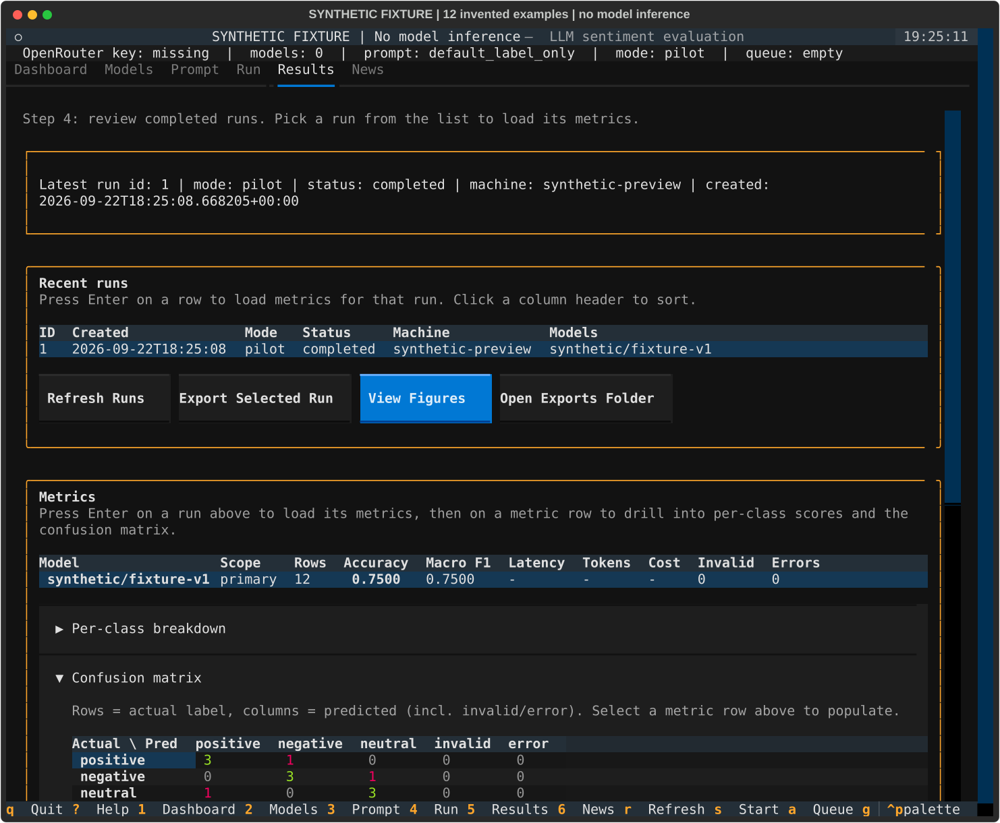
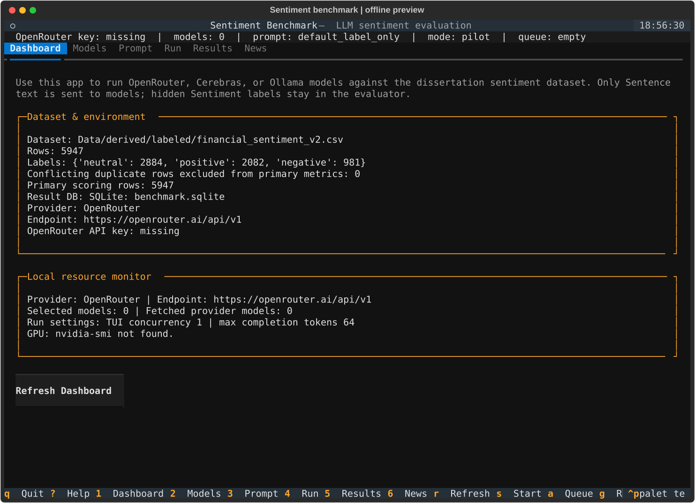

# Try the offline demo

This walkthrough validates the public sentiment benchmark and runs the separate
historical strategy pipeline on **synthetic events, scores and prices**. It shows
configuration inspection, stage execution and report generation. Its output is
software demonstration evidence, not a market result or a dissertation rerun.



*Captured command output from a successful local run. Playback uses fixed reading
times rather than measured execution latency. A static transcript follows below.*

## Run it

With Python 3.12 and uv installed, run from the repository root:

```bash
uv sync --locked
uv run --locked python scripts/portfolio_demo.py
```

Dependency installation needs network access. The demo itself uses local fixtures
and requires no API keys, model downloads or licensed news inputs.

Each invocation creates a fresh `results/portfolio_demo/run-.../` directory. It
copies the [smoke configuration](../configs/strategy_research/smoke.toml), changes
only its output roots, then invokes the existing CLI. Original inputs and earlier
run directories are preserved. Demo outputs are Git-ignored.

## What to expect

1. **Validate the benchmark.** The output reports 5,947 rows: 2,884 neutral,
   2,082 positive and 981 negative. Duplicate and conflicting-label groups are zero.
2. **Inspect the synthetic strategy.** The dry run reports 12 events, 11 fixture
   scores, 96 price rows, two feasible tuning folds and zero expected hosted calls.
   One event intentionally lacks a score; the fixture's configured 90% minimum
   success rate allows 11/12. Ten scored events are executable. Missing scores are
   not silently converted to neutral sentiment.
3. **Generate the report.** The command prints `Strategy report complete` and the
   derived/results paths. Its run-identity suffix may vary with dependency versions.

The strategy fixture uses the XNYS calendar, a 15-minute processing buffer,
adjusted-open execution, a synthetic evaluation boundary of 12 January 2026,
10 bps cost per side, and 100 bootstrap replications with seed `20260715`.
`fixture-direction-v1` supplies canned scores; no model inference occurs.
The public classification benchmark and synthetic strategy fixtures are separate
inputs, shown in sequence to demonstrate two capabilities.

The printed directory contains:

| File or directory | Inspect it for |
| --- | --- |
| `demo.toml` | Exact demo configuration and isolated output paths |
| `step-1.txt` through `step-3.txt` | Commands and captured output |
| `results/strategy-smoke-*/report/summary.md` | Generated synthetic report |
| `results/strategy-smoke-*/report/figures/` | Return and exposure/turnover SVGs |
| `results/strategy-smoke-*/backtest/` | Metrics, diagnostics and bootstrap output |
| `results/strategy-smoke-*/manifests/` | Stage identities and output hashes |
| `derived/strategy-smoke-*/` | Intermediate synthetic artifacts |

The dry-run message about creating no files describes that CLI inspection step.
The wrapper has already created its isolated directory and configuration.

## Explore the interface



This Results view uses 12 invented classification examples and canned predictions,
separate from both the public benchmark and the strategy demo. The evaluator
computes macro-F1 of 0.75 from those records; the capture script verifies the
metrics and an actual export. The model label and screenshot title identify the
synthetic fixture. These values illustrate the interface, not model performance.

```bash
uv run --locked sentiment-bench tui
```



The screenshot uses the public dataset and an empty temporary database, with
credentials and model auto-fetch disabled. It does not display fabricated model
results. Your normal TUI session can load your own saved settings and runs;
model execution requires a configured provider. See the [TUI guide](tui_guide.md).

## Go deeper

- [Three engineering decisions](engineering_case_study.md): data integrity, artifact identity and capital accounting.
- [Final-study reproduction](reproducing_the_submission.md): validate committed aggregate evidence separately.
- [Benchmark getting started](getting_started.md): configure a provider and run an actual sentiment model.
- [Asset capture instructions](assets/README.md): reproduce the screenshot and transcript replay.
