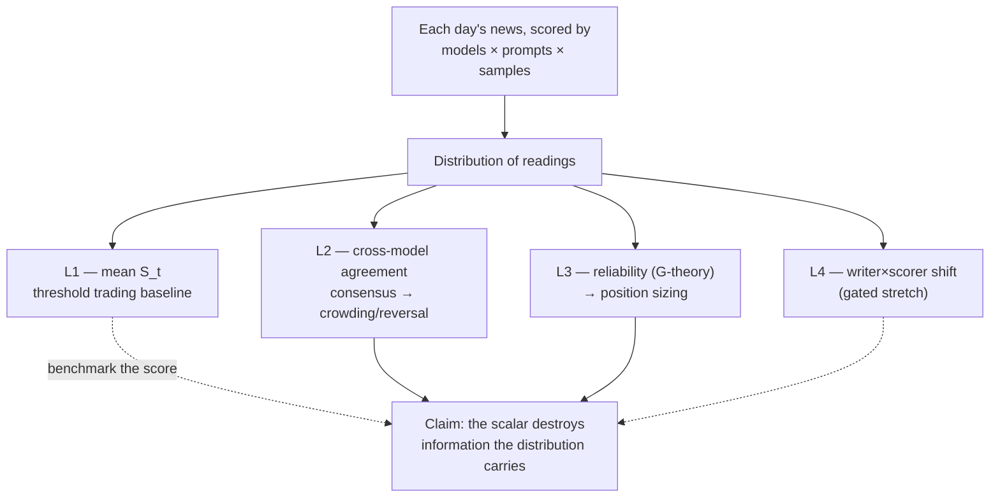

# Research Protocol

Last updated: 2026-06-28

Operational documentation:

- [Getting started](getting_started.md)
- [CLI reference](cli_reference.md)
- [Model providers](model_providers.md)
- [Tavily news sourcing](news_sourcing.md)
- [Frozen LSEG analysis workflow](lseg_analysis_workflow.md)
- [Results and exports](results_and_exports.md)
- [Architecture](architecture.md)

## Purpose

This repository is the measurement engine for the dissertation **"Beyond the Score"**
(direction confirmed with the supervisor on 2026-06-12; full research design lives in
the Obsidian vault, `wiki/thesis/Beyond the Score Plan.md`).

The dissertation's central claim: a sentiment pipeline that compresses each day's news
into one scalar S_t and trades on it is using the wrong object. When multiple models,
prompts, and stochastic samples score the same text, they produce a *distribution* of
readings, and properties of that distribution carry economically meaningful information
that the scalar destroys.

The research is organized into layers, and this repository feeds all of them:

| Layer | Distributional property | Repository's role |
| --- | --- | --- |
| **L1** (baseline) | Mean (S_t) | Per-article sentiment scoring feeding daily aggregation and the supervisor's threshold trading strategy |
| **L2** (consensus → crowding) | Cross-model agreement | Full-roster scoring of timestamped news items; agreement statistics per item |
| **L3** (reliability → sizing) | Reliability (G-coefficient) | Crossed-design runs (item × model × prompt × sample) supplying the G-study variance decomposition |
| **L4** (stretch, gated) | Score shift on machine text | Writer×scorer scoring matrix, if the gate opens at M2 |

The repository's original two aims — benchmarking LLMs against non-LLM baselines, and
investigating sentiment ambiguity via duplicate-label conflict, model disagreement,
prompt sensitivity, and self-consistency — survive intact as *instruments*: the
benchmark comparison is the extraction-comparison milestone (M3), and the ambiguity
toolkit provides L2's ambiguity proxy and L3's measurement facets.

The protocol is intended to make formal experiments reproducible, comparable, and
appropriately limited in interpretation.

## Research Questions

Dissertation-level questions (from the Beyond the Score plan):

- **RQ1 (L1, baseline):** Can a daily aggregated sentiment signal, traded via a tuned
  threshold rule, generate profit on index futures vs price-only and buy-and-hold
  baselines?
- **RQ2 (L2, consensus → crowding):** Does the level of agreement among independent
  models about a news item predict how its initial price reaction resolves — reversal
  after high-consensus readings vs drift after low-consensus readings?
- **RQ3 (L3, reliability → sizing):** Does a trading rule that knows the measurement
  error of its sentiment signal — shrinking unreliable scores and sizing positions by
  signal-to-noise — outperform the fixed-threshold rule on the same signal?
- **RQ4 (L4, stretch):** Do sentiment scorers shift systematically on machine-written
  versions of the same news?

Operational measurement questions answered inside this repository (these support the
RQs; they are not the dissertation's headline questions):

- **OQ1.** How accurately do the selected LLMs classify financial text into `positive`,
  `negative`, and `neutral` labels compared with established non-LLM baselines?
- **OQ2.** How robust are model rankings and per-class outcomes to prompt design, label
  ordering, and instruction paraphrase? (Feeds the L3 prompt facet.)
- **OQ3.** Do rows with conflicting human labels or high model disagreement show higher
  signs of sentiment ambiguity than rows without label conflict? (Validates the L2
  ambiguity proxy against human-disagreement ground truth.)
- **OQ4.** How do cost, latency, invalid-output rate, API error rate, and
  completion-token budget affect the practical use of LLMs for this pipeline?

## Hypotheses

The dissertation's pre-registered hypothesis families are stated in the Beyond the
Score plan and are fixed in advance:

- **H2a–H2c** (L2): reversal after high-agreement readings; drift after low-agreement
  readings; effects concentrated where machine consensus occurs despite textual
  ambiguity.
- **H3a–H3c** (L3): measurement variance is structured (model and prompt facets
  material); item-level variance correlates with human-agreement tiers; shrinkage and
  signal-to-noise sizing weakly dominate the fixed threshold on risk-adjusted P/L.

Benjamini–Hochberg correction is applied across the H2/H3 family, and event-study
horizons are fixed in advance at 1, 5, and 10 days.

Measurement-level expectations for the repository's own benchmark and ambiguity runs
(numbered E to avoid collision with the pre-registered families):

**E1.** Stronger LLMs and domain-specialized models will outperform trivial and lexical
baselines on macro-F1, balanced accuracy, and MCC, not only raw accuracy.

**E2.** Prompt perturbations will change measured performance for at least some models,
so prompt sensitivity should be reported alongside headline benchmark scores.

**E3.** Conflicting duplicate rows and rows with higher inter-model disagreement will
show higher ambiguity indicators, such as self-consistency entropy or lower agreement
statistics.

**E4.** Cost, latency, parse failures, and API errors will create meaningful tradeoffs
between model quality and operational practicality.

These expectations describe empirical patterns in the measurement layer. They do not
imply causal claims about market behavior, investor decision-making, or the true
psychological sentiment of text authors; market-facing inference belongs to the L1–L3
designs (chronological splits, leakage controls, pre-registered tests) and is bounded
by the interpretation limits below.

## Dataset Policy

### Labeled benchmark set

The default labeled benchmark dataset is
`Data/derived/labeled/financial_sentiment_v2.csv`, rebuilt from original sources by
`scripts/build_labeled_dataset.py`. Do not manually edit the derived file; rebuild it
from the script if source handling changes. Treat `Data/data.csv` as immutable legacy
source material. Do not clean, relabel, deduplicate, or overwrite it in place.

The dataset has two required columns:

- `Sentence`: financial text to classify.
- `Sentiment`: gold label, expected to be one of `positive`, `negative`, or `neutral`.

Provenance was verified on 2026-06-12 (M1-5; full findings in the dataset card):
`data.csv` is PhraseBank `Sentences_66Agree.txt` + FiQA 2018, plus 514 corrupt rows —
every PhraseBank negative duplicated under a wrong `neutral` label. The 514 conflicting
duplicate groups are therefore **merge corruption, not human disagreement**, and must
not be used as an ambiguity signal. The genuine graded human-disagreement ground truth
for the L2 ambiguity proxy (H2c) and the L3 tier check (H3b) is PhraseBank's
annotator-agreement tier, carried as `pb_agreement_tier` in the provenance-clean
rebuild `Data/derived/labeled/financial_sentiment_v2.csv`
(`scripts/build_labeled_dataset.py`). Formal runs use the rebuild by default — on
`data.csv` the primary scope contains zero PhraseBank negatives. License (CC BY-NC-SA)
and LLM training-data contamination caveats are recorded at ingest and acknowledged in
the write-up.

Experiments use two scoring scopes:

- `primary`: excludes duplicate sentence groups where the same sentence appears with
  conflicting labels. This is the preferred scope for headline model comparisons.
- `all`: includes all selected rows, including conflicting duplicates. This is an audit
  scope for sensitivity and ambiguity analysis.

Pilot experiments use a balanced sample of 30 primary rows per class by default. Full
experiments may evaluate every row, subject to cost and runtime constraints. Any
derived dataset or cleaned view must document its source file, cleaning steps, label
mapping, split logic, and random seed.

### News corpus

The primary event-study corpus is the fixed 33-company US LSEG panel from 2025-12-26
through 2026-06-26. It supplies the L2 single-stock arm and the event-level signal used
by L3. Futures remain a secondary overlay. The design makes no pre/post-2023 claim.
Tavily and NewsAPI remain exploratory/pilot sources, while FNSPID or GDELT are
documented fallbacks rather than inputs silently pooled into the frozen primary cohort.

LSEG raw checkpoints are licensed local material. The cleaned corpus remains ineligible
for formal scoring until its raw manifest is completed and verified. The analysis
cohort then selects the first relevance-passing eligible revision per
`(story_family, symbol)`, records `include`/`review`/`exclude` screening decisions, and
uses only `include` events in the primary analysis. A headline alias match passes; a
lead alias match also requires at least two body mentions. Curated aliases and TOML
overrides are versioned and auditable.

Seed 42 freezes 2,100 development and 900 chronological-holdout events in New York
time. The 500-item L3 prompt-facet subset is development-only. The cohort builder
refuses incomplete corpora, undersized samples, overwrites, and configuration drift.
News records do not become gold benchmark labels without the separate joint-validation
protocol below.

### Price data

Daily prices come from Yahoo Finance: index futures (FTSE, DOW, Hang Seng) for L1 and
the L2 futures overlay, plus single-name constituents for the L2 event-study arm.
Timestamp alignment follows the news-before-decision rule (see Leakage below).

The Week 3 exploratory pilot assigns all news on exchange-local day D, enters at the
next observed trading session's adjusted open, and measures adjusted-close returns over
1–7 trading sessions. It reports event-level and equal-weight mean returns only; overlapping
events are not presented as a funded portfolio, and transaction costs are omitted as an
explicit pilot limitation.

## Model Selection

The frozen LSEG crossed-scoring roster is:

- GPT-4o mini
- Gemini 2.5 Flash Lite
- Llama 3.3 70B Instruct
- `gemma3:12b`
- `qwen3:8b`

FinBERT and VADER remain deterministic contrasts. Formal execution fails unless local
model tags and digests can be verified. Other formal benchmark comparisons may include:

- OpenRouter-accessed LLMs selected for relevance, availability, cost, and diversity of
  provider/model family (4–5 hosted models, including Gemini given its role in the
  supervisor's prior work).
- Ollama-hosted local models, including Gemma-family models running on a separate
  desktop PC, when provider route, model tag, host configuration, and sampling settings
  are recorded.
- `baseline/majority`, as a lower-bound sanity check.
- `baseline/tfidf_logreg`, as a lightweight supervised lexical baseline evaluated
  out-of-fold.
- `baseline/vader`, as a lexicon-based sentiment baseline and non-LLM contrast in L2.
- `baseline/finbert`, as a financial-domain transformer baseline and non-LLM contrast
  in L2.

**Roster freeze.** The model roster is frozen before formal runs begin (M1-3/W3 at the
latest). Because L2 agreement statistics and the L3 crossed design depend on every
model scoring every item, adding a model after the freeze requires re-running
everything; additions are therefore prohibited without an explicit registry entry
recording the re-run.

Model lists must be recorded in the experiment registry and exports. LLM runs should
record provider route, model ID, prompt ID/hash, temperature, retry policy,
concurrency, token limits, run date, machine label/id, package version, Python version,
git commit, and database backend. External model behavior may drift over time, and
local model behavior may vary by machine, so results should be interpreted as
observations from the recorded run context.

## Default Experimental Settings

Unless a formal experiment states otherwise, use these defaults from the benchmark
package:

- Dataset path: `Data/derived/labeled/financial_sentiment_v2.csv`
- Labels: `positive`, `negative`, `neutral`
- Random seed: `42`
- Pilot sample: `30` rows per class from the primary scope
- LLM temperature: `0.0` for deterministic benchmark runs
- Self-consistency temperature: greater than `0.0`, with the value and sample count
  recorded
- Default maximum completion tokens: `64`
- Reasoning-model maximum completion-token budget: `2048`
- Concurrency: `1`
- Retries: `3` for LLM API runs

Few-shot runs must record `few_shot_k`, `few_shot_seed`, selected demonstration logic,
and prompt hash. Demonstration rows must not overlap with evaluation rows.

**Crossed-design requirement (L3).** Formal scoring is item × model × prompt-variant ×
stochastic sample. Target-company and general-financial soft-label prompt families each
have a base, label-order, and semantic-paraphrase variant. Five samples are recorded per
cell. The frozen plan is 100,000 LSEG calls plus 47,500 labeled-benchmark calls: 147,500
total, of which 88,500 are hosted and 59,000 local. Each stored response is keyed by
item/content hash, model/digest, prompt/hash, and sample index; resume accepts exact
matches only.

**Calibration prerequisite (blocking).** A soft-label prompt variant (per-class
probability output) plus Brier score and expected calibration error (ECE) metrics must
be in the repository **before** any formal scoring run, so that runs are not paid for
twice. This is M1-7 and is an L3 prerequisite.

## Metrics and Statistical Tests

Classification quality should be reported with more than one metric because the dataset
is imbalanced.

Primary classification metrics:

- Accuracy
- Macro-F1
- Weighted-F1
- Balanced accuracy
- Matthews correlation coefficient
- Per-class precision, recall, F1, and support
- Confusion matrices
- Invalid-output and API-error counts

Calibration metrics (required once the soft-label variant lands):

- Brier score
- Expected calibration error (ECE)

Uncertainty, agreement, and comparison statistics:

- Bootstrap confidence intervals for accuracy and macro-F1
- Paired McNemar tests for model comparisons on shared rows
- Cohen's kappa for pairwise model agreement
- Fleiss' kappa for multi-model agreement
- Krippendorff's alpha for nominal agreement
- Prompt sensitivity summaries across label-order and paraphrase variants
- Self-consistency entropy, majority fraction, and majority-vote accuracy for repeated
  stochastic samples (within-model noise, kept separate from between-model disagreement
  by design)

Layer-level analysis (computed from repository outputs, reported in the dissertation):

- L2: five-sample majority reading per model; pairwise agreement classified as
  unanimous/high, 4–1/medium, or at most 0.4/low; mean normalized self-consistency
  entropy as H2c ambiguity; company-day weights summing to one; and CAR(0,h) at h = 1,
  5, and 10. The primary return model uses 120 sessions against `^GSPC` and ends 21
  sessions before the event; market-adjusted returns are a sensitivity. Inference uses
  company/date effects and two-way clustered uncertainty.
- L3: crossed item, model, prompt, interaction, and sample-residual variance components;
  variance shares, G/dependability coefficients, bounded item reliability, and
  equal-weight daily reliability. Fixed-threshold, shrunk-signal, and signal-to-noise
  rules are tuned on development only and compared on the identical holdout with 10 bps
  per side and date-block bootstrap inference. PhraseBank agreement tiers provide the
  independent validation.
- Benjamini–Hochberg correction across the pre-registered H2/H3 family; transaction-cost
  sensitivity on every P/L claim

Where additional pairwise comparisons are made outside the pre-registered family,
results should be interpreted cautiously and the correction or grouping strategy
documented in the dissertation text.

## Leakage and Split Policy

- Chronological train/test splits everywhere; no tuning on the test window. The
  threshold *L* and any sizing parameters are tuned on the training split only.
- News-before-decision timestamp rule: a trading decision may only use news with
  timestamps strictly before the decision point.
- Memorization / look-ahead is now instrumented, not just acknowledged. Each sentiment
  score is stamped with its scorer's training knowledge cutoff and an `is_post_cutoff`
  flag, so event returns are stratified into contamination-free (event after cutoff) vs
  potentially contaminated (event at/before cutoff). The `[cutoff]` policy defaults to
  `stratify` — it only annotates and reports (`sensitivity_cutoff.csv`), leaving the
  frozen primary cell untouched — while `post_only` restricts the traded signal to
  contamination-free scores. A complementary entity-masking ablation
  (`[scoring].masking_mode = both`) re-scores each item with the company name, ticker,
  and aliases replaced by `[COMPANY]`/`[TICKER]` placeholders, isolating the model's
  memorized name-prior from text-driven sentiment (`sensitivity_masking.csv`). Note these
  are two distinct axes: the LLM knowledge cutoff (model training date vs event date) is
  separate from the analyst out-of-time holdout.

### LSEG Local-Model Evaluation

- Sample 150 `include` events from the frozen cohort, stratified by ticker and exchange-local news date.
- Double-code 30 sampled events selected with seed 43. Both annotators record relevance and sentiment; report percent agreement and Cohen's kappa for each field separately, then adjudicate every disagreement separately before calculating model metrics.
- Export only adjudicated-relevant records.
- Report accuracy, macro-F1, MCC, per-class precision/recall/F1, confusion matrices, and invalid-output coverage against both the existing financial benchmark and the adjudicated local LSEG sample.
- Sort unique dates and make a chronological 70/30 development/holdout split. Tune on the first 70% only. Freeze exact model tags/digests, prompt hash, cleaning version, scoring representation, and decision policy before evaluating the final 30% once.
- Predictive reporting includes coverage, traded-event count, hit rate, gross/net mean returns, confidence intervals, and Benjamini-Hochberg-adjusted results. Overlapping events are screening evidence, not independent causal observations.
- The trading policy predicts sentiment, not market impact. Market-impact modeling remains a separate future experiment.

## Interpretation Limits

The dataset is financial-domain text and should not be generalized to non-financial
sentiment without further evidence.

The label distribution is neutral-heavy, so raw accuracy can overstate practical
performance. Macro-F1, balanced accuracy, MCC, and per-class scores should be
emphasized.

Conflicting duplicate labels are treated as evidence of annotation uncertainty or
dataset inconsistency, not as proof that any individual label is wrong.

LLM outputs are sensitive to prompts, model versions, provider routing, token budgets,
and API behavior. Exports and registry entries must be used to contextualize every
result.

Self-consistency entropy and model disagreement are proxies for ambiguity. They support
interpretation when aligned with error analysis (and, where provenance allows,
validation against PhraseBank human-agreement tiers), but they do not directly measure
human uncertainty.

Backtest results are not deployable alpha. L1–L3 P/L claims are statements about the
recorded backtest context, reported with and without transaction costs; profitability
is not required for the layers to be informative, and publishable nulls ("machine
consensus carries no information about reaction resolution"; "reliability information
adds nothing tradable") are acceptable outcomes. No experiment in this repository
should be framed as causal evidence about financial markets, future asset performance,
or investor behavior.

## Required Experiment Record

Every formal dissertation run or run family should have an entry in
`experiments/manifest.toml` and an export under `results/exports/` when available. At
minimum, record:

- Run ID or run family ID
- Commit SHA used for the run
- Dataset path and SHA-256 hash
- Prompt ID and prompt hash
- Model IDs
- Provider route, machine label/id, package version, Python version, and git
  commit/dirty state
- Mode, seed, sample logic, temperature, and token settings
- Metrics emphasized in the dissertation
- Cost and latency notes when available
- Interpretation notes and dissertation section relevance
- For crossed-design runs: the registered facet levels (prompt variants, sample count)
  and which layer(s) the run feeds (L1 scoring, L2 agreement, L3 G-study, L4 matrix)
