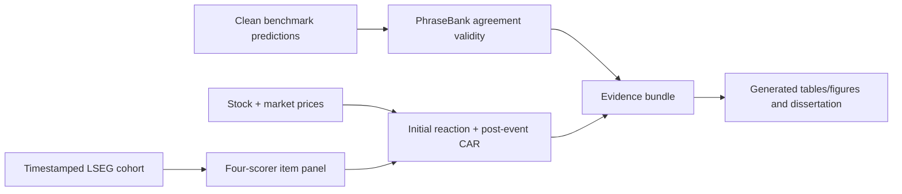

# Research Protocol

Last updated: 2026-07-12

> **Protocol status.** This document records the refocused dissertation design. Items marked as implementation targets are not yet executable merely because they appear here. Formal run identities become binding only when a dated config/manifest is frozen before execution. Completed artifacts are never overwritten; revised designs receive new IDs and directories.

Operational planning: [Dissertation execution plan](dissertation_execution_plan.md)

## Purpose

This repository is the measurement and evidence engine for **Beyond the Mean: Cross-Model Agreement and Post-News Return Resolution**.

Primary research question:

> Does cross-model agreement—assessed against graded human annotation agreement—add out-of-sample information about firm-level post-news abnormal returns beyond mean sentiment and the initial price reaction?

The protocol separates three constructs that the previous four-layer design conflated:

1. **benchmark competence** — whether each scorer classifies financial sentiment credibly;
2. **construct validity** — whether item-level model agreement corresponds to graded human agreement and error risk;
3. **external predictive validity** — whether agreement adds held-out market information beyond the mean score.

Benchmark accuracy is not treated as a market signal. Cross-model agreement is not called reliability, confidence, truth, investor positioning, or crowding.

## Core evidence flow



Core outputs are complete even when the agreement trend or market comparison is null, provided the design, data and inference pass their gates.

## Research questions and hypotheses

### Supporting question 1 — construct validity

Does agreement among the selected heterogeneous scorers increase with Financial PhraseBank annotator-agreement tiers and correspond to lower classification error?

Primary expectation:

\[
\rho_S(A_i,T_i) > 0,
\]

where `A_i` is continuous pairwise model agreement and `T_i` is the ordered PhraseBank tier. Report the rank association with uncertainty, tier effects, error/risk–coverage behaviour, adjusted sensitivity, and leave-one-model-out results. This expectation can be rejected without invalidating the pipeline.

### Supporting question 2 — external predictive validity

Does agreement improve held-out prediction of post-news abnormal returns relative to mean sentiment alone and the strongest individual scorer?

Primary outcome:

\[
CAR_{i,+1:+5},
\]

which excludes the initial event-session reaction.

Primary predictive comparison:

1. strongest individual scorer + initial reaction;
2. ensemble mean sentiment + initial reaction;
3. ensemble mean + agreement + mean×agreement + initial reaction.

The primary held-out estimand is `MSE(model 3) - MSE(model 2)`; a negative value favours the agreement-augmented model. Report MAE, out-of-sample R-squared, and a date-block bootstrap interval. Coefficient estimates are secondary explanatory evidence. A null means agreement has measurement relevance at most in this sample.

## Dataset policy

### Labeled benchmark

The default dataset is `Data/derived/labeled/financial_sentiment_v2.csv`, rebuilt by `scripts/build_labeled_dataset.py`. Never edit it manually.

- PhraseBank contributes the graded 50/66/75/100% human-agreement tiers.
- FiQA is a benchmark complement but does not provide equivalent annotator-agreement tiers.
- `Data/data.csv` is immutable legacy material containing documented merge corruption and is not an ambiguity source.
- Report PhraseBank and FiQA separately when provenance fields or label-generation processes differ.
- Record source, cleaning, mapping, split and content hashes for every derived view.

The construct-validity analysis uses the 4,836 PhraseBank rows with recoverable tiers and complete core-roster predictions.

### LSEG news

The candidate market corpus is the existing 33-company US collection covering approximately late December 2025 through June 2026. It remains licensed local material and is conditional on the 19 July gate.

The canonical analysis event is the earliest eligible revision for each `story_family × symbol`. The analysis later aggregates multiple eligible stories to one `symbol × event_session` row. Every exclusion and aggregation must be auditable.

Formal scoring waits for:

- a complete verified raw manifest;
- a canonical cleaned corpus and cleaner version;
- a relevance-audited cohort and attrition report;
- an immutable chronological development/evaluation split;
- a verified price panel and 100-event return dry run.

### Prices

The current `Data/derived/prices/lseg_us_sector_33.csv` is not sufficient for the intended market model because it lacks the market series and has only about 127–128 sessions. The implementation target is a new hashed panel containing all retained stocks plus the verified broad-market series and enough history for:

- 120 estimation sessions;
- a 21-session gap;
- the initial event session;
- ten subsequent sessions.

The core plan does not depend on index futures.

## Core scorer roster

The fixed core roster is:

- ProsusAI/FinBERT;
- VADER;
- Cerebras `gemma-4-31b`;
- Cerebras `gpt-oss-120b`.

These are selected heterogeneous scorers, not independent raters. The same four identities and label mapping are used for PhraseBank validation and LSEG scoring.

LSEG uses one target-company prompt, temperature 0, and one sample. Model IDs, provider route, prompt hash, content hash and runtime metadata are recorded. Hosted failures may be retried under the frozen policy; a different model/prompt creates a new run rather than repairing the old identity silently.

TF–IDF is optional because existing benchmark predictions are out-of-fold. A valid LSEG extension must train and record a full-data estimator rather than reuse incompatible OOF identities.

## Agreement construction

For item `i` with `m` model labels, primary agreement is:

\[
A_i = \frac{\sum_{j<k} 1(y_{ij}=y_{ik})}{\binom{m}{2}}.
\]

Use the continuous statistic in primary analyses. Discrete high/medium/low labels are descriptive only. Preserve mean sentiment and model-score dispersion as separate fields. Within-model sampling entropy is not available in the one-sample core and belongs to optional work.

Required PhraseBank reporting:

- agreement and bootstrap interval by human tier;
- Spearman trend;
- adjustment/sensitivity for gold class and text length;
- consensus and model error by tier/agreement;
- risk–coverage or selective-accuracy curve;
- leave-one-model-out agreement analysis.

Agreement corresponding to a human tier supplies convergent validity only. It does not prove the same construct transfers unchanged to LSEG company news.

## Event timing and abnormal returns

Use `version_created`, convert from UTC to `America/New_York`, and apply a declared session-close rule. Same-session assignment is allowed only when publication precedes that rule; otherwise use the next trading session. Daily data leave residual intraday contamination, which must be disclosed.

For each stock event:

1. fit the declared market model on 120 sessions ending 21 sessions before the event;
2. calculate the event-session abnormal return as `initial_reaction`;
3. calculate post-event `CAR(+1,+5)` without the event session;
4. calculate `+1` and `+10` outcomes as declared sensitivities;
5. aggregate to one `symbol × event_session` observation before inference.

Do not use `news_date` alone for tradable-session alignment. Do not call a sentiment-signed CAR “reaction reversal” unless the initial reaction is explicitly separated.

## Development and evaluation discipline

- Freeze the chronological boundary before formal LSEG scoring.
- Development data determine standardisation and any model fit.
- The evaluation block is inspected once after the frozen identity/analysis checks pass.
- Use identical eligible events for all nested comparisons.
- Do not choose the roster, prompt, agreement measure, bucket thresholds, horizon or subgroup from evaluation outcomes.
- The period has already been explored with lexicon/LLM signals; describe it as a chronological evaluation block, not a pristine confirmatory holdout.

The predictive model must not depend on date fixed-effect categories unavailable at evaluation time. Explanatory coefficient tables may use company/date-aware clustered uncertainty. Primary loss uncertainty uses a date-block bootstrap to preserve common market-date dependence.

## Feasibility gate

The market route passes on 19 July only if:

- at least 80% of evaluation events align to valid return windows;
- at least 25 symbols survive;
- audited relevance precision is at least 0.85;
- enough independent dates support the declared bootstrap/inference;
- the 100-event dry run proves initial/post-event separation and reproduces deterministically.

On failure, the dissertation activates this fallback:

> Does cross-model agreement provide a valid and practically useful uncertainty signal for financial sentiment classification across human-agreement tiers and model families?

The LSEG evidence then becomes exploratory. The writing and submission dates do not move, and no third design is invented.

## Required artifacts

### Agreement validity

`results/agreement_validation/phrasebank_core_v1/`:

- `item_metrics.csv`
- `tier_summary.csv`
- `trend_tests.csv`
- `model_error_by_tier.csv`
- `leave_one_model_out.csv`
- `agreement_by_tier.png`
- `summary.md`
- `manifest.json`

### Core LSEG scoring

`results/scoring/lseg_us_sector_33_core_v1/`:

- `llm_scores.jsonl`
- `baseline_scores.jsonl`
- `scores.jsonl`
- `coverage.csv`
- `manifest.json`

### Event study

`results/l2/lseg_us_sector_33_core_v1/`:

- `item_metrics.csv`
- `event_panel.csv`
- `development_coefficients.csv`
- `holdout_predictions.csv`
- `model_comparison.csv`
- `bootstrap.csv`
- `robustness.csv`
- `figures/`
- `summary.md`
- `manifest.json`

Register the three run families in `experiments/manifest.toml`, export main-text tables/figures into `dissertation/generated/`, and never hand-type final result values.

## Interpretation limits

- The study is predictive/associational, not causal.
- Agreement is observed model behaviour, not investor holdings, order flow, adoption, or crowding.
- Shared training data and architectures may create common bias.
- PhraseBank validation may not transfer fully to Reuters/LSEG style, targets or event context.
- Daily prices cannot fully isolate intraday timing.
- Many news events share firms and dates; raw event count is not independent sample size.
- A backtest or event study is not deployable alpha.
- Report all nulls, attrition, effect sizes, intervals, failures and deviations.

## Result freeze and quality checks

Results freeze on 31 July 2026. Afterward permit only bug fixes, declared robustness, exact reproduction and regenerated assets.

Required checks:

```bash
pytest -q <focused core tests>
pytest -q
ruff check .
mypy src/sentiment_benchmark
sentiment-bench validate-data
cd dissertation
make assets
make count
make pdf
```

Replay the core results into a fresh directory and compare identities/hashes before freeze.

## Nice-to-have extensions

An extension may start only after core reproduction, at least 7,500 substantive dissertation words, no unresolved core evidence placeholder, and no risk to the 9–10 August supervisor draft. At most one enters the main text.

Priority order:

1. one fixed after-cost agreement-conditioned portfolio comparison;
2. TF–IDF fifth scorer;
3. prompt-order/paraphrase variants and stochastic self-consistency;
4. one powered sector or event-type analysis;
5. training-cutoff placebo;
6. legacy threshold/index-futures replication;
7. G-theory reliability, shrinkage and position sizing;
8. writer–scorer Echo experiment;
9. wider universes, countries, intraday data or persona dispersion.

The old crossed L2/L3 design remains reproducible documentation for future work, not the dissertation's critical path.
