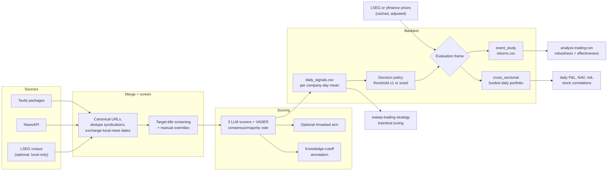
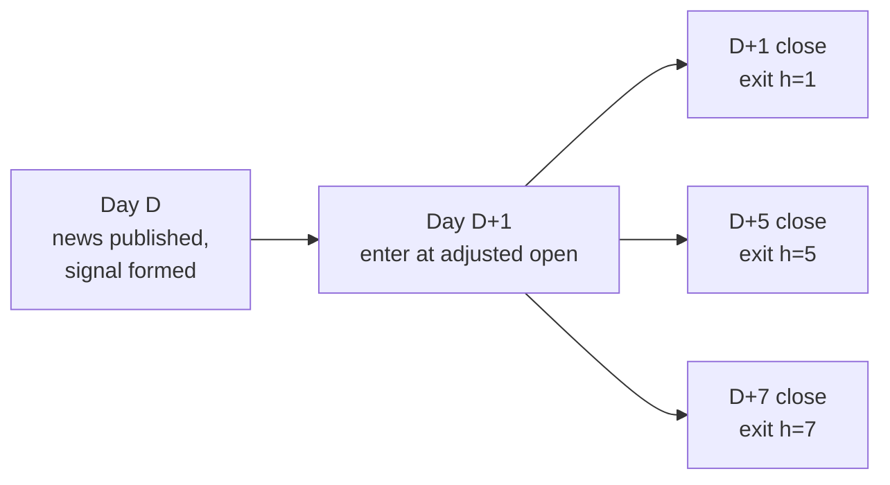
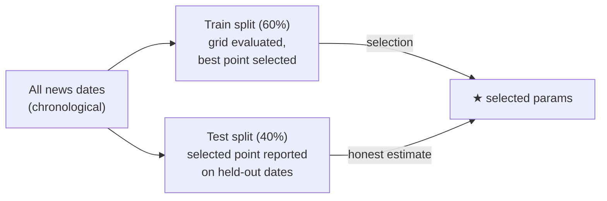
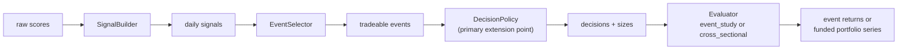
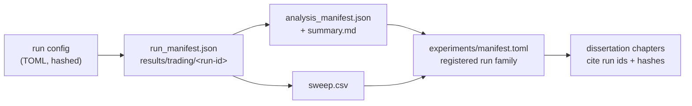

# Trading Pipeline And Backtesting

Last updated: 2026-07-11

This guide explains the news-to-price trading pipeline end to end: how articles become sentiment scores, how scores become daily signals and trades, how event returns and funded portfolio P&L are computed, and how the analysis, effectiveness battery, parameter sweep, and pluggable strategy layer fit together.

> **Closing-phase status (30 July 2026).** This is reusable historical infrastructure, not the active dissertation design. The current work asks how to filter and aggregate firm-day news in [`final_experiments/`](../final_experiments/README.md); it imports stable utilities here without treating another backtest as the research objective.

> **Interpretation limit.** Everything here is research infrastructure for the dissertation's L1 layer, not a live-order system or investment advice. Company-day events overlap and are treated as independent by the statistics, so all p-values are optimistic *screening diagnostics* — a confirmatory claim requires a plan filed before its data, e.g. the (currently parked) [Trading pre-registration](trading_preregistration.md).

## The Pipeline At A Glance



One command runs the left half through the selected evaluation frame; two more analyze and tune a completed run without re-scoring:

| Stage | Command | Re-runs APIs? |
| --- | --- | --- |
| Collect, screen, score, price, evaluate | `run-trading-strategy` | Yes (resumable; cached parts skipped) |
| Robustness report + effectiveness battery | `analyze-trading-run` | No |
| Parameter tuning on a training split | `sweep-trading-strategy` | No |
| Headline-only value screen (LSEG) | `analyze-headline-value` | No |

## Stage 1: Sources And Screening

`run-trading-strategy` reads a TOML config (for example [`configs/trading_prereg_main.toml`](../configs/trading_prereg_main.toml)) that fixes the company panel, news dates, providers, models, and policy. It merges provider records into a provider-neutral article table, canonicalizes URLs, removes exact headline syndications, and assigns each article an exchange-local news date.

Screening is `automatic_title_rule_v1` — a target alias must appear in the title, excluding consumer promotions — plus documented manual review persisted as a `*_overrides.toml`. Every automatic and manual decision is recorded under `Data/derived/trading/<run-id>/` so inclusion is auditable and is never tuned after seeing returns.

## Stage 2: Scoring

Each accepted text (the common `title + snippet/description` representation) is scored by the configured LLM roster plus VADER. A `consensus/majority` scorer aggregates the individual model labels. Two optional sensitivity layers annotate — but never alter — the primary scores:

- **Entity masking** (`[scoring].masking_mode = both`): a parallel arm scores anonymised text under `#masked` scorer ids, testing whether models react to the company name rather than the news.
- **Knowledge-cutoff stratification** (`[cutoff].policy = stratify`): each score records whether the news date is after the scoring model's knowledge cutoff, separating contamination-free events.

LLM responses and NewsAPI source pointers are cached, so an interrupted or rolling run resumes without re-spending.

## Stage 3: Signals And The Trading Rule

Scores aggregate to one signal per `(scorer, company, news date)`: the mean sentiment across that day's accepted texts, with a minimum-story floor. The default decision rule is the supervisor's threshold strategy:

- mean sentiment > `threshold` → long, full +1 position
- mean sentiment < `-threshold` → short, full −1 position
- otherwise → hold (recorded with its reason in `trading_decisions.csv`)

Timing avoids look-ahead: all of day *D*'s news is known before entry, which happens at the **next observed session's adjusted open**, and each horizon *h* exits at the adjusted close *h* sessions later.



The default `event_study` frame computes each event on $10,000 notional, with gross and net columns (two-sided transaction costs and a disclosed short-borrow assumption). This remains the diagnostic frame used by the existing effectiveness battery and parameter sweep. The opt-in `cross_sectional` frame accounts for the same decisions as a funded, overlapping portfolio; its accounting is described below.

Prices come through the `PriceProvider` seam ([prices.py](../src/sentiment_benchmark/prices.py)) with an opt-in per-(symbol, window) cache (`[prices].cache_dir`), so completed runs are deterministic and offline-replayable. Two backends exist: `lseg` (preferred for formal runs — licensed daily bars through the same Workspace session as the news collection, split/correction-adjusted but not dividend-adjusted, i.e. price returns) and `yfinance` (the historical default; folds dividends in via `auto_adjust`). Configs that omit `[prices]` keep yfinance, so previously registered runs are unaffected.

Two policy options handle thin coverage:

- A company-day with no accepted texts produces **no signal** — it is dropped, never imputed.
- With `[index_fallback]` enabled, a company-day with fewer than `min_texts` accepted texts keeps its signal but trades a US index (for example `^GSPC`) instead of the stock; the rows are flagged `index_fallback` and counted in the manifest.

### Funded cross-sectional evaluation

Set `[strategy] eval_frame = "cross_sectional"` to turn the decisions into daily positions, P&L, and NAV. Each `(scorer, horizon)` cell is an independent portfolio with its own starting capital; results from different scorers or horizons are therefore comparable experiments, not simultaneous claims on the same cash balance.

The evaluator groups signals by their **actual entry session**, rather than by publication date. This matters for after-close, weekend, and holiday news: different news dates can map to the same next tradable open, and the portfolio must size them together. For a horizon of *H* sessions, each entry cohort receives `gross_exposure / H` times that day's starting NAV. These rotating sleeves make overlapping cohorts share capital instead of each receiving a fresh full-capital allocation. Lots are marked open-to-close on entry day and close-to-close thereafter, then exit at the horizon close. Net P&L charges the configured per-side transaction cost on actual entry and exit notional, plus daily short borrow on the absolute closing short market value.

Within a cohort, `weighting = "equal"` gives each active name equal weight on its side of the book, while `weighting = "signal"` scales by the decision magnitude. With `dollar_neutral = true`, the sleeve is split 50/50 between long and short notional; `require_two_sided = true` admits a cohort only when it contains at least one decision on each side. `max_abs_weight` and `max_positions_per_side` limit name concentration and cohort breadth. The evaluator records unused capacity rather than silently levering the remaining names past a cap. Its default `duplicate_entry_policy = "error"` also rejects duplicate `(scorer, symbol, entry session)` decisions instead of double-counting them.

```toml
[strategy]
id = "sentiment_magnitude_v1"
scale = 1.0
max_position = 1.0
eval_frame = "cross_sectional"

[portfolio]
gross_exposure = 1.0
dollar_neutral = true
weighting = "signal"            # equal | signal
require_two_sided = true
max_abs_weight = 0.10
max_positions_per_side = 10
duplicate_entry_policy = "error"
periods_per_year = 252
annual_risk_free_rate = 0.0
estimate_shrunk_covariance = true
```

The run's `[run] notional_usd` is the initial NAV of each independent scorer/horizon portfolio. The daily portfolio table is the authoritative funded series. It contains start/end NAV, gross and net P&L, cumulative profit, daily return, drawdown, exposure, turnover, and costs. Annual Sharpe is calculated from daily net NAV returns using `periods_per_year`; annual percentage profit is the geometric annual return from the full NAV path. The stock-level table reconciles to the daily total and supports pairwise correlations of aligned daily net-return contributions (inactive names contribute zero). Both sample and Ledoit–Wolf covariance estimates of those contributions are exported when shrinkage is enabled.

These statistics support model development, but they do not make selection bias disappear. Picking the highest Sharpe scorer/horizon, the smoothest equity curve, or the most negative stock pairs on the full sample is exploratory. Freeze the rule and correlation/covariance estimate on a chronological training window, then report performance once on untouched validation/holdout data.

For the supervisor's Week 6 cross-model comparison, `compare-week6-models`
enforces one shared split and identical company-day keys. It calibrates absolute
score gates by scorer-specific development quantiles, freezes each rule, and
reports the untouched evaluation. Its optional combined portfolio requires every
selected pair to be supported, development-profitable, and negatively correlated;
if no pair qualifies, the command reports that result rather than substituting a
merely low-absolute-correlation portfolio.

The funded book currently assumes one exchange calendar/timezone and one USD capital base, so it is appropriate for the configured US stock universe rather than an unhedged multi-currency portfolio. Prefer disabling `[index_fallback]` for stock-diversification research: several company signals can otherwise resolve to the same index symbol, which is not independent exposure. If fallback is retained, keep the source-symbol attribution in `portfolio_trades.csv` and use an explicit duplicate policy. Annualisation covers the portfolio's first-entry through final-exit sessions; the price provider's extra fetch buffer is not treated as additional zero-return history.

## Stage 4: Run Artifacts

A completed run writes to `results/trading/<run-id>/` and refuses to be overwritten by a changed config (the manifest hashes config and evidence):

| File | Contents |
| --- | --- |
| `sentiment_scores.csv` | Per-text, per-scorer labels with cutoff and masking annotations. |
| `daily_signals.csv` | Per company-day mean sentiment and accepted-text counts per scorer. |
| `trading_decisions.csv` | Long/short/hold per signal, including hold reasons. |
| `prices.csv` | Adjusted open/close series used for entries and exits. |
| `returns.csv` | Per-event gross/net returns and P&L for horizons D+1..D+7; retained as event-level diagnostics. |
| `portfolio_trades.csv` | Entry-lot audit trail: scorer/horizon, source/traded symbol, target weight, shares, entry/exit sessions, and costs. |
| `daily_stock_pnl.csv` | Dense stock×session panel of gross/net P&L, costs, return contribution, exposure, and cumulative contribution; inactive dates are explicit zeros. |
| `daily_portfolio.csv` | Funded daily NAV, return, cumulative profit, drawdown, exposure, turnover, and costs. |
| `portfolio_summary.csv` | Per scorer/horizon total and annualised performance, risk, drawdown, turnover, and cost metrics. |
| `stock_summary.csv` | Per-stock profit and risk contribution statistics. |
| `pnl_correlation.csv` | Pairwise correlations of aligned daily net-return contributions, with sample size, simultaneous-active days, and a both-profitable flag. |
| `pnl_covariance.csv` | Sample and Ledoit–Wolf covariance estimates for aligned daily net-return contributions. |
| `sensitivity_cutoff.csv` | Mean net return and hit rate split by pre-/post-knowledge-cutoff. |
| `sensitivity_masking.csv` | Masked vs unmasked comparison (only when a masked arm ran). |
| `equity_curve.png` | Event-study cumulative net P&L for the primary scorer. |
| `portfolio_equity.png` | Funded end-of-day NAV curves by scorer and horizon. |
| `stock_equity_curves.png` | Per-stock cumulative net P&L contributions for the finite-Sharpe leader (total-return fallback). |
| `pnl_correlation_heatmap.png` | Stock contribution-correlation heatmap for that highlighted case. |
| `summary.md` | Answer-first event or funded report; the funded version ranks scorer/horizon Sharpe and lists profitable negatively correlated pairs. |
| `run_manifest.json` | Config hash, corpus hashes, model tags/digests, prompt identity, policy settings, event counts. |

The run also registers in `experiments/manifest.toml` with its resolved `strategy_id` and parameters.

## Analyzing A Run

```bash
sentiment-bench analyze-trading-run \
  --run-dir results/trading/<run-id> \
  --output-dir results/trading/<run-id>_analysis \
  --comparison-run-dir results/trading/<earlier-run-id>   # optional
```

The analysis never overwrites an existing directory and never calls an API. It writes robustness tables (`horizon_summary.csv`, company/date breakdowns, `signal_distribution.csv`, `source_yield.csv`, leave-one-company-out estimates, LLM/VADER agreement diagnostics), five static plots, a technical `summary.md`, a `source_map.md`, and a hashed `analysis_manifest.json`. Bootstrap intervals are seeded percentile bootstraps and remain descriptive because events overlap.

### The Effectiveness Battery

The same command runs three complementary test families per `(scorer, horizon)` cell ([trading_effectiveness.py](../src/sentiment_benchmark/trading_effectiveness.py)), appended to `summary.md` and written as CSVs:

| Family | Question | Tests | Output |
| --- | --- | --- | --- |
| Significance & direction | Is the mean event return non-zero? Does the hit rate beat a coin flip? | t-test, Wilcoxon signed-rank, sign test, binomial; **Benjamini–Hochberg** correction across the scorer-horizon mean-return family | `effectiveness_significance.csv` |
| Benchmark comparison | Does the strategy beat passive buy-and-hold of the same names? | Paired test of the per-event difference | `effectiveness_benchmarks.csv` |
| Risk-adjusted economics | Is the edge economically meaningful? | Return/risk ratio, win/loss profile, profit factor, naive max drawdown, realised P&L | `effectiveness_economics.csv` |

**Week 3 result (exploratory, 22 events):** no scorer-horizon mean return survived BH correction; a suggestive but non-significant positive pattern appeared for the consensus scorer at D+3..D+6. That pattern motivated — but does not bias — the filed Week 4 test (consensus, D+5, q < 0.05 on the main set *and* same-sign replication on an untouched holdout); its collection is currently parked.

## Tuning: The Parameter Sweep

```bash
sentiment-bench sweep-trading-strategy \
  --run-dir results/trading/<run-id> \
  --scorer consensus/majority \
  --strategy sentiment_threshold_v1 \
  --thresholds 0.0,0.1,0.2,0.3 --horizons 1,3,5 \
  --metric sharpe --train-fraction 0.6
```

The sweep reloads `daily_signals.csv` and `prices.csv` (no re-scoring), splits **chronologically by news date**, evaluates the strategy's declared parameter grid × horizon, and selects the best point on the *training* metric only — held-out test metrics are reported alongside, so tuning cannot leak:



Selection metrics (`mean_return`, `hit_rate`, `sharpe`) are notional-independent ratios. Outputs are `sweep.csv` (every grid point, selected row flagged, idea-specific values in a `params` column) and a `<stem>_heatmap.png` threshold × horizon figure next to it.

## Pluggable Strategies

A trading "idea" spans four seams of one pipeline, each a small protocol in [strategies.py](../src/sentiment_benchmark/strategies.py):



Registered built-ins (`sentiment-bench list-strategies`):

| Strategy id | Idea |
| --- | --- |
| `sentiment_threshold_v1` | Equal-weight long/short: full ±1 position once mean sentiment clears the no-trade band. **Default** — reproduces the legacy rule byte-for-byte, so the filed Trading pre-registration is untouched. |
| `sentiment_magnitude_v1` | Conviction-weighted long/short: position size scales with \|mean sentiment\| (clipped). |
| `headline_sentiment_threshold_v1` | Threshold rule applied to per-headline signals (headline information-value pipeline). |

A run selects its idea in the config; a sweep with `--strategy`:

```toml
[strategy]
id = "sentiment_magnitude_v1"   # see `sentiment-bench list-strategies`
scale = 1.0                      # idea-specific params
max_position = 1.0
eval_frame = "cross_sectional"   # event_study | cross_sectional
```

Shared decision parameters (`threshold`, `min_valid_stories`, costs) still come from `[signal_policy]`; funded-book settings come from `[portfolio]`. Adding an idea usually means implementing one seam (typically a `DecisionPolicy`) and calling `register(Strategy(...))`; the sweep, effectiveness battery, and experiment registry then work on it unchanged.

## Headline-Only Value Analysis

For LSEG collections where story bodies are gated but headlines are complete, `analyze-headline-value` screens what the headlines alone are worth — coverage per company-day, an event-type taxonomy, source mix, and a lexicon-scored headline backtest through the same backtest core:

```bash
sentiment-bench analyze-headline-value \
  --collection-root Data/collections/lseg_us_sector_33_6m \
  --prices Data/derived/prices/lseg_us_sector_33.csv
```

It writes `company_day_panel.csv`, `headline_events.csv`, `category_summary.csv`, `source_summary.csv`, `daily_signals.csv`, a local raw-headline calibration template, and — when prices are available — `trading_returns.csv`/`trading_decisions.csv`/`trading_summary.csv`; without prices the trading arm is reported as blocked rather than silently skipped. All artifacts stay local because headlines are licensed text. See the [CLI reference](cli_reference.md#analyze-headline-value) for options.

## Reading The Evidence Chain

Every layer is a separate, hashed artifact, so a dissertation claim can be traced end to end:



Related reading: [Trading pre-registration](trading_preregistration.md) (filed but parked; binds only if its forward collection is executed), [Research protocol](research_protocol.md) (current closing-phase guardrails), [Results and exports](results_and_exports.md) (artifact schemas), [Architecture](architecture.md) (module boundaries).
