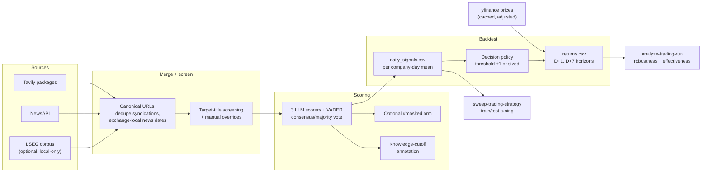
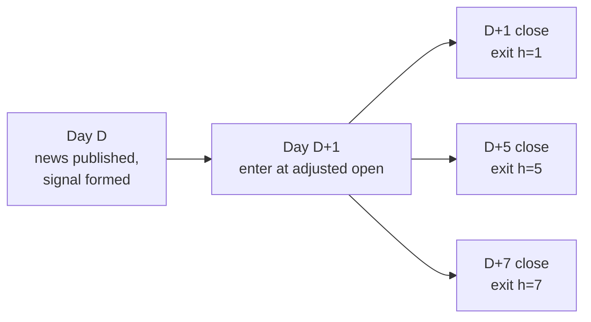
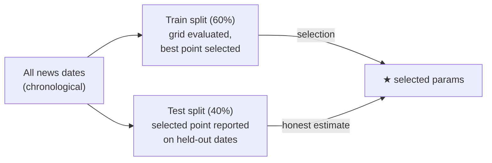
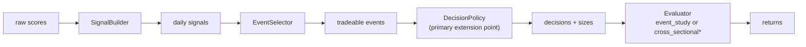
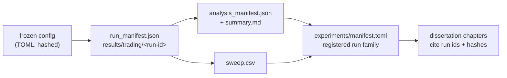

# Trading Pipeline And Backtesting

Last updated: 2026-07-01

This guide explains the news-to-price trading pipeline end to end: how articles become sentiment scores, how scores become daily signals and trades, how event returns are computed, and how the analysis, effectiveness battery, parameter sweep, and pluggable strategy layer fit together.

> **Interpretation limit.** Everything here is research infrastructure for the dissertation's L1 layer, not a live-order system or investment advice. Company-day events overlap and are treated as independent by the statistics, so all p-values are optimistic *screening diagnostics* — the only confirmatory claim comes from the frozen [Trading pre-registration](trading_preregistration.md).

## The Pipeline At A Glance



One command runs the left half through `returns.csv`; two more analyze and tune a completed run without re-scoring:

| Stage | Command | Re-runs APIs? |
| --- | --- | --- |
| Collect, screen, score, price, return | `run-trading-strategy` | Yes (resumable; cached parts skipped) |
| Robustness report + effectiveness battery | `analyze-trading-run` | No |
| Parameter tuning on a training split | `sweep-trading-strategy` | No |
| Headline-only value screen (LSEG) | `analyze-headline-value` | No |

## Stage 1: Sources And Screening

`run-trading-strategy` reads a frozen TOML config (for example [`configs/trading_prereg_main.toml`](../configs/trading_prereg_main.toml)) that fixes the company panel, news dates, providers, models, and policy. It merges provider records into a provider-neutral article table, canonicalizes URLs, removes exact headline syndications, and assigns each article an exchange-local news date.

Screening is `automatic_title_rule_v1` — a target alias must appear in the title, excluding consumer promotions — plus documented manual review persisted as a `*_overrides.toml`. Every automatic and manual decision is recorded under `Data/derived/trading/<run-id>/` so inclusion is auditable and is never tuned after seeing returns.

## Stage 2: Scoring

Each accepted text (the common `title + snippet/description` representation) is scored by the configured LLM roster plus VADER. A `consensus/majority` scorer aggregates the individual model labels. Two optional sensitivity layers annotate — but never alter — the primary scores:

- **Entity masking** (`[scoring].masking_mode = both`): a parallel arm scores anonymised text under `#masked` scorer ids, testing whether models react to the company name rather than the news.
- **Knowledge-cutoff stratification** (`[cutoff].policy = stratify`): each score records whether the news date is after the scoring model's knowledge cutoff, separating contamination-free events.

LLM responses and NewsAPI source pointers are cached, so an interrupted or rolling run resumes without re-spending.

## Stage 3: Signals And The Trading Rule

Scores aggregate to one signal per `(scorer, company, news date)`: the mean sentiment across that day's accepted texts, with a minimum-story floor. The default decision rule is the supervisor's threshold strategy:

- mean sentiment > `threshold` → long, full +1 position
- mean sentiment < `-threshold` → short, full −1 position
- otherwise → hold (recorded with its reason in `trading_decisions.csv`)

Timing avoids look-ahead: all of day *D*'s news is known before entry, which happens at the **next observed session's adjusted open**, and each horizon *h* exits at the adjusted close *h* sessions later.



Returns are computed on $10,000 notional per event, with gross and net columns (two-sided transaction costs and a disclosed short-borrow assumption). Prices come through the `PriceProvider` seam ([prices.py](../src/sentiment_benchmark/prices.py)) with an opt-in per-(symbol, window) cache (`[prices].cache_dir`), so completed runs are deterministic and offline-replayable. Two backends exist: `lseg` (preferred for formal runs — licensed daily bars through the same Workspace session as the news collection, split/correction-adjusted but not dividend-adjusted, i.e. price returns) and `yfinance` (the historical default; folds dividends in via `auto_adjust`). Frozen configs that omit `[prices]` keep yfinance, so registered runs are unaffected.

Two policy options handle thin coverage:

- A company-day with no accepted texts produces **no signal** — it is dropped, never imputed.
- With `[index_fallback]` enabled, a company-day with fewer than `min_texts` accepted texts keeps its signal but trades a US index (for example `^GSPC`) instead of the stock; the rows are flagged `index_fallback` and counted in the manifest.

## Stage 4: Run Artifacts

A completed run writes to `results/trading/<run-id>/` and refuses to be overwritten by a changed config (the manifest hashes config and evidence):

| File | Contents |
| --- | --- |
| `sentiment_scores.csv` | Per-text, per-scorer labels with cutoff and masking annotations. |
| `daily_signals.csv` | Per company-day mean sentiment and accepted-text counts per scorer. |
| `trading_decisions.csv` | Long/short/hold per signal, including hold reasons. |
| `prices.csv` | Adjusted open/close series used for entries and exits. |
| `returns.csv` | Per-event gross/net returns and P&L for horizons D+1..D+7. |
| `sensitivity_cutoff.csv` | Mean net return and hit rate split by pre-/post-knowledge-cutoff. |
| `sensitivity_masking.csv` | Masked vs unmasked comparison (only when a masked arm ran). |
| `equity_curve.png` | Cumulative net P&L for the primary scorer. |
| `run_manifest.json` | Config hash, corpus hashes, model tags/digests, prompt identity, policy settings, event counts. |

The run also registers in `experiments/manifest.toml` with its resolved `strategy_id` and parameters.

## Analyzing A Run

```bash
sentiment-bench analyze-trading-run \
  --run-dir results/trading/<run-id> \
  --output-dir results/trading/<run-id>_analysis \
  --comparison-run-dir results/trading/<earlier-run-id>   # optional
```

The analysis never overwrites an existing directory and never calls an API. It writes robustness tables (`horizon_summary.csv`, company/date breakdowns, `signal_distribution.csv`, `source_yield.csv`, leave-one-company-out estimates, LLM/VADER agreement diagnostics), five static plots, a technical `summary.md`, a `source_map.md`, and a hashed `analysis_manifest.json`. Bootstrap intervals are seeded percentile bootstraps and remain descriptive because events overlap.

### The Effectiveness Battery

The same command runs three complementary test families per `(scorer, horizon)` cell ([trading_effectiveness.py](../src/sentiment_benchmark/trading_effectiveness.py)), appended to `summary.md` and written as CSVs:

| Family | Question | Tests | Output |
| --- | --- | --- | --- |
| Significance & direction | Is the mean event return non-zero? Does the hit rate beat a coin flip? | t-test, Wilcoxon signed-rank, sign test, binomial; **Benjamini–Hochberg** correction across the scorer-horizon mean-return family | `effectiveness_significance.csv` |
| Benchmark comparison | Does the strategy beat passive buy-and-hold of the same names? | Paired test of the per-event difference | `effectiveness_benchmarks.csv` |
| Risk-adjusted economics | Is the edge economically meaningful? | Return/risk ratio, win/loss profile, profit factor, naive max drawdown, realised P&L | `effectiveness_economics.csv` |

**Week 3 result (exploratory, 22 events):** no scorer-horizon mean return survived BH correction; a suggestive but non-significant positive pattern appeared for the consensus scorer at D+3..D+6. That pattern motivated — but does not bias — the frozen Week 4 test (consensus, D+5, q < 0.05 on the main set *and* same-sign replication on an untouched holdout).

## Tuning: The Parameter Sweep

```bash
sentiment-bench sweep-trading-strategy \
  --run-dir results/trading/<run-id> \
  --scorer consensus/majority \
  --strategy sentiment_threshold_v1 \
  --thresholds 0.0,0.1,0.2,0.3 --horizons 1,3,5 \
  --metric sharpe --train-fraction 0.6
```

The sweep reloads `daily_signals.csv` and `prices.csv` (no re-scoring), splits **chronologically by news date**, evaluates the strategy's declared parameter grid × horizon, and selects the best point on the *training* metric only — held-out test metrics are reported alongside, so tuning cannot leak:



Selection metrics (`mean_return`, `hit_rate`, `sharpe`) are notional-independent ratios. Outputs are `sweep.csv` (every grid point, selected row flagged, idea-specific values in a `params` column) and a `<stem>_heatmap.png` threshold × horizon figure next to it.

## Pluggable Strategies

A trading "idea" spans four seams of one pipeline, each a small protocol in [strategies.py](../src/sentiment_benchmark/strategies.py):



\* `event_study` is implemented; `cross_sectional` (a long/short portfolio book) is a guarded planned fast-follow and currently errors.

Registered built-ins (`sentiment-bench list-strategies`):

| Strategy id | Idea |
| --- | --- |
| `sentiment_threshold_v1` | Equal-weight long/short: full ±1 position once mean sentiment clears the no-trade band. **Default** — reproduces the legacy rule byte-for-byte, so the frozen Trading pre-registration is untouched. |
| `sentiment_magnitude_v1` | Conviction-weighted long/short: position size scales with \|mean sentiment\| (clipped). |
| `headline_sentiment_threshold_v1` | Threshold rule applied to per-headline signals (headline information-value pipeline). |

A run selects its idea in the config; a sweep with `--strategy`:

```toml
[strategy]
id = "sentiment_magnitude_v1"   # see `sentiment-bench list-strategies`
scale = 1.0                      # idea-specific params
max_position = 1.0
eval_frame = "event_study"
```

Shared decision parameters (`threshold`, `min_valid_stories`, costs) still come from `[signal_policy]`. Adding an idea usually means implementing one seam (typically a `DecisionPolicy`) and calling `register(Strategy(...))`; the sweep, effectiveness battery, and experiment registry then work on it unchanged.

## Headline-Only Value Analysis

For LSEG collections where story bodies are gated but headlines are complete, `analyze-headline-value` screens what the headlines alone are worth — coverage per company-day, an event-type taxonomy, source mix, and a lexicon-scored headline backtest through the same backtest core:

```bash
sentiment-bench analyze-headline-value \
  --collection-root Data/collections/lseg_us_sector_33_6m \
  --prices Data/derived/prices/lseg_us_sector_33.csv
```

It writes `company_day_panel.csv`, `headline_events.csv`, `category_summary.csv`, `source_summary.csv`, `daily_signals.csv`, a local raw-headline calibration template, and — when prices are available — `trading_returns.csv`/`trading_decisions.csv`/`trading_summary.csv`; without prices the trading arm is reported as blocked rather than silently skipped. All artifacts stay local because headlines are licensed text. See the [CLI reference](cli_reference.md#analyze-headline-value) for options.

## Reading The Evidence Chain

Every layer is a separate, hashed artifact, so a dissertation claim can be traced end to end:



Related reading: [Trading pre-registration](trading_preregistration.md) (the frozen confirmatory test), [Research protocol](research_protocol.md) (L1–L4 design), [Results and exports](results_and_exports.md) (artifact schemas), [Architecture](architecture.md) (module boundaries).
