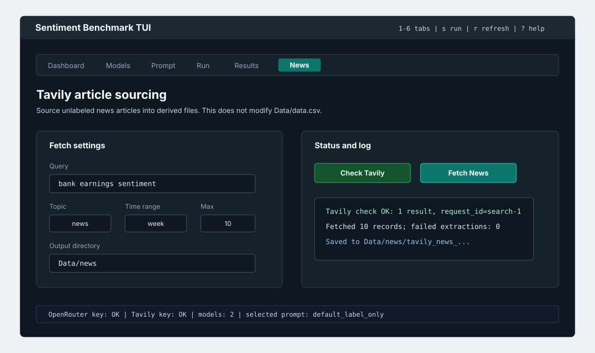

# How To Use The Terminal UI

The TUI is the interactive front end for the same benchmark, provider, results, Tavily, and LSEG workflows exposed by the CLI.



## Prerequisites

- Project installed with `python -m pip install -e ".[dev]"`.
- `Data/derived/labeled/financial_sentiment_v2.csv` available.
- Provider credentials or Ollama host configured if you plan to run models.
- `TAVILY_API_KEY` configured if you plan to fetch Tavily articles from the News tab.
- Optional LSEG collection support requires `python -m pip install -e ".[lseg]"`, LSEG Workspace Desktop running, and a collection config such as `configs/lseg_us_mega_cap_1y.toml`.
- Optional: `nvidia-smi` on PATH if you want GPU utilization, VRAM, power, and temperature in the local resource monitor.

## Open The TUI

```bash
sentiment-bench tui
```

The app stores local session preferences in `results/tui_session.json`.

Session preferences and the experiment queue are saved atomically, so an interrupted
write preserves the previous file. The normal `sentiment-bench tui` launcher records
application warnings in `results/tui.log` and hard-crash traces in
`results/tui_crash.log`. Check the application log if settings fail to save or a saved
state file cannot be read.

On Windows, if `sentiment-bench` is not recognized, activate the virtual environment or run the executable directly:

```powershell
.\.venv\Scripts\Activate.ps1
sentiment-bench tui

# Or:
.\.venv\Scripts\sentiment-bench.exe tui
```

## Keyboard Shortcuts

| Key | Action |
| --- | --- |
| `1` | Dashboard |
| `2` | Models |
| `3` | Prompt |
| `4` | Run |
| `5` | Results |
| `6` | News |
| `r` | Refresh active data |
| `s` | Start a benchmark run |
| `c` | Cancel current run |
| `?` | Help |

## Tab Guide

| Tab | Purpose | Typical actions |
| --- | --- | --- |
| Dashboard | Shows dataset, provider, run readiness, and local resource monitor. | Pick provider and endpoint, confirm credentials, review selected models and GPU/runtime state. |
| Models | Fetches and filters provider models. | Auto-detect local Ollama models, search, select one or more models, confirm provider availability. |
| Prompt | Edits prompt configuration. | Pick prompt preset, review prompt text, save a custom TUI prompt. |
| Run | Configures experiment settings. | Choose pilot/full mode, seed, temperature, tokens, few-shot settings, baselines, and Ollama thinking behavior. |
| Results | Loads stored run metrics. | Inspect metrics, machine labels, confusion matrices, misclassifications, exports, and figures. |
| News | Sources Tavily article corpora and runs guided LSEG collection actions. | Check APIs, fetch articles, run LSEG raw collection, build clean corpora, and refresh the LSEG catalog. |

## Run A Benchmark

1. Open Dashboard and select provider.
2. Enter the provider endpoint:

   ```text
   https://openrouter.ai/api/v1
   ```

   or:

   ```text
   https://api.cerebras.ai/v1
   ```

   or:

   ```text
   http://desktop-pc:11434
   ```

3. Open Models and fetch models. Cerebras returns the models available to the current project. For local Ollama at `http://localhost:11434`, the TUI auto-fetches installed models on startup unless `SENTIMENT_BENCH_AUTO_FETCH_MODELS=0`.
4. Select one or more model IDs.
5. Open Prompt and choose `default_label_only`, `finance_calibrated_label_only`, or another prompt.
6. Open Run, keep `pilot` for the first pass, and start the run.
7. Cerebras automatically starts at concurrency 64 and applies model-aware request pacing. For Gemma 4/Ollama models, keep `Disable Ollama thinking` enabled so reasoning tokens do not consume the short answer budget.
8. Open Results when the run finishes.

## Local Resource Monitor

The Dashboard and Run tabs show a live local resource monitor. It reports provider, endpoint, selected/fetched model counts, TUI concurrency, max completion tokens, and provider-specific throughput settings. For Cerebras it shows the active request pace; for Ollama it shows `OLLAMA_NUM_PARALLEL` and thinking behavior. When `nvidia-smi` is available, it also reports each NVIDIA GPU's utilization, VRAM, power, and temperature.

Use this monitor as a run-health signal, not as the only speed metric. A single Ollama request can leave GPU utilization below maximum even while the model is working. Increase concurrency only after a pilot run is stable and watch invalid outputs, latency, and VRAM pressure together.

## Gemma 4 And Ollama Thinking

Gemma 4 and other thinking-capable Ollama models may spend a short completion budget on reasoning before returning a label. The TUI includes a `Disable Ollama thinking` checkbox on the Run tab and highlights it as a recommendation for `gemma4:*` models. The setting is stored in run request metadata.

For short financial-sentiment classification, `finance_calibrated_label_only` is the recommended prompt preset for Gemma 4 pilots.

## Source News

1. Open News.
2. Enter a query such as:

   ```text
   bank earnings sentiment
   ```

3. Choose topic and time range.
4. Keep extraction enabled unless you only need snippets.
5. Click Check Tavily for a low-cost connectivity check.
6. Click Fetch News.
7. Read the log line for the saved output path and failed extraction count.

The News tab writes the same files as `sentiment-bench fetch-news`: `articles.jsonl`, `articles.csv`, and `manifest.json`.

## Export Results

In the Results tab:

1. Select a completed run.
2. Review machine labels, primary metrics, and all-scope metrics.
3. Use Export Run to write `results/exports/run_<id>/`.
4. Use View Figures if the optional plotting extra is installed.

When Turso/libSQL is configured, the Results tab reads the shared run history. Each new run stores `machine_id`, `machine_label`, and an environment snapshot so runs from different machines can be distinguished.

## Troubleshooting

| Symptom | Likely cause | Fix |
| --- | --- | --- |
| Models tab shows no models | Provider credential or endpoint problem. | Check `.env`, provider selector, endpoint, and firewall. |
| Cerebras returns 401 | `CEREBRAS_API_KEY` is missing or invalid. | Add the key to `.env`, restart the TUI, and fetch models again. |
| Cerebras is unexpectedly slow | The API key belongs to a lower-quota project, or another process shares the key. | Check the key's project, close stale TUI processes, and restart so `.env` is reloaded; the client displays and enforces live quota headers. |
| Local Ollama models do not auto-fetch | Auto-fetch is disabled, provider is not Ollama, or host is not localhost. | Set provider to Ollama, use `http://localhost:11434`, click Fetch Models manually, or remove `SENTIMENT_BENCH_AUTO_FETCH_MODELS=0`. |
| Run button refuses to start | Missing model selection or invalid settings. | Review Dashboard readiness and Run validation hints. |
| Ollama run fails from another machine | Ollama server not reachable. | Check `OLLAMA_HOST`, host firewall, and `ollama list` on the model host. |
| Gemma 4 outputs are invalid | Thinking consumed the label budget or the prompt was too generic. | Keep `Disable Ollama thinking` enabled and use `finance_calibrated_label_only`. |
| GPU line is missing | `nvidia-smi` is unavailable or no NVIDIA GPU is reported. | Install NVIDIA drivers/tools or treat the monitor as CPU/provider-only. |
| News check fails | `TAVILY_API_KEY` missing or invalid. | Add the key to `.env`, restart the TUI, and retry Check Tavily. |
| Figures do not open | Plotting extra not installed or OS open failed. | Run `python -m pip install -e ".[figures]"` and export again. |
