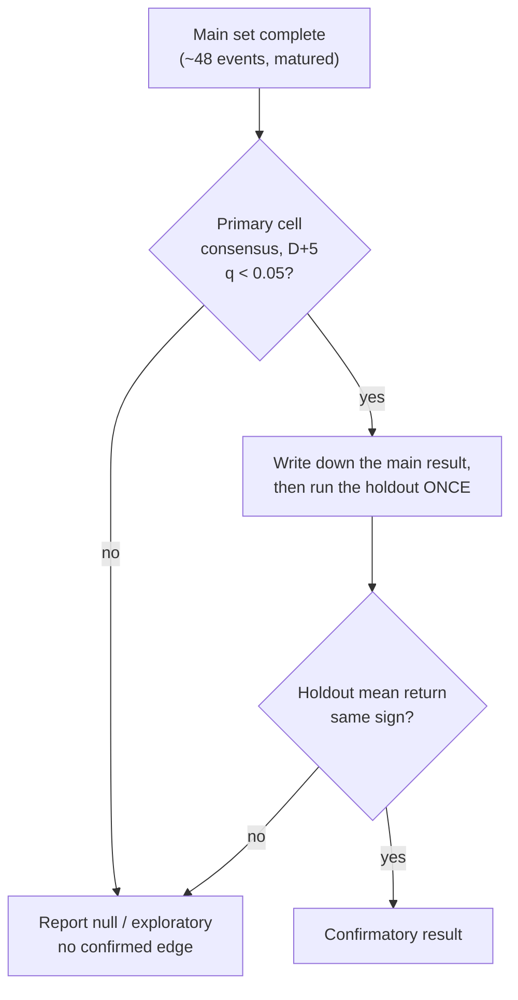

# Week 4+ Trading Test — Pre-registration

**Status:** frozen before collection · **Date filed:** 2026-06-24

This document fixes the analysis plan *before* any Week 4 data is collected or
seen, so the confirmatory result cannot be shaped by the data. The exploratory
Week 3 run ([broad reviewed](../configs/week3_trading_broad_reviewed.toml)) is
retained separately as hypothesis-generating context and is **not** part of this
test.

## Motivation

Week 3 covered three *adjacent* days (8 events/horizon usable across 22 events).
The effectiveness battery found no scorer-horizon mean return significant after
Benjamini-Hochberg correction, but a suggestive positive pattern for the
consensus scorer at D+3..D+6 (mean ≈1.2%, hit rate ≈65–71%). A power analysis on
the observed effect size (return/risk ≈0.36 at D+5) implies **~60 events** are
needed to detect it at 80% power, two-sided 5% — roughly 3× Week 3. Adjacent days
and extra companies add economically-correlated events, so the design widens
**time**, not the same window.

## Hypothesis

> For the consensus scorer at the D+5 horizon, the mean event return is non-zero.

One-sided economic interpretation (long positive / short negative sentiment) is
expected to produce a **positive** mean if any edge exists.

## Primary analysis (fixed)

| Element | Value |
| --- | --- |
| Primary scorer | `consensus/majority` |
| Primary horizon | **D+5** (5 trading sessions after entry) |
| Primary metric | Mean event return vs 0 — one-sample t-test, reported with BH-corrected q |
| Significance threshold | q < 0.05 after Benjamini-Hochberg across the scorer-horizon mean-return family |
| Entry / exit | Next observed session adjusted open → adjusted close at D+5 |
| Costs | None (descriptive; flagged as a limitation) |

Everything else the pipeline produces — other scorers, horizons D+1..D+7,
buy-and-hold benchmark, risk economics, company/date breakdowns — is **secondary
/ sensitivity** and reported as such.

## Design

- **Panel:** the 8-company Week 3 set (AAPL, MSFT, NVDA, AMZN, TSLA, JPM, XOM, BA).
- **Main dates (6, non-adjacent, forward/rolling):** 2026-06-25, 07-02, 07-09,
  07-16, 07-23, 07-30 → ~48 planned company-day events.
  ([week4_trading_main.toml](../configs/week4_trading_main.toml))
- **Holdout (2, later, untouched):** 2026-08-06, 08-13.
  ([week4_trading_holdout.toml](../configs/week4_trading_holdout.toml))
- **Sourcing:** live NewsAPI + Tavily gap fetch per company-day; thin-coverage
  days (<3 texts) fall back to `^GSPC` rather than being dropped.

If the schedule allows, add 1–2 more main dates (toward ~60 events) before
locking; do this *before* collection, not after seeing returns.

## Decision rule

A result is treated as **confirmatory** only if **both** hold:

1. The primary cell (consensus, D+5) is significant at q < 0.05 on the main set; **and**
2. It **replicates with the same sign** on the holdout.



Any other outcome (significant on main but not holdout, or null) is reported
honestly as exploratory / no confirmed edge. The holdout is analysed **once**,
at the very end, after the main primary result is written down.

## Frozen inclusion rules

- Screening: `automatic_title_rule_v1` (target alias in title, excluding consumer
  promotions) plus documented manual review persisted as a `*_overrides.toml`.
- Rules are **not** tuned after seeing returns. Manual review decisions are
  recorded with reasons and are auditable.

## Operational notes (collection)

- **Rolling collection.** NewsAPI only indexes ~30 days back, so collect each
  date close to when it occurs. Returns can only be computed once a date has aged
  7 trading sessions, so the final return computation happens after the last date
  matures (~late August).
- **Resume support.** The pipeline caches NewsAPI source pointers and LLM scores;
  set `[scoring].resume_scores_path` and `[sources].newsapi_sources_file` on
  later runs to avoid re-spending on already-collected dates. (If the
  collect-now / compute-later cadence needs a dedicated collect-only step, that
  is a small pipeline addition — ask.)
- **Reproducibility.** Each completed run hashes its config and inputs and
  registers in `experiments/manifest.toml`; a changed config cannot overwrite a
  completed run.

## Run order

```bash
# 1. Dry-run check (no API calls)
sentiment-bench run-trading-strategy --config configs/week4_trading_main.toml --dry-run

# 2. Collect + score + price + return (rolling; rerun as dates mature)
sentiment-bench run-trading-strategy --config configs/week4_trading_main.toml

# 3. Effectiveness analysis (after the main set is complete)
sentiment-bench analyze-trading-run \
  --run-dir results/trading/week4_trading_main \
  --comparison-run-dir results/trading/week3_trading_broad_20260624_reviewed \
  --output-dir results/trading/week4_trading_main_analysis

# 4. ONLY after the main primary result is locked: run the holdout, then analyse it.
```
