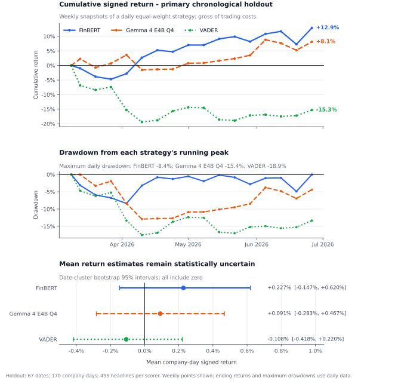

# Local Gemma 4 Headline Sentiment and One-Day Returns

## Technical summary

The frozen local experiment successfully assigned reproducible soft-label sentiment scores to all **2,282** intended Reuters headline candidates and compared Gemma 4 with FinBERT and VADER in a no-look-ahead, next-open-to-following-open return study. The untouched primary holdout contains **495 headlines**, **170 company-days**, and **67 trading dates**.

No model produced statistically reliable evidence of a one-day return association. FinBERT had the largest holdout point estimate at **+0.227% per company-day**, followed by Gemma at **+0.091%** and VADER at **-0.108%**, but every date-clustered 95% confidence interval included zero. These are exploratory gross-return associations, not evidence of a causal or deployable trading edge.

## The positive paths remain statistically uncertain

The figure separates three questions that a single point-estimate chart obscures: how the equal-weight strategy evolved, how far it fell from its running peak, and whether the mean company-day return estimate excludes zero. Weekly points are shown for legibility; ending compounded returns and maximum drawdowns were calculated from the complete daily series.



| Scorer | Company-days | Mean signed return | Date-cluster 95% CI | Hit rate | Rank correlation | Turnover | Annualized Sharpe | Max drawdown | Ending compounded return |
|---|---:|---:|---:|---:|---:|---:|---:|---:|---:|
| FinBERT | 170 | +0.227% | [-0.147%, +0.620%] | 48.82% | 0.104 | 10.07% | 1.44 | -8.38% | +12.89% |
| Gemma 4 E4B Q4 | 170 | +0.091% | [-0.283%, +0.467%] | 52.90% | 0.014 | 8.85% | 1.01 | -15.38% | +8.12% |
| VADER | 170 | -0.108% | [-0.418%, +0.220%] | 46.77% | -0.053 | 7.16% | -2.21 | -18.91% | -15.30% |

The cumulative paths are descriptive rather than inferential. FinBERT and Gemma ended positive, but Gemma experienced a materially deeper drawdown and its rank correlation was close to zero. The intervals are more decision-relevant than the apparent ranking of the ending paths: they do not distinguish any model from no association at conventional levels.

## Scope and population definitions

The local collection covers **22 US mid-cap companies**. Validation reconciled **2,637 unique collected headline rows** to **2,282 unique direct-filter candidates**. A reproducible exact company-name, alias, or RIC identity produced:

- 1,928 explicit-target headlines;
- 354 contextual headlines;
- 323 market-price or technical headlines; and
- 1,627 primary explicit-target, nontechnical headlines.

The primary analysis excludes contextual and market-price/technical headlines. Those flags remain available for sensitivity analysis. The associated price panel contains **5,830 rows**, or **265 sessions for every company**, from 20 June 2025 through 10 July 2026, with open, high, low, close, and volume.

The score is sentiment strength rather than a predicted return:

```text
score = P(positive) - P(negative)
score_100 = 100 * score
```

The local scorer preserved all three probabilities, the score in `[-1, 1]`, `score_100` in `[-100, 100]`, normalized label, model identity, prompt hash, status/error fields, latency, and token counts.

## Model and inference specification

Gemma used the exact Ollama tag `gemma4:e4b-it-qat` with digest:

```text
ee665637121887cf3befff38abbb1be4ee117c7db867d97a67e29049ecd7e15f
```

The run used Q4 quantization, temperature zero, thinking disabled, schema-constrained JSON, a 32-token completion budget, and prompt hash `0db6fbc08e608099`. Ollama reported the model as 100% GPU-resident on an NVIDIA RTX 3060 Ti. The requested context was 1,024 tokens; the effective final context reported by Ollama was 2,048, while the largest prompt used 144 tokens.

The prompt was the general financial soft-label prompt. It scores headline tone, not company-specific price impact. This choice avoids falsely claiming that a target company was supplied to the model when the unique-headline scorer passed only headline text.

### Frozen 100-headline throughput benchmark

| Client/server concurrency | Successful | Errors | Wall time | Valid headlines/s | Peak VRAM | GPU residence |
|---:|---:|---:|---:|---:|---:|---:|
| 1 | 100 | 0 | 82.604 s | 1.211 | 7,691 MiB | 100% |
| 2 | 100 | 0 | 57.686 s | 1.734 | 7,736 MiB | 100% |
| 4 | 100 | 0 | 66.836 s | 1.496 | 7,756 MiB | 100% |

Concurrency 2 was selected because it was fastest. Concurrency 4 regressed and approached the 8 GB VRAM ceiling, so concurrency 8 was not attempted. Direct llama.cpp was not benchmarked because the optimized Ollama path was reliable and did not trigger the fallback criterion.

The final Gemma pass scored **2,282/2,282 headlines with zero failures** in **2,397.391 seconds (39.96 minutes)**, or **0.952 valid headlines/s**. Mean latency was 2,100 ms, mean prompt throughput was 111.53 tokens/s, mean completion throughput was 45.38 tokens/s, and peak recorded VRAM was 7,978 MiB.

## Score behavior shows model-specific calibration

| Scorer | Negative | Neutral | Positive | Mean score_100 | Standard deviation | 5th percentile | Median | 95th percentile |
|---|---:|---:|---:|---:|---:|---:|---:|---:|
| Gemma 4 E4B Q4 | 558 | 683 | 1,041 | 13.58 | 59.87 | -85.0 | 20.0 | 90.0 |
| FinBERT | 469 | 1,071 | 742 | 11.38 | 54.44 | -91.18 | 2.11 | 90.75 |
| VADER | 1 | 2,264 | 17 | 6.03 | 16.30 | -21.1 | 0.0 | 30.4 |

Gemma produced only 58 distinct `score_100` values and often emitted rounded probabilities, so its empirical distribution contains visible spikes at round scores. FinBERT produced a distinct score for every headline. VADER concentrated heavily at zero. These calibration differences mean score magnitudes should not be compared across models as if they were on an identical probabilistic scale.

## No-look-ahead return design

Publication timestamps were converted to the first observed 09:30 America/New_York session open **strictly after** publication. A pre-open headline could enter at that session's open; an intraday, after-hours, weekend, holiday, or exactly-09:30 headline waited for the next observed open. The primary one-trading-day return is entry open to following open.

For each scorer, headline scores were averaged at company-entry-date grain. The position was `sign(mean company-day score)`. Strategy return was position multiplied by the open-to-open forward return. Daily strategy returns were equal-weighted across available company-days. The ending paths compound those daily returns; the reported mean signed return is the mean across company-days.

The chronological development period used the first 70% of aligned dates and ended on **9 March 2026**. The final 30% was held out. Prompts, filters, thresholds, and model selection were not tuned on holdout returns. Confidence intervals used **1,000 bootstrap resamples clustered by entry date**, with seed **42**. One normalized headline associated with multiple companies was excluded from the return join because its single global first timestamp could not safely establish company-specific availability.

## Robustness checks do not establish an edge

The all-direct holdout sensitivity produced a FinBERT mean of **+0.215%** with a 95% interval of **[-0.034%, +0.490%]** and a Gemma mean of **+0.010%** with an interval of **[-0.268%, +0.296%]**. Contextual nontechnical Gemma observations had a **-0.407%** mean with an interval of **[-0.797%, +0.089%]**, but only 58 company-days contributed. All reported sensitivity intervals included zero.

The results therefore support a negative conclusion: this frozen experiment does not provide statistically reliable evidence that general headline-tone scores predict next-open-to-following-open returns in the studied population.

## Limitations and uncertainty

- Returns are gross of transaction costs, slippage, financing, and borrow costs.
- LSEG prices include split and exchange corrections but are not back-adjusted for dividends.
- The general prompt measures headline tone rather than target-company impact.
- Date-clustered intervals do not eliminate all cross-company, repeated-event, or overlapping-information dependence.
- The holdout contains 170 company-days, so economically meaningful effects may remain imprecisely estimated.
- Model label and score distributions differ substantially; cross-model magnitude comparisons are calibration comparisons as well as sentiment comparisons.
- The study is observational and exploratory. It does not establish causality or a deployable strategy.

## Recommended next steps

1. Implement and preregister a company-headline scoring identity so the model can estimate target-specific impact without changing the frozen general-tone result.
2. Extend the frozen sample across additional non-overlapping periods and companies before drawing economic conclusions.
3. Add a fully costed, funded portfolio evaluation with prespecified thresholds and no holdout tuning.
4. Audit a stratified headline sample for target relevance, score arithmetic, and model calibration before any second formal run.
5. Retain FinBERT, Gemma, and VADER as separate comparators rather than selecting a winner from this holdout.

## Further questions

- Does target-specific prompting improve rank correlation without increasing malformed outputs or prompt sensitivity?
- Are results concentrated in earnings/guidance or analyst-rating events after correcting for multiple comparisons?
- How stable are score distributions and strategy outcomes across later chronological freezes?
- Do calibrated score magnitudes add information beyond the sign-only position rule?

## Reproducibility and provenance

The report contains aggregate-only data and no licensed headline text. Raw LSEG data, headline-level scores, and experimental outputs remain ignored and local.

| Artifact | SHA-256 |
|---|---|
| Gemma score CSV | `47fe6a7a8e1b73f79bbc958e66c9abae6b82c02d4e3101a1db4a66958acc4d58` |
| VADER/FinBERT score CSV | `d3b12e4ef95399c1796f3bf5a345c911c5f6b1a415a212587911c961513a4399` |
| Price panel CSV | `dc4e06fa9e177428593a516bb94d5f216f6eed34af217872b195d7359d6dc3ca` |
| Return metrics CSV | `1c786c3fd512633e059fd02daf9eb964e5788adc84d412ca97d08167c1798770` |
| Return-study manifest | `cb51e33750b2f07bae3e3b76b7396833da29f8f8899d552aa3f83fc166204cdd` |
| Benchmark summary | `329059c868f16534d96bb6ad578257016f310a1f13ee801947e389f137e5092b` |

The scoring implementation is recorded in commit `714a9a97cab2009fd20f354a861a709e3589c01e`; the return-study implementation is recorded in commit `ae48e25e31bb52b8bf2effca96d94aba7d96268c`. The source-controlled figure inputs are [weekly strategy paths](data/local_gemma4_holdout_weekly.csv) and [holdout metrics](data/local_gemma4_holdout_metrics.csv).
